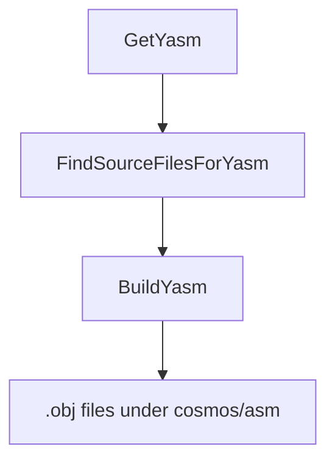

`Cosmos.Asm.Build` compiles handwritten assembly sources into object files that are linked with the NativeAOT output. 

---

## Flow chart

---

## Parameters

| Name | Description | Default |
| --- | --- | --- |
| `YasmPath` | Full path to the `yasm` executable. Auto-detected by `GetYasm` if not set. | Unix: `/usr/bin/yasm`; Windows: resolved via `where yasm` |
| `AsmSearchPath` | One or more directories to scan (non-recursive) for `*.asm`. | none |
| `AsmFiles` | Explicit list of `*.asm` files to compile (added to scan results). | none |
| `AsmOutputPath` | Directory for compiled object files. | `$(IntermediateOutputPath)/cosmos/asm/` |

Notes:
- On Unix, `YasmPath` also defaults from props if empty; on all platforms `GetYasm` attempts to locate `yasm` on PATH.
- When `RuntimeIdentifier` is set (e.g., `linux-x64`), `FindSourceFilesForYasm` will prefer an architecture subfolder if present (e.g., `<searchDir>/x64/`).

---

## Tasks

| Task | Description | Depends On |
| --- | --- | --- |
| `GetYasm` | Resolves `YasmPath` using `which` (Unix) or `where` (Windows). | none |
| `FindSourceFilesForYasm` | Cleans inputs, applies arch overrides, and discovers `*.asm` under `AsmSearchPath`. | `Build` |
| `BuildYasm` | Invokes `YasmBuildTask` for each file with `-felf64`, writing to `AsmOutputPath`. | `FindSourceFilesForYasm; GetYasm` |
| `CleanYasm` | Removes `$(IntermediateOutputPath)/cosmos/asm/`. | `Clean` |

---

## Detailed Workflow

1. `GetYasm` attempts to set `YasmPath` from the system (`which yasm` or `where yasm`). You can override `YasmPath` in your project.
2. `FindSourceFilesForYasm`:
   - Removes any nonexistent entries from `AsmSearchPath` and `AsmFiles` (emits warnings).
   - If `RuntimeIdentifier` is set, replaces any `AsmSearchPath` that contains a matching arch subfolder with that subfolder (e.g., `x64`).
   - Builds a non-recursive search pattern `%(AsmSearchPath.FullPath)/*.asm` and adds results to `AsmFiles` (deduplicated).
3. `BuildYasm` calls the `YasmBuildTask` for each file:
   - Computes a SHA1 of the source and emits `<name>-<sha1>.obj` into `AsmOutputPath`.
   - Executes `yasm -felf64 -o <output.obj> <input.asm>`.
4. `CleanYasm` deletes the `cosmos/asm` intermediate folder during `Clean`.

---

## Outputs

- Object files in `$(IntermediateOutputPath)/cosmos/asm/` named as `<sourceName>-<sha1>.obj` where `<sha1>` is the content hash of the source. This guarantees deterministic, cache-friendly names across builds.

---

## Related components

- [`Cosmos.Build.Asm`](../../../src/Cosmos.Build.Asm)
