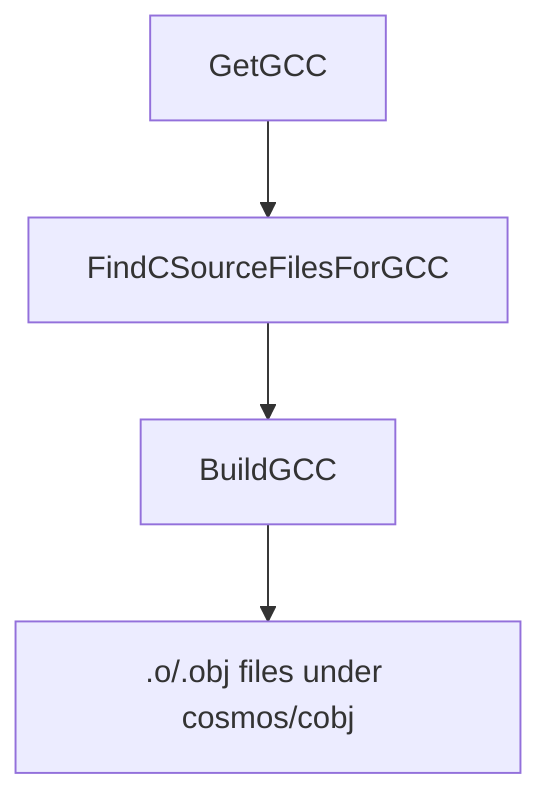

`Cosmos.Build.GCC` compiles C sources into object files that are linked with the NativeAOT output.

---

## Flow chart

---

## Parameters

| Name | Description | Default |
| --- | --- | --- |
| `GCCPath` | Full path or name of the `gcc` executable. Set by `GetGCC` per-OS, overridable in your project. | Unix: `gcc`; Windows: `x86_64-elf-gcc` |
| `GCCProject` | One or more directories to scan (non-recursive) for `*.c`. Supports arch subfolder override. | none |
| `GCCOutputPath` | Directory for compiled object files. | `$(IntermediateOutputPath)/cosmos/cobj/` |
| `GCCCompilerFlags` | Additional compiler flags passed to GCC. | `-O2 -fno-stack-protector -nostdinc -fno-builtin` plus arch flags |

Notes:
- When `RuntimeIdentifier` is set (e.g., `linux-x64`), `FindCSourceFilesForGCC` prefers an architecture subfolder if present (e.g., `<dir>/x64/`).
- On Windows the default tool is a cross-compiler (`x86_64-elf-gcc`); on Unix it is `gcc`. You can override `GCCPath`.

---

## Tasks

| Task | Description | Depends On |
| --- | --- | --- |
| `GetGCC` | Resolves `GCCPath` per OS (Unix: `gcc`, Windows: `x86_64-elf-gcc`). | none |
| `FindCSourceFilesForGCC` | Cleans `@(GCCProject)` inputs and applies arch overrides. | `Build` |
| `BuildGCC` | Invokes `GCCBuildTask` to compile each `*.c` in every `@(GCCProject)` directory. | `FindCSourceFilesForGCC; GetGCC` |
| `CleanGCC` | Removes `$(IntermediateOutputPath)/cosmos/cobj/`. | `Clean` |

---

## Detailed workflow

1. `GetGCC` sets `GCCPath` according to the host OS. You can override `GCCPath` in your project file if needed.
2. `FindCSourceFilesForGCC`:
   - Removes any nonexistent paths from `@(GCCProject)` (emits warnings).
   - If `RuntimeIdentifier` is set and a matching arch subfolder exists (e.g., `x64`), the folder is replaced with that subfolder.
   - Logs the final list of C project directories.
3. `BuildGCC`:
   - Ensures `GCCOutputPath` (`$(IntermediateOutputPath)/cosmos/cobj/`) exists and cleans stale objects.
   - For each `@(GCCProject)` directory, calls `GCCBuildTask` which compiles every `*.c` file in that directory (non-recursive).
   - Each file is compiled individually to an object named `<name>-<sha1>.(obj|o)` where the hash is derived from file contents; extension is `.obj` on Windows, `.o` elsewhere.
4. `CleanGCC` removes the `cosmos/cobj` directory during `Clean`.

---

## Outputs

- Object files in `$(IntermediateOutputPath)/cosmos/cobj/` named as `<sourceName>-<sha1>.(obj|o)`.

---

## Related components

- [`Cosmos.Build.GCC`](../../../src/Cosmos.Build.GCC)
