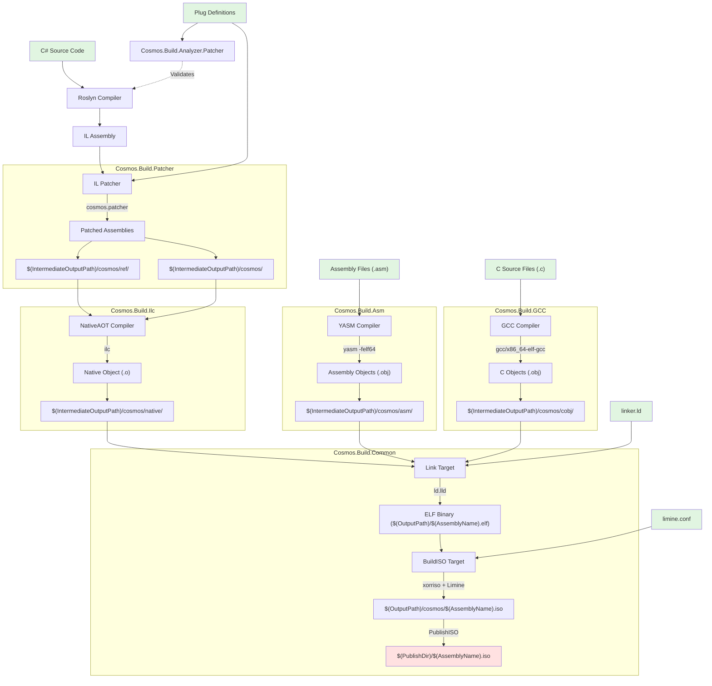

# Kernel Compilation Steps

This document outlines the complete build pipeline that transforms C# kernel code into a bootable ISO image using .NET NativeAOT compilation, custom IL patching, and native code generation.

## Compilation Flow Chart

## Prerequisites

| Tool | Purpose | Required Version |
|------|---------|-----------------|
| **.NET SDK** | Core compilation | 9.0.200+ |
| **YASM** | Assembly compilation | Latest |
| **ld.lld** | ELF linking | LLVM toolchain |
| **xorriso** | ISO creation | Latest |
| **gcc/x86_64-elf-gcc** | C compilation | Cross-compiler on Windows |

## Stage Details

### Stage 1: C# Compilation & Analysis
- **Tool**: Roslyn Compiler
- **Analyzer**: `Cosmos.Build.Analyzer.Patcher`
- **Input**: C# source code with plug annotations
- **Output**: IL assemblies
- **Validation**: Plug usage correctness

### Stage 2: IL Patching
- **Tool**: `Cosmos.Patcher`
- **Process**: 
  1. SetupPatcher: Gathers assemblies and plug references
  2. FindPluggedAssembliesTask: Identifies target assemblies
  3. PatcherTask: Rewrites IL with plug implementations
- **Output**: 
  - Patched assemblies: `$(IntermediateOutputPath)/cosmos/`
  - References: `$(IntermediateOutputPath)/cosmos/ref/`

### Stage 3: NativeAOT (ILC)
- **Tool**: `ilc.exe` (from Microsoft.DotNet.ILCompiler)
- **Process**:
  1. ResolveIlcPath: Locates ILCompiler tools
  2. WriteIlcRsp: Generates response file with options
  3. CompileWithIlc: Transforms IL to native code
- **Output**: Native objects in `$(IntermediateOutputPath)/cosmos/native/`

### Stage 4: Native Code Compilation

#### 4A: Assembly (YASM)
- **Tool**: `yasm`
- **Output**: `$(IntermediateOutputPath)/cosmos/asm/*.obj`

#### 4B: C Code (GCC)
- **Tool**: `gcc` (Unix) or `x86_64-elf-gcc` (Windows)
- **Output**: `$(IntermediateOutputPath)/cosmos/cobj/*.o`

### Stage 5: Linking (ELF)
- **Tool**: `ld.lld`
- **Config**: `Linker/linker.ld`
- **Inputs**: All native, assembly, and C objects
- **Output**: `$(OutputPath)/$(AssemblyName).elf`

### Stage 6: ISO Creation (Limine)
- **Tools**: `xorriso`, `limine`
- **Process**:
  1. Fetch/build Limine bootloader
  2. Stage ELF and config to ISO root
  3. Create ISO with xorriso (MBR + UEFI)
  4. Install Limine on ISO
- **Config**: `Bootloader/limine.conf`
- **Output**: 
  - ISO: `$(OutputPath)/cosmos/$(AssemblyName).iso`
  - Published: `$(PublishDir)/$(AssemblyName).iso`

## Output Summary

| Stage | Output Path | Content |
|-------|------------|---------|
| Patching | `$(IntermediateOutputPath)/cosmos/` | Main patched assembly |
| Patching | `$(IntermediateOutputPath)/cosmos/ref/` | Reference assemblies |
| NativeAOT | `$(IntermediateOutputPath)/cosmos/native/` | Native object files (.o) |
| Assembly | `$(IntermediateOutputPath)/cosmos/asm/` | YASM objects (.obj) |
| C Code | `$(IntermediateOutputPath)/cosmos/cobj/` | GCC objects (.o/.obj) |
| Linking | `$(OutputPath)/$(AssemblyName).elf` | Linked ELF kernel |
| ISO | `$(OutputPath)/cosmos/$(AssemblyName).iso` | Bootable ISO image |
| Publish | `$(PublishDir)/$(AssemblyName).iso` | Published ISO |

## Key Components

- [`Cosmos.Sdk`](../../../src/Cosmos.Sdk) - MSBuild SDK orchestration
- [`Cosmos.Build.Patcher`](../../../src/Cosmos.Build.Patcher) - IL patching infrastructure
- [`Cosmos.Build.Ilc`](../../../src/Cosmos.Build.Ilc) - NativeAOT integration
- [`Cosmos.Build.Asm`](../../../src/Cosmos.Build.Asm) - Assembly compilation
- [`Cosmos.Build.GCC`](../../../src/Cosmos.Build.GCC) - C compilation
- [`Cosmos.Build.Common`](../../../src/Cosmos.Build.Common) - Linking and ISO creation

## Example Project

Reference implementation: `examples/KernelExample/KernelExample.csproj`
