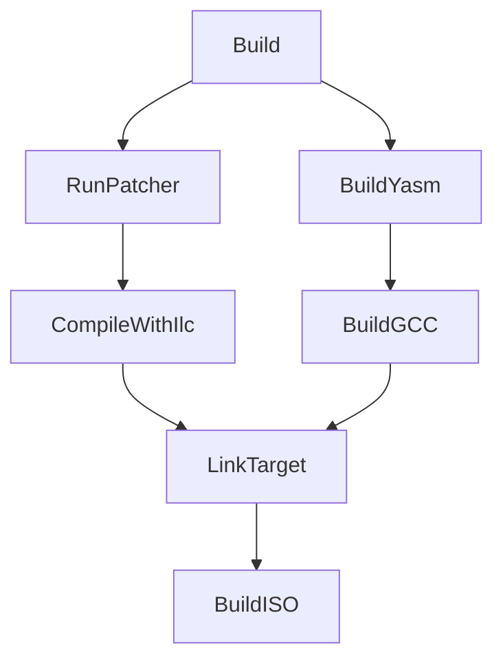

This document outlines the build process for the C# kernel, which utilizes .NET NativeAOT compilation combined with a custom patching mechanism ([Plugs](../plugs.md)) to produce a bootable ELF kernel file and a final bootable ISO image.

## Overview

MSBuild orchestrates several `Cosmos.*` components to transform your kernel into a bootable image. The flow is:

Key components and docs:
- [Patcher](patcher-build.md)
- [ILC](ilc-build.md)
- [Asm](asm-build.md)
- [GCC](gcc-build.md)

Example project: examples/KernelExample/KernelExample.csproj

## Prerequisites

Ensure the following tools and SDKs are installed:

* **.NET SDK**: Version 9.0.200 or later (as specified in `global.json`), including the NativeAOT compilation tools.
* **YASM Assembler**: Required by `Cosmos.Asm.Build` for compiling `.asm` files.
* **LLD Linker (`ld.lld`)**: Part of the LLVM toolchain, required by `Cosmos.Common.Build` for linking object files into the final ELF executable.
* **xorriso**: Required by `Cosmos.Common.Build` for creating the final bootable ISO image.

## Stages

1) C# compile + analyzer
- Roslyn compiles to IL; analyzer from src/Cosmos.Build.Analyzer.Patcher validates plug usage.

2) IL patching
- Targets and tasks from src/Cosmos.Build.Patcher run Cosmos.Patcher to apply plugs.
- Outputs under `$(IntermediateOutputPath)/cosmos/` with references in `cosmos/ref/`.
- Details: [Patcher build](patcher-build.md)

3) NativeAOT (ILC)
- src/Cosmos.Build.Ilc generates `.ilc.rsp` then runs `ilc` to emit native `.o` objects.
- Outputs in `$(IntermediateOutputPath)/cosmos/native/`.
- Details: [ILC build](ilc-build.md)

4) Native bits (Asm and C)
- Assembly: src/Cosmos.Build.Asm compiles `*.asm` via Yasm to `$(IntermediateOutputPath)/cosmos/asm/`.
- C: src/Cosmos.Build.GCC compiles `*.c` to `$(IntermediateOutputPath)/cosmos/cobj/`.
- Configure paths in your project with `AsmSearchPath`/`AsmFiles` and `GCCProject`.
- Details: [ASM build](asm-build.md), [GCC build](gcc-build.md)

5) Linking (ELF)
- src/Cosmos.Build.Common links ILC, asm, and C objects into an ELF using `ld.lld`.
- Linker script: examples/KernelExample/Linker/linker.ld
- Output: `$(OutputPath)/$(AssemblyName).elf`

6) ISO image (Limine)
- src/Cosmos.Build.Common fetches/builds Limine, stages files, runs xorriso, and installs Limine on the ISO.
- Bootloader config: examples/KernelExample/Bootloader/limine.conf
- ISO output: `$(OutputPath)/cosmos/$(AssemblyName).iso`, also copied to publish by `PublishISO`.

## Outputs summary

- Patched IL + refs: `$(IntermediateOutputPath)/cosmos/` and `cosmos/ref/`
- ILC native objects: `$(IntermediateOutputPath)/cosmos/native/`
- Asm objects: `$(IntermediateOutputPath)/cosmos/asm/`
- C objects: `$(IntermediateOutputPath)/cosmos/cobj/`
- ELF: `$(OutputPath)/$(AssemblyName).elf`
- ISO: `$(OutputPath)/cosmos/$(AssemblyName).iso`

## Related source

- [`Cosmos.Sdk`](../../../src/Cosmos.Sdk)
- [`Cosmos.Build.Patcher`](../../../src/Cosmos.Build.Patcher)
- [`Cosmos.Build.Ilc`](../../../src/Cosmos.Build.Ilc)
- [`Cosmos.Build.Asm`](../../../src/Cosmos.Build.Asm)
- [`Cosmos.Build.GCC`](../../../src/Cosmos.Build.GCC)
- [`Cosmos.Build.Common`](../../../src/Cosmos.Build.Common)
