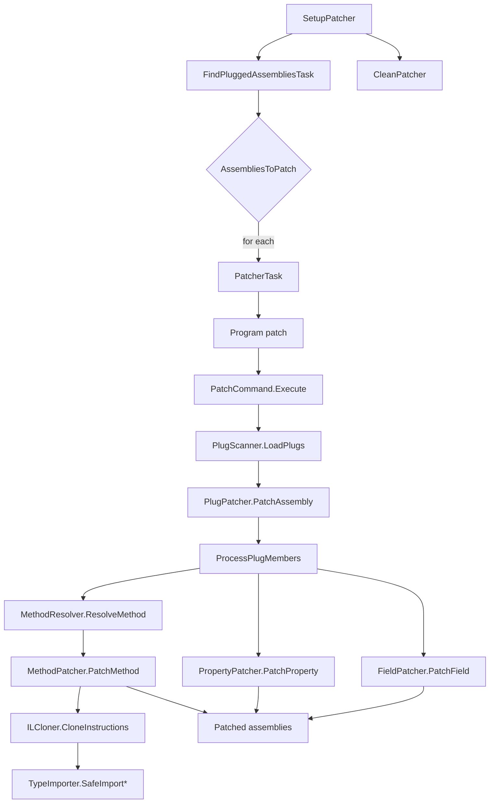

## Overview

`Cosmos.Patcher.Build` wires the [`Cosmos.Patcher`](../../../src/Cosmos.Patcher) tool into the MSBuild pipeline. `Cosmos.Patcher` rewrites IL in candidate assemblies by applying CosmosOS-style plugs so that the .NET Core framework can run on NativeAOT targets. Static analysis is provided by [`Cosmos.Patcher.Analyzer`](../../../src/Cosmos.Build.Analyzer.Patcher), which reports plug errors during C# compilation before any IL is rewritten.

---

## .NET Assembly Structure

A .NET assembly (`.dll` or `.exe`) is a portable executable containing metadata and IL code. The patcher manipulates these structures using Mono.Cecil.

```
┌─────────────────────────────────────────────────────────────────────┐
│                        AssemblyDefinition                           │
│  ┌───────────────────────────────────────────────────────────────┐  │
│  │ Name: "MyAssembly"                                            │  │
│  │ Version: 1.0.0.0                                              │  │
│  │ CustomAttributes: [AssemblyInfo, ...]                         │  │
│  └───────────────────────────────────────────────────────────────┘  │
│                              │                                      │
│                              ▼                                      │
│  ┌───────────────────────────────────────────────────────────────┐  │
│  │                   ModuleDefinition[0]                         │  │
│  │  ┌─────────────────────────────────────────────────────────┐  │  │
│  │  │ Name: "MyAssembly.dll"                                  │  │  │
│  │  │ AssemblyReferences: [mscorlib, System.Runtime, ...]     │  │  │
│  │  │ TypeReferences: [external type tokens]                  │  │  │
│  │  └─────────────────────────────────────────────────────────┘  │  │
│  │                           │                                   │  │
│  │                           ▼                                   │  │
│  │  ┌─────────────────────────────────────────────────────────┐  │  │
│  │  │                  TypeDefinition[0]                      │  │  │
│  │  │  ┌───────────────────────────────────────────────────┐  │  │  │
│  │  │  │ FullName: "MyNamespace.MyClass"                   │  │  │  │
│  │  │  │ BaseType: System.Object                           │  │  │  │
│  │  │  │ Interfaces: [IDisposable, ...]                    │  │  │  │
│  │  │  │ CustomAttributes: [Plug, Serializable, ...]       │  │  │  │
│  │  │  │                                                   │  │  │  │
│  │  │  │  ┌─────────────────────────────────────────────┐  │  │  │  │
│  │  │  │  │            FieldDefinition[0]               │  │  │  │  │
│  │  │  │  │  Name, FieldType, Attributes, Constant      │  │  │  │  │
│  │  │  │  ├─────────────────────────────────────────────┤  │  │  │  │
│  │  │  │  │            FieldDefinition[n]               │  │  │  │  │
│  │  │  │  └─────────────────────────────────────────────┘  │  │  │  │
│  │  │  │                                                   │  │  │  │
│  │  │  │  ┌─────────────────────────────────────────────┐  │  │  │  │
│  │  │  │  │          PropertyDefinition[0]              │  │  │  │  │
│  │  │  │  │  Name, PropertyType, GetMethod, SetMethod   │  │  │  │  │
│  │  │  │  ├─────────────────────────────────────────────┤  │  │  │  │
│  │  │  │  │          PropertyDefinition[n]              │  │  │  │  │
│  │  │  │  └─────────────────────────────────────────────┘  │  │  │  │
│  │  │  │                                                   │  │  │  │
│  │  │  │  ┌─────────────────────────────────────────────┐  │  │  │  │
│  │  │  │  │           MethodDefinition[0]               │  │  │  │  │
│  │  │  │  │  Name, ReturnType, Parameters, Attributes   │  │  │  │  │
│  │  │  │  │                                             │  │  │  │  │
│  │  │  │  │  ┌───────────────────────────────────────┐  │  │  │  │  │
│  │  │  │  │  │           MethodBody                  │  │  │  │  │  │
│  │  │  │  │  │  Variables: [local0, local1, ...]     │  │  │  │  │  │
│  │  │  │  │  │  MaxStackSize: 8                      │  │  │  │  │  │
│  │  │  │  │  │  InitLocals: true                     │  │  │  │  │  │
│  │  │  │  │  │                                       │  │  │  │  │  │
│  │  │  │  │  │  Instructions:                        │  │  │  │  │  │
│  │  │  │  │  │   IL_0000: ldarg.0                    │  │  │  │  │  │
│  │  │  │  │  │   IL_0001: call .ctor                 │  │  │  │  │  │
│  │  │  │  │  │   IL_0006: ldstr "Hello"              │  │  │  │  │  │
│  │  │  │  │  │   IL_000B: call Console.WriteLine     │  │  │  │  │  │
│  │  │  │  │  │   IL_0010: ret                        │  │  │  │  │  │
│  │  │  │  │  │                                       │  │  │  │  │  │
│  │  │  │  │  │  ExceptionHandlers:                   │  │  │  │  │  │
│  │  │  │  │  │   [try/catch/finally blocks]          │  │  │  │  │  │
│  │  │  │  │  └───────────────────────────────────────┘  │  │  │  │  │
│  │  │  │  ├─────────────────────────────────────────────┤  │  │  │  │
│  │  │  │  │           MethodDefinition[n]               │  │  │  │  │
│  │  │  │  └─────────────────────────────────────────────┘  │  │  │  │
│  │  │  └───────────────────────────────────────────────────┘  │  │  │
│  │  ├─────────────────────────────────────────────────────────┤  │  │
│  │  │                  TypeDefinition[n]                      │  │  │
│  │  └─────────────────────────────────────────────────────────┘  │  │
│  └───────────────────────────────────────────────────────────────┘  │
│  ┌───────────────────────────────────────────────────────────────┐  │
│  │                   ModuleDefinition[n]                         │  │
│  └───────────────────────────────────────────────────────────────┘  │
└─────────────────────────────────────────────────────────────────────┘
```

## Flow chart



---

## Parameters

| Name | Description | Default |
| --- | --- | --- |
| `EnablePatching` | Enables or disables patching. | `true` |
| `CosmosPatcherExe` | Path to the `Cosmos.Patcher` executable. | `%USERPROFILE%\.dotnet\tools\cosmos.patcher.exe` on Windows, `cosmos.patcher` on Unix |
| `PatcherOutputPath` | Directory where patched assemblies are written. | `$(IntermediateOutputPath)/cosmos/ref/` |
| `PlugReference` | Names of plug assemblies to include. | none |

---

## Tasks

| Task | Description | Depends On |
| --- | --- | --- |
| `SetupPatcher` | Collects candidate assemblies, resolves plug references, and prepares output directories. | `Build`, `ResolveIlcPath` |
| `RunPatcher` | Executes `Cosmos.Patcher` for each entry in `AssembliesToPatch`. | `SetupPatcher` |
| `CleanPatcher` | Removes files generated by the patcher. | `Clean` |
| `FindPluggedAssembliesTask` | Filters candidate assemblies to only those containing target types. | `SetupPatcher` |
| `PatcherTask` | MSBuild wrapper around `Cosmos.Patcher` for custom scenarios. | none |

---

## Detailed workflow

1. **SetupPatcher** gathers output and reference assemblies, resolves plug references, and stores them in `$(IntermediateOutputPath)/cosmos`.

2. **FindPluggedAssembliesTask** uses [`PlugScanner.FindPluggedAssemblies`](../../../src/Cosmos.Patcher/PlugScanner.cs) to cross-reference plug targets against the candidate assemblies and produces `AssembliesToPatch`.

3. **RunPatcher** iterates over `AssembliesToPatch` and, for each assembly, the [`PatcherTask`](../../../src/Cosmos.Build.Patcher/Tasks/PatcherTask.cs) launches the [`Cosmos.Patcher`](../../../src/Cosmos.Patcher) CLI ([`Program`](../../../src/Cosmos.Patcher/Program.cs) → [`PatchCommand.Execute`](../../../src/Cosmos.Patcher/PatchCommand.cs)). Inside `Execute`:
   - The target assembly is loaded with `AssemblyDefinition.ReadAssembly` and plug assemblies are gathered.
   - [`PlugScanner.LoadPlugs`](../../../src/Cosmos.Patcher/PlugScanner.cs) discovers plug types in those assemblies.
   - [`PlugPatcher.PatchAssembly`](../../../src/Cosmos.Patcher/PlugPatcher.cs) groups plugs by their `[Plug]` target and patches each target type using:
       - [`MethodResolver`](../../../src/Cosmos.Patcher/Resolution/MethodResolver.cs) matches plug signatures (including constructors and `aThis` parameters) by name and parameter types.
       - [`MethodPatcher`](../../../src/Cosmos.Patcher/Patching/MethodPatcher.cs) swaps or clones IL and strips P/Invoke metadata.
       - [`ILCloner`](../../../src/Cosmos.Patcher/IL/ILCloner.cs) clones instructions, remaps parameters, and fixes branch targets.
       - [`TypeImporter`](../../../src/Cosmos.Patcher/IL/TypeImporter.cs) safely imports type/method/field references, fixing self-references that would cause invalid IL metadata.
       - [`PropertyPatcher`](../../../src/Cosmos.Patcher/Patching/PropertyPatcher.cs) wires getters and setters to plug implementations.
       - [`FieldPatcher`](../../../src/Cosmos.Patcher/Patching/FieldPatcher.cs) copies constant values and redirects field accesses.
   - The patched assembly is written to `PatcherOutputPath`.

4. **CleanPatcher** deletes the patched output when the project is cleaned.

5. [`Cosmos.Patcher.Analyzer`](../../../src/Cosmos.Build.Analyzer.Patcher) validates plug rules during compilation to catch errors before patching.

---

## Outputs

- Patched app assembly: `$(IntermediateOutputPath)/cosmos/$(AssemblyName)_patched.dll` — main project output after plug application.
- Reference assemblies for ILC: `$(IntermediateOutputPath)/cosmos/ref/*.dll` — patched where plugs apply; otherwise copied unmodified for resolution.
- Intermediate directories are created on demand under `$(IntermediateOutputPath)/cosmos/`.

Notes:
- `RunPatcher` only runs when `EnablePatching` is `true` and after `SetupPatcher` computes `@(AssembliesToPatch)` and destinations.

---

## Related components

- [`Cosmos.Patcher`](../../../src/Cosmos.Patcher)
- [`Cosmos.Patcher.Analyzer`](../../../src/Cosmos.Build.Analyzer.Patcher)
