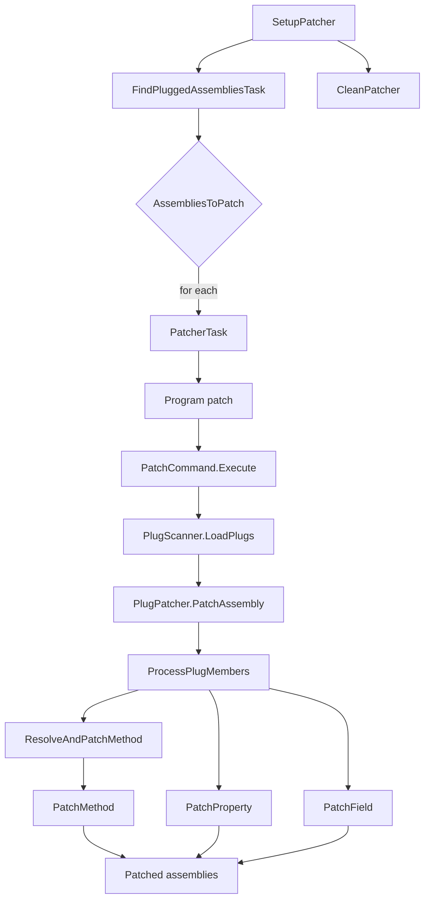

## Overview

`Cosmos.Patcher.Build` wires the [`Cosmos.Patcher`](../../../src/Cosmos.Patcher) tool into the MSBuild pipeline. `Cosmos.Patcher` rewrites IL in candidate assemblies by applying CosmosOS-style plugs so that the .NET Core framework can run on NativeAOT targets. Static analysis is provided by [`Cosmos.Patcher.Analyzer`](../../../src/Cosmos.Build.Analyzer.Patcher), which reports plug errors during C# compilation before any IL is rewritten.

---

## Flow chart

---

## Parameters

| Name | Description | Default |
| --- | --- | --- |
| `EnablePatching` | Enables or disables patching. | `true` |
| `CosmosPatcherExe` | Path to the `Cosmos.Patcher` executable. | `%USERPROFILE%\\.dotnet\\tools\\cosmos.patcher.exe` on Windows, `cosmos.patcher` on Unix |
| `PatcherOutputPath` | Directory where patched assemblies are written. | `$(IntermediateOutputPath)/cosmos/ref/` |
| `PlugReference` | Names of plug assemblies to include. | none |

---

## Tasks

| Task | Description | Depends On |
| --- | --- | --- |
| `SetupPatcher` | Collects candidate assemblies, resolves plug references, and prepares output directories. | `Build`, `ResolveIlcPath` |
| `RunPatcher` | Executes `Cosmos.Patcher` for each entry in `AssembliesToPatch`. | `SetupPatcher` |
| `CleanPatcher` | Removes files generated by the patcher. | `Clean` |
| `FindPluggedAssembliesTask` | Filters candidate assemblies to only those containing target types. | `SetupPatcher` |
| `PatcherTask` | MSBuild wrapper around `Cosmos.Patcher` for custom scenarios. | none |

---

## Detailed workflow

1. **SetupPatcher** gathers output and reference assemblies, resolves plug references, and stores them in `$(IntermediateOutputPath)/cosmos`.
2. **FindPluggedAssembliesTask** uses [`PlugScanner.FindPluggedAssemblies`](../../../src/Cosmos.Patcher/PlugScanner.cs) to cross-reference plug targets against the candidate assemblies and produces `AssembliesToPatch`.
3. **RunPatcher** iterates over `AssembliesToPatch` and, for each assembly, the [`PatcherTask`](../../../src/Cosmos.Build.Patcher/Tasks/PatcherTask.cs) launches the [`Cosmos.Patcher`](../../../src/Cosmos.Patcher) CLI ([`Program`](../../../src/Cosmos.Patcher/Program.cs) → [`PatchCommand.Execute`](../../../src/Cosmos.Patcher/PatchCommand.cs)). Inside `Execute`:
   - The target assembly is loaded with `AssemblyDefinition.ReadAssembly` and plug assemblies are gathered.
   - [`PlugScanner.LoadPlugs`](../../../src/Cosmos.Patcher/PlugScanner.cs) discovers plug types in those assemblies.
   - [`PlugPatcher.PatchAssembly`](../../../src/Cosmos.Patcher/PlugPatcher.cs) groups plugs by their `[Plug]` target and patches each target type. Internally it calls:
       - [`ProcessPlugMembers`](../../../src/Cosmos.Patcher/PlugPatcher.cs) to walk each plug type.
       - [`ResolveAndPatchMethod`](../../../src/Cosmos.Patcher/PlugPatcher.cs) matches plug signatures (including constructors and `aThis` parameters) and delegates to [`PatchMethod`](../../../src/Cosmos.Patcher/PlugPatcher.cs) which swaps or clones IL and strips P/Invoke metadata.
       - [`PatchProperty`](../../../src/Cosmos.Patcher/PlugPatcher.cs) wires getters and setters to plug implementations.
       - [`PatchField`](../../../src/Cosmos.Patcher/PlugPatcher.cs) copies constant values and redirects field accesses.
   - The patched assembly is written to `PatcherOutputPath`.
4. **CleanPatcher** deletes the patched output when the project is cleaned.
5. [`Cosmos.Patcher.Analyzer`](../../../src/Cosmos.Build.Analyzer.Patcher) validates plug rules during compilation to catch errors before patching.

---

## Related components

- [`Cosmos.Patcher`](../../../src/Cosmos.Patcher)
- [`Cosmos.Patcher.Analyzer`](../../../src/Cosmos.Build.Analyzer.Patcher)
