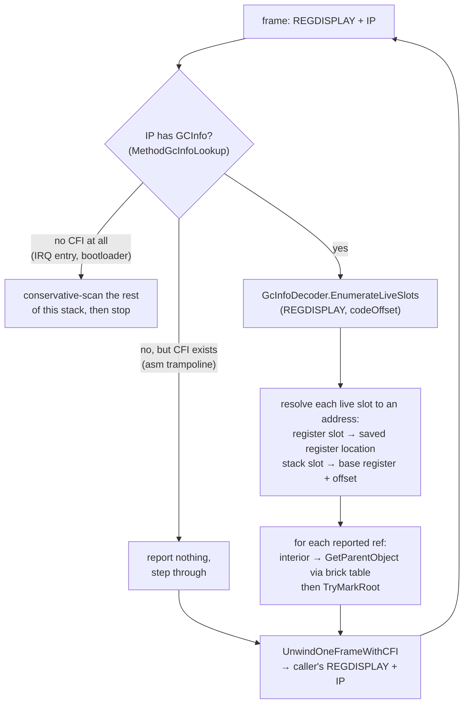

## Overview

This article describes how the garbage collector finds roots on thread stacks: a **precise** per-frame scan driven by the **GCInfo** metadata that the NativeAOT compiler (ILC) emits for every method. It replaces the **conservative** scan documented in [Garbage Collector: Mark phase](garbage-collector.md#mark-phase) wherever the precise scan is provably sound.

> **Status.** The precise scan is live for the GC-triggering thread and for exception funclet frames, and it resolves interior pointers to their parent objects (epic [#348](https://github.com/valentinbreiz/nativeaot-patcher/issues/348) phases 1 to 3 and 5, interior pointer support from [#376](https://github.com/valentinbreiz/nativeaot-patcher/issues/376)/[#384](https://github.com/valentinbreiz/nativeaot-patcher/issues/384)). The conservative scan still covers threads preempted in the scheduler; retiring it needs [return-address hijacking](#the-safepoint-constraint), tracked in [#385](https://github.com/valentinbreiz/nativeaot-patcher/issues/385).

---

## Why conservative scanning has to go

### What the conservative scan does

During the mark phase the GC has to discover every object still reachable from a thread's stack: local variables, spilled registers, method arguments. The conservative scan does not know which stack words are object references and which are integers, so it treats every pointer-sized word as a candidate (`ScanThreadStack` and `ScanMemoryRange` feeding `TryMarkRoot` in [`GarbageCollector.Mark.cs`](../../../src/Cosmos.Kernel.Core/Memory/GarbageCollector/GarbageCollector.Mark.cs)). `TryMarkRoot` keeps a candidate only if it lands inside the GC heap and its would-be `MethodTable` pointer lives in the kernel's higher half. Those are plausibility filters, not proof.

Anything that looks like a heap pointer becomes a root. A thread's stack, walked 8 bytes at a time:

| Stack word | What it actually is | Conservative verdict |
|------------|--------------------|--------------------|
| `0x0000000000000007` | int 7 | Not in heap range, ignored |
| `0xFFFF8001A2B3C4D0` | live `List<int>` reference | In heap range, marked ✅ correct |
| `0xFFFF8001DEADBEEF` | dead spill slot | Still in range, marked ❌ false root |
| `0x00007FFE12340000` | a return address | Not in range, ignored |
| `0xFFFF8001CAFE0000` | stale callee pointer | Still in range, marked ❌ false root |

### Problem 1: over-rooting

Any stale heap pointer left in a dead spill slot, a scratch slot, or a not-yet-overwritten callee frame is treated as a root, so the object it points at survives the collection, along with everything it transitively references. A false root through a strong reference leaks silently. A false root that keeps a weak reference's target alive is at least visible: a weak handle that should have been cleared still resolves, which is what CI catches.

### Problem 2: layout fragility (the `InterruptScope` regression)

Because the scan reads whatever word sits at each stack offset, its correctness depends on the exact stack layout the compiler chose: which slot got reused, which value was left there, whether the scan range happens to cover it. That layout shifts whenever codegen shifts.

The concrete instance (issue [#346](https://github.com/valentinbreiz/nativeaot-patcher/issues/346)): commit `6c497186` added a single field, `private ulong _savedFlags;`, to the [`InterruptScope`](../../../src/Cosmos.Kernel.Core/CPU/InternalCpu.cs) ref struct. `InterruptScope` always lives on the stack, its construction is aggressively inlined, and `using (InternalCpu.DisableInterruptsScope())` wraps the GC, heap, and scheduler hot paths. The extra 8 bytes shifted the slots below it; a stale `byte[128]` pointer in a returned frame landed in a slot the conservative scan reads, the array was kept alive, its weak handle was not cleared, and the GarbageCollector suite's weak reference and dependent handle tests failed on ARM64. The field was reverted in `2f1b6d17` and later re-added (as the `SaveIrqAndDisable` / `RestoreIrq` pair), which is safe now that the GC-triggering thread is scanned precisely: the frame where that stale pointer lived is no longer read word by word.

### Why ARM64 broke and x64 did not

Same source change, different outcome per architecture, because "is there a stale heap pointer in a slot the scan reads" is a codegen artifact and ILC makes independent decisions per arch:

- **Register file.** x64 has 16 general-purpose registers, ARM64 has 31. The register allocator spills different values to different stack slots, so the stale pointer sat in a spilled slot on one arch and in a register (reused before the GC ran) on the other.
- **Frame setup and alignment.** x64 (`push rbp` / `sub rsp, N`) and ARM64 (`stp x29, x30, [sp, #-N]!`, SP kept 16-byte aligned) absorb 8 extra bytes differently. On one arch the field fell into existing padding; on the other it pushed every slot below it down.
- **Inlining.** ILC's inliner uses a per-arch cost model, so the set of live frames at GC time differs.

The arch asymmetry is the problem statement: the GC was not consistently broken, it broke whenever the compiler happened to put a stale pointer where the scan looks. Adding a field, upgrading ILC, or introducing a local are all the same class of failure. ARM64 GC CI is the canary because ARM64 codegen surfaces it first.

### The shortcut that does not work

A tempting half-measure is to keep the conservative scan but only read live frame ranges found by walking the RBP / X29 frame-pointer chain. That is not safe here: ILC compiles many functions without a frame pointer, so the frame chain silently skips those frames. The kernel's own exception unwinder documents this (see the comment about the managed equivalent of `-fomit-frame-pointer` in [`ExceptionHelper.cs`](../../../src/Cosmos.Kernel.Core/Runtime/ExceptionHandling/ExceptionHelper.cs)). For exception dispatch a skipped frame is tolerable. For the GC a skipped frame means missed roots, which collects a live object and turns into a use-after-free during sweep, strictly worse than the false rooting it was meant to remove. Precise GCInfo is the only correct path.

---

## What GCInfo is

When ILC compiles a method it emits, alongside the machine code, a small GCInfo blob that answers one question:

> If a GC fires while execution is at code offset N inside this method, which CPU registers and which stack slots hold live object references, which of those are interior pointers, and which are pinned?

One blob per method. It is what makes a precise scan possible: instead of guessing which stack words look like pointers, the GC asks the compiler.

### Where it lives in the binary

ILC writes one record per method into the `.dotnet_eh_table` section, laid out `[LSDA header][GCInfo blob][EH clauses]`. The linker keeps the section and its bounds: see `*(.dotnet_eh_table)` and `__dotnet_eh_table_start` / `__dotnet_eh_table_end` in [`linker.x64.ld`](../../../src/Cosmos.Build.Templates/Linker/linker.x64.ld) and [`linker.arm64.ld`](../../../src/Cosmos.Build.Templates/Linker/linker.arm64.ld). The DWARF `.eh_frame` FDE for a method carries a pointer to that record's LSDA header, and [`MethodGcInfoLookup`](../../../src/Cosmos.Kernel.Core/Runtime/GcInfo/MethodGcInfoLookup.cs) walks `.eh_frame` to resolve an instruction pointer to it. So an IP is only an LSDA-header walk away from the GCInfo blob. No build-pipeline, post-link tool, or patcher change is needed.

The `.dotnet_eh_table` section is a sequence of these records, one per method, each laid out in this order:

| Record part | Contents |
|-------------|----------|
| LSDA header, byte 0 | `unwindBlockFlags`: `UBF_FUNC_KIND_MASK` 0x03 (ROOT / HANDLER / FILTER), `UBF_FUNC_HAS_EHINFO` 0x04, `UBF_FUNC_HAS_ASSOCIATED_DATA` 0x10 |
| funclet records only | An int32 self-relative offset to the main method's LSDA plus an int32 start delta; a funclet reuses its main method's GCInfo |
| if `HAS_ASSOCIATED_DATA` | int32 pointer |
| if `HAS_EHINFO` | int32 pointer |
| **GCInfo blob** | Bit-packed (see below); this is what the precise scan decodes |
| EH clauses | The try/catch/finally table |

A method's `.eh_frame` FDE points its LSDA pointer at that record's first byte, and the code offset for the GCInfo query is `ip - methodStart`.

The LSDA header layout is the format the NativeAOT runtime parses; the upstream reference is `FindMethodInfo` / `GetCodeOffset` in `dotnet/runtime/src/coreclr/nativeaot/Runtime/unix/UnixNativeCodeManager.cpp`.

### What's inside the blob

GCInfo is a tightly bit-packed stream; every field takes the minimum number of bits and nothing is byte-aligned. Logically it has three parts:

| Part | Contents |
|------|----------|
| **Header** | Version and flags, code length (equals the FDE's PC range, a useful sanity check), the stack-base register that stack slot offsets are relative to (`SP` or the frame register), whether a GS cookie or generics context is present, the number of safepoints, and the number of fully-interruptible ranges. |
| **Slot table** | The universe of slots this method ever uses for object refs. Each slot is either a register (by number) or a stack slot (base register plus signed offset). Per-slot flags: `GC_SLOT_INTERIOR` (the value points into the middle of an object, not at its header) and `GC_SLOT_PINNED` (the target must not move). Untracked slots, live for the whole method body, sit at the end of the table. |
| **Liveness** | Which slots are live at which code offsets. A fully-interruptible range encodes liveness valid at any IP inside it; a partially-interruptible method encodes liveness per **safepoint** (call site) only. |

A method's GCInfo, conceptually. First the slot table:

| Slot | Location | Holds | Flags |
|------|----------|-------|-------|
| 0 | register `RSI` | `s` | none |
| 1 | stack, frame base - 0x18 | `a` | none |
| 2 | stack, frame base - 0x20 | `&arr[3]` | `INTERIOR` |
| 3 | stack, SP + 0x08 | | `PINNED` |

Then the liveness of those slots over the method body, from offset 0x00 to the code length:

| Code offset | Live slots |
|-------------|------------|
| 0x00 to 0x4A | none |
| 0x4A to 0x6C | only slot 1 (the array) |
| 0x6C to code length | only slot 0 (the string) |

### A tiny worked example

```csharp
static void Foo()
{
    byte[] a = new byte[128];     // 'a' is an object reference
    Bar();                        // ←(I) call site = safepoint; 'a' still needed below, so live here
    GC.KeepAlive(a);
    string s = Compute();         // 's' is an object reference; 'a' is now dead
    Console.WriteLine(s);         // ←(II) call site = safepoint; 's' live, 'a' dead here
}
```

- A GC fires while `Foo`'s frame is on the stack with the IP at the return address after `Bar()`. The code offset resolves to safepoint (I), GCInfo reports only the slot holding `a`, and the `byte[128]` is kept. Nothing else.
- A GC fires with the IP at the return address after `WriteLine`. Safepoint (II) reports only the register holding `s`. The `byte[128]` is not reported and is collected, even though its stale pointer still sits in `a`'s stack slot. That last case is exactly what the conservative scan gets wrong.

The authoritative format and decoder semantics are `dotnet/runtime/src/coreclr/vm/gcinfodecoder.cpp` (`GcInfoDecoder::EnumerateLiveSlots`, built with `GCINFODECODER_NO_EE` for NativeAOT) and `dotnet/runtime/src/coreclr/inc/{gcinfotypes.h,gcinfodecoder.h}`. The kernel's decoder is a direct port of the v4 subset it needs.

---

## How the precise scan walks a thread

The scan walks the GC-triggering thread one frame at a time. For each frame it has two inputs: the IP (a return address pointing into that method's code) and a `REGDISPLAY`, a struct holding this frame's register state. Both come from machinery built for exception handling: the CFI unwinder in [`ExceptionHelper.cs`](../../../src/Cosmos.Kernel.Core/Runtime/ExceptionHandling/ExceptionHelper.cs) reconstructs caller register state frame by frame, and a small native stub (`_native_capture_regdisplay`) seeds the initial `REGDISPLAY` for the scan's own frame.

The driver is `PreciseScanCurrentThread` in [`GarbageCollector.PreciseStack.cs`](../../../src/Cosmos.Kernel.Core/Memory/GarbageCollector/GarbageCollector.PreciseStack.cs), dispatched from `ScanStackRoots` for the GC-triggering thread only. The walk is capped at 256 unwind steps past the first frame.



Per reported slot, the callback (`PreciseRootTrampoline`) does one of two things:

- A plain reference is passed to `TryMarkRoot` directly; the usual heap-range and `MethodTable` checks are harmless belt and braces on a precisely reported root.
- A slot flagged `GC_CALL_INTERIOR` holds a pointer into the middle of an object (a byref, a span's reference). The callback resolves it to the containing object with `GetParentObject`: pick the pinned segment list if `GC_CALL_PINNED` is also set and the regular list otherwise, find the containing segment, ask the segment's brick table for the closest recorded object start below the address, walk forward object by object until one covers the address, and mark that object. This is the fix for objects reachable only through a byref (issue [#384](https://github.com/valentinbreiz/nativeaot-patcher/issues/384)); the mechanism is described in [Garbage Collector: Interior pointers](garbage-collector.md#interior-pointers).

Frames without GCInfo come in two kinds. A hand-written asm trampoline that still carries `.cfi` directives (`RhpCallCatchFunclet`, `RhpCallFilterFunclet`, `RhpThrowEx`) is stepped through reporting nothing: the managed frames on either side cover its register save locations, and the in-flight exception object is reported from the funclet's or `RhpThrowEx`'s own slot deeper on the stack. A frame with no CFI at all (interrupt entry stubs, the bootloader) ends the walk: the scanner conservatively scans the remaining stack range and stops rather than crashing. The same conservative tail runs if the unwinder fails mid-walk or a method's slot table overflows the decoder's fixed buffer.

Funclet frames (catch, filter, and finally bodies) carry no GCInfo of their own. Their LSDA header redirects to the main method's record, and the code offset is resolved against the main method's start, so the funclet is scanned with the parent's slot table on the frame it actually runs on. Filter funclets run mid-throw, so the parent's untracked slots may be stale there and are not reported (`NoReportUntracked`); catch and finally funclets report them normally, and marking is idempotent, so double-reporting with the parent frame is harmless.

---

## The safepoint constraint

GCInfo is only valid at safepoints: call sites for a partially-interruptible method, or any IP inside a fully-interruptible range. So whether a precise scan of a given thread is sound depends on where that thread's instruction pointer is when the GC runs:

1. **The thread that triggered the GC.** It reached the collector through a managed call chain into the allocator, so every return address up its stack is a call-site safepoint. A precise scan of this thread is sound. Exception funclet frames are entered through the dispatcher's `call` too, so they are also safepoints.

2. **Threads parked in the scheduler.** A thread in the run queue, blocked, or sleeping was preempted by the timer IRQ at an arbitrary instruction, not necessarily a safepoint, so its GCInfo lookup may be meaningless there. Stock NativeAOT solves this with return-address hijacking: before scanning such a thread, the runtime overwrites an on-stack return address with the address of a stub, lets the thread run to that return, parks it at the stub (a safepoint by construction), scans it precisely, then restores the real return address. Cosmos has no such subsystem yet; this is issue [#385](https://github.com/valentinbreiz/nativeaot-patcher/issues/385).

Until then, threads other than the GC-triggering one keep the conservative scan described in [Garbage Collector: Mark phase](garbage-collector.md#mark-phase). The threads and their saved register state come from the scheduler's registry; see [Scheduler](scheduler.md).

---

## Source files

| Piece | Where | Notes |
|-------|-------|-------|
| Precise per-frame walk | [`GarbageCollector.PreciseStack.cs`](../../../src/Cosmos.Kernel.Core/Memory/GarbageCollector/GarbageCollector.PreciseStack.cs) | walk loop, root callback, interior pointer resolution; `ScanStackRoots` in `GarbageCollector.Mark.cs` dispatches to it |
| GCInfo v4 decoder | [`GcInfoDecoder.cs`](../../../src/Cosmos.Kernel.Core/Memory/GarbageCollector/GcInfo/GcInfoDecoder.cs), [`GcSlotTable.cs`](../../../src/Cosmos.Kernel.Core/Memory/GarbageCollector/GcInfo/GcSlotTable.cs), [`GcInfoTypes.cs`](../../../src/Cosmos.Kernel.Core/Memory/GarbageCollector/GcInfo/GcInfoTypes.cs), [`GcInfoBitStreamReader.cs`](../../../src/Cosmos.Kernel.Core/Memory/GarbageCollector/GcInfo/GcInfoBitStreamReader.cs) | header, slot table, `EnumerateLiveSlots`; port of `gcinfodecoder.cpp` |
| IP to GCInfo lookup | [`MethodGcInfoLookup.cs`](../../../src/Cosmos.Kernel.Core/Runtime/GcInfo/MethodGcInfoLookup.cs), [`EhFrameNative.cs`](../../../src/Cosmos.Kernel.Core/Bridge/Import/EhFrameNative.cs) | the kernel's single `.eh_frame` / LSDA parser: IP → FDE → LSDA → GCInfo blob, including the funclet-to-main redirect; also serves the exception unwinder |
| CFI unwinder, `REGDISPLAY` | [`ExceptionHelper.cs`](../../../src/Cosmos.Kernel.Core/Runtime/ExceptionHandling/ExceptionHelper.cs) (+ `ExceptionHelper.X64.cs` / `ExceptionHelper.ARM64.cs`, [`RegisterContext.X64.cs`](../../../src/Cosmos.Kernel.Core/Runtime/ExceptionHandling/RegisterContext.X64.cs) / [`RegisterContext.ARM64.cs`](../../../src/Cosmos.Kernel.Core/Runtime/ExceptionHandling/RegisterContext.ARM64.cs)) | `UnwindOneFrameWithCFI` executes DWARF call-frame instructions to reconstruct the caller's register state, built for [#227](https://github.com/valentinbreiz/nativeaot-patcher/issues/227) |
| `_native_capture_regdisplay` stub | `src/Cosmos.Kernel.Native.X64/CPU/ContextCapture.s`, `src/Cosmos.Kernel.Native.ARM64/CPU/ContextCapture.s`, [`ContextSwitchNative.cs`](../../../src/Cosmos.Kernel.Core/Bridge/Import/ContextSwitchNative.cs) | seeds the initial `REGDISPLAY` for the GC-triggering thread |
| `.dotnet_eh_table` kept, with `__dotnet_eh_table_start/end` | [`linker.x64.ld`](../../../src/Cosmos.Build.Templates/Linker/linker.x64.ld), [`linker.arm64.ld`](../../../src/Cosmos.Build.Templates/Linker/linker.arm64.ld) | GCInfo is reachable at runtime via the FDE LSDA |
| IRQ save/restore natives | `Cosmos.Kernel.Native.{X64,ARM64}/CPU/CpuOps.s`, [`CpuNative.cs`](../../../src/Cosmos.Kernel.Core/Bridge/Import/CpuNative.cs) | used by [`InterruptScope`](../../../src/Cosmos.Kernel.Core/CPU/InternalCpu.cs) (the re-added `_savedFlags` save/restore form) |
| Conservative scan (parked threads) | [`GarbageCollector.Mark.cs`](../../../src/Cosmos.Kernel.Core/Memory/GarbageCollector/GarbageCollector.Mark.cs) | `ScanThreadStack` / `ScanMemoryRange` / `TryMarkRoot`; what remains until hijacking lands |
| Tests | `tests/Kernels/Cosmos.Kernel.Tests.GarbageCollector` | `GC_GcInfoDecoder`, `GC_PreciseStackScan`, `GC_FuncletNoFalseRoot`, `GC_FuncletNoCrashOnAllocInCatch`, `GC_StackScanPaddingStress`, `GC_InteriorPointerRoot` |
| Hijack stub | not yet written | [#385](https://github.com/valentinbreiz/nativeaot-patcher/issues/385), phase 4 of the epic |
