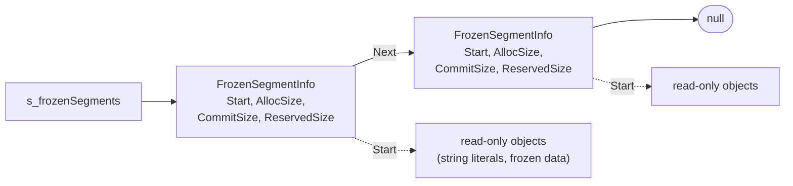
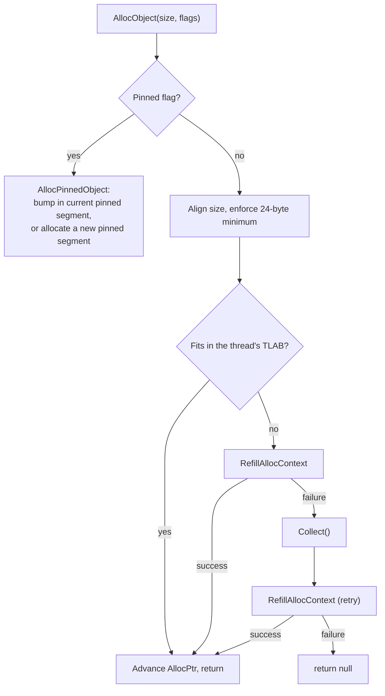
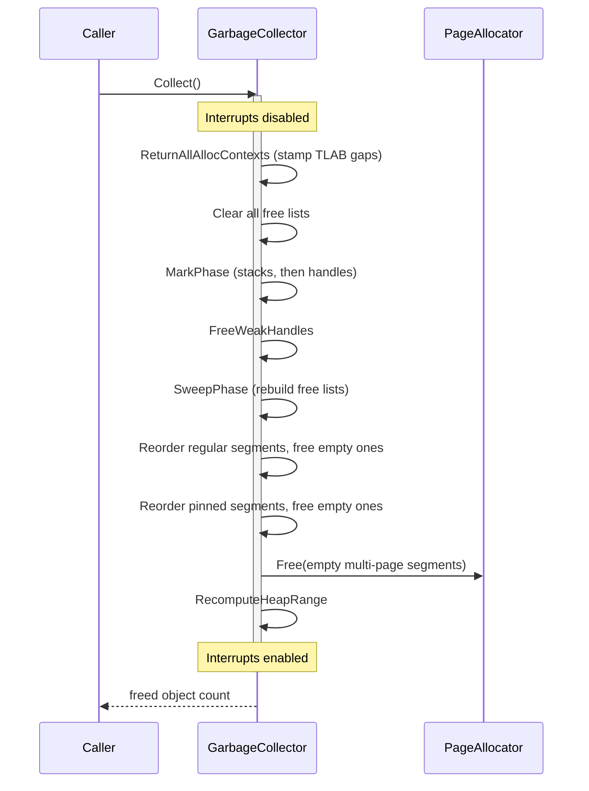
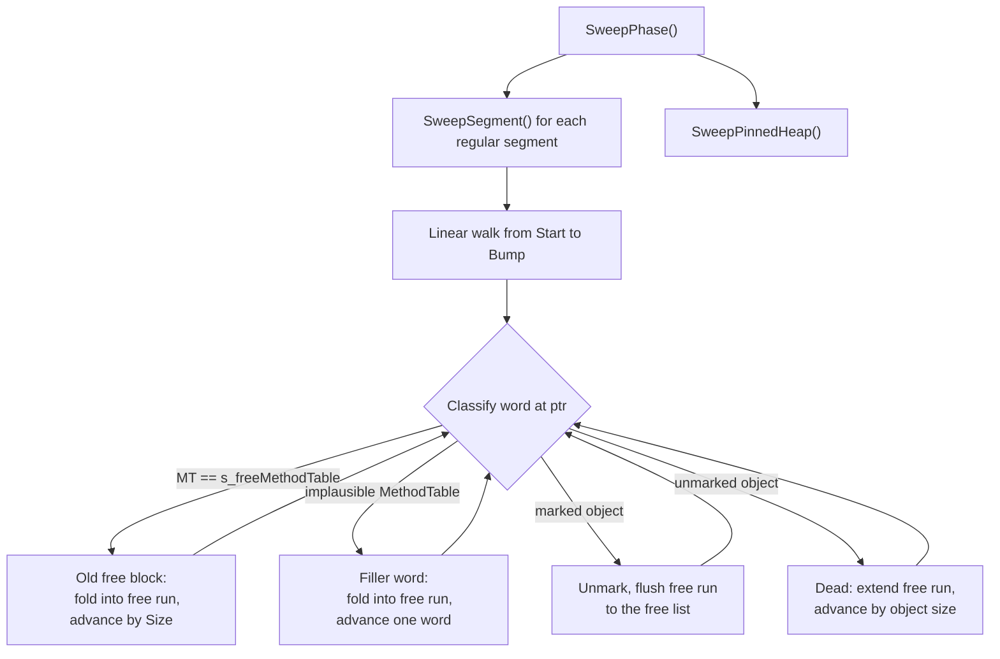

*OrionGC's namesake. Image credit & copyright: [Stanislav Volskiy](https://apod.nasa.gov/apod/ap151123.html), APOD 2015 November 23.*

## Overview

The garbage collector (it identifies itself as **OrionGC** in the runtime configuration table) is a stop-the-world, non-moving, mark-and-sweep collector with a single generation. It manages four kinds of memory:

- the regular GC heap, a linked list of bump-allocated segments,
- the pinned object heap, a second segment list for objects that must not move,
- the GC handle store, per-type segmented tables of `GCHandle` slots,
- frozen segments, pre-initialized read-only data registered by the runtime and never collected.

Allocation goes through per-thread TLABs (thread-local allocation buffers). A collection runs when a TLAB refill fails even after growing the heap, or when `Collect()` is called explicitly. The whole collection runs inside `InternalCpu.DisableInterruptsScope()`, so no thread switch or interrupt handler can observe the heap mid-collection.

Roots come from three places: the GC-triggering thread's stack, scanned precisely from NativeAOT GCInfo (see [Precise Stack Scanning (GCInfo)](garbage-collector-gcinfo.md)); every other registered thread's stack and saved registers, scanned conservatively; and strong GC handles. Static fields need no separate scan pass: module initialization parks every module's GC-statics base objects in a spine array behind a strong handle, so the handle scan reaches them.

The code lives in `src/Cosmos.Kernel.Core/Memory/GarbageCollector/`. The `GarbageCollector` class itself is a static partial class split by phase (`.Alloc`, `.Tlab`, `.Mark`, `.Sweep`, and so on); segments, handles, and the TLAB struct sit in their own types, and the `GcInfo/` folder holds the decoder for the precise stack scan. The full file map is in [Source files](#source-files) at the end of this article.

Two `GCSegmentManager` instances exist: `s_segmentManager` for the regular heap and `s_pinnedSegmentManager` for the pinned heap. The handle store is `s_gCHandleManager`, a `GCHandleManager`.

---

## Core structures

### MethodTable

Every managed type compiled by ILC has a `MethodTable`, a type descriptor that lives in the kernel's data sections, never on the GC heap. The GC reads a handful of its fields:

| Field | Purpose |
|-------|---------|
| `RawBaseSize` | Size of a fixed-size object in bytes |
| `BaseSize` / `ComponentSize` | Base size plus per-element size for arrays and strings |
| `HasComponentSize` | True for arrays and strings |
| `ContainsGCPointers` | True if instances contain references the GC must trace |

Because `MethodTable` pointers always live in kernel space, outside the heap, the GC uses that as a validity filter: a candidate object whose first word is null, points inside the GC heap, or sits below `AddressSpace.KernelSpaceStart` cannot be a real object.

### Object header

Every object on the GC heap starts with a [`GCObject`](../../../src/Cosmos.Kernel.Core/Memory/GarbageCollector/GCObject.cs) header:

| Offset | Size (x64) | Contents | Notes |
|--------|------------|----------|-------|
| 0 | 8 bytes | `MethodTable*` | Bit 0 doubles as the mark bit |
| 8 | 4 bytes | `Length` | Element count for arrays and strings |
| 12 | rest of the object | Fields or elements | |

`MethodTable` pointers are aligned, so bit 0 is normally zero. `Mark()` sets it, `Unmark()` clears it, and `GetMethodTable()` masks it off before dereferencing. `ComputeSize()` returns `BaseSize + Length * ComponentSize` for arrays and strings, `RawBaseSize` for everything else.

### FreeBlock

Dead space is described by `FreeBlock` entries linked into size-class free lists. A `FreeBlock` is laid out so the sweep can walk over it like an object, with the marker `MethodTable` at offset 0 and `Size` where `GCObject.Length` sits:

| Offset | Size (x64) | Contents | Notes |
|--------|------------|----------|-------|
| 0 | 8 bytes | `MethodTable*` | Points at the `s_freeMethodTable` marker that identifies free blocks |
| 8 | 4 bytes | `Size` | Total size of this free block (4 bytes of padding follow) |
| 16 | 8 bytes | `Next*` | Next free block in the same size class |

The header is 24 bytes, which is why `MinBlockSize` is 24: every allocation is rounded up to at least that, so any object can later be turned into a free block in place.

### AllocContext (TLAB)

[`AllocContext`](../../../src/Cosmos.Kernel.Core/Memory/GarbageCollector/AllocContext.cs) is the per-thread allocation state, stored inline on each `Scheduler.Thread` (with a static fallback context for early boot, before the scheduler runs):

| Field | Meaning |
|-------|---------|
| `AllocPtr` | Current allocation pointer, advances toward `AllocLimit` |
| `AllocLimit` | End of the TLAB; reaching it forces a refill |
| `AllocBytes` | Cumulative bytes this thread allocated on the regular heap |
| `AllocBytesUoh` | Cumulative bytes this thread allocated on the pinned heap |

---

## Memory layout

### Segments

A segment is a contiguous range of pages from the page allocator (`PageType.GCHeap`). The [`GCSegment`](../../../src/Cosmos.Kernel.Core/Memory/GarbageCollector/GCSegment.cs) header sits at the base of the allocation, followed by the segment's brick table, then 8 reserved bytes, then the usable region:

<svg viewBox="0 0 760 292" style="width:100%;min-width:620px;max-width:760px;display:block" role="img" aria-label="Memory layout of one GC segment: the GCSegment header, the brick table, 8 reserved bytes, then the usable region. Start points at the first usable byte, Bump at the boundary between allocated objects and free space, End one past the last byte, Next at the following segment.">
  <defs>
    <marker id="seg-ah" viewBox="0 0 10 10" refX="9" refY="5" markerWidth="6.5" markerHeight="6.5" orient="auto-start-reverse">
      <path d="M0,0 L10,5 L0,10 z" fill="currentColor"/>
    </marker>
  </defs>
  <!-- caption + outer dashed page allocation -->
  <text x="14" y="18" font-size="12.5" font-style="italic" fill="currentColor" fill-opacity="0.7">one segment — one or more pages from the page allocator</text>
  <rect x="10" y="28" width="726" height="228" rx="4" fill="none" stroke="currentColor" stroke-opacity="0.5" stroke-dasharray="6 5"/>
  <!-- GCSegment header -->
  <rect x="30" y="52" width="160" height="180" fill="currentColor" fill-opacity="0.07" stroke="currentColor"/>
  <text x="110" y="71" text-anchor="middle" font-size="13" font-weight="bold" fill="currentColor">GCSegment header</text>
  <line x1="30" y1="80" x2="190" y2="80" stroke="currentColor" stroke-opacity="0.4"/>
  <g font-family="ui-monospace, SFMono-Regular, Menlo, Consolas, monospace" font-size="12.5" fill="currentColor">
    <text x="42" y="96">Next</text>
    <text x="42" y="121">Start</text>
    <text x="42" y="146">End</text>
    <text x="42" y="171">Bump</text>
    <text x="42" y="196">TotalSize</text>
    <text x="42" y="221">UsedSize</text>
  </g>
  <!-- brick table -->
  <rect x="190" y="52" width="62" height="180" fill="currentColor" fill-opacity="0.12" stroke="currentColor"/>
  <text x="221" y="202" text-anchor="middle" font-size="12" fill="currentColor">brick</text>
  <text x="221" y="217" text-anchor="middle" font-size="12" fill="currentColor">table</text>
  <!-- 8 reserved bytes (narrow sliver, labelled below) -->
  <rect x="252" y="52" width="14" height="180" fill="currentColor" fill-opacity="0.2" stroke="currentColor"/>
  <polyline points="259,232 259,244 270,244" fill="none" stroke="currentColor" stroke-opacity="0.6"/>
  <text x="274" y="248" font-size="11.5" fill="currentColor" fill-opacity="0.8">8 reserved bytes</text>
  <!-- usable region: allocated part + bump region -->
  <rect x="266" y="52" width="244" height="180" fill="currentColor" fill-opacity="0.06"/>
  <rect x="266" y="52" width="450" height="180" fill="none" stroke="currentColor"/>
  <line x1="510" y1="52" x2="510" y2="232" stroke="currentColor" stroke-dasharray="4 4"/>
  <text x="388" y="220" text-anchor="middle" font-size="12.5" font-family="ui-monospace, SFMono-Regular, Menlo, Consolas, monospace" fill="currentColor">[obj A] [obj B] [free] …</text>
  <text x="613" y="220" text-anchor="middle" font-size="12.5" font-style="italic" fill="currentColor" fill-opacity="0.7">(unallocated)</text>
  <!-- pointer lines from the header fields -->
  <g stroke="currentColor" stroke-width="1.4">
    <line x1="90" y1="92" x2="550" y2="92" marker-end="url(#seg-ah)"/>
    <line x1="94" y1="117" x2="263" y2="117" marker-end="url(#seg-ah)"/>
    <line x1="80" y1="142" x2="713" y2="142" marker-end="url(#seg-ah)"/>
    <line x1="90" y1="167" x2="507" y2="167" marker-end="url(#seg-ah)"/>
  </g>
  <text x="558" y="96" font-size="12" font-style="italic" fill="currentColor" fill-opacity="0.75">(next segment or null)</text>
  <!-- extent labels under the usable region -->
  <g stroke="currentColor" stroke-opacity="0.35" stroke-dasharray="2 3">
    <line x1="266" y1="234" x2="266" y2="268"/>
    <line x1="510" y1="234" x2="510" y2="268"/>
    <line x1="716" y1="234" x2="716" y2="268"/>
  </g>
  <g stroke="currentColor" stroke-width="1.2">
    <line x1="269" y1="268" x2="507" y2="268" marker-start="url(#seg-ah)" marker-end="url(#seg-ah)"/>
    <line x1="513" y1="268" x2="713" y2="268" marker-start="url(#seg-ah)" marker-end="url(#seg-ah)"/>
  </g>
  <g font-size="12" fill="currentColor" fill-opacity="0.8" text-anchor="middle">
    <text x="388" y="284">allocated objects &amp; free blocks</text>
    <text x="613" y="284">free space (bump region)</text>
  </g>
</svg>

The strip is one contiguous allocation in address order, page-aligned base on the left. `Start` points at the first byte after the reserved slot, `Bump` at the boundary where the next allocation lands (it advances toward `End`, one past the segment's last byte), and `Next` links the segments into the chains shown below. `TotalSize` is `End - Start`; `UsedSize` counts the bytes in use before sweep.

- `Start` to `Bump` holds allocated objects and free blocks left behind by earlier collections.
- `Bump` to `End` is untouched space; bump allocation hands out memory from `Bump` and advances it.
- The 8 reserved bytes before `Start` exist because the runtime writes an object header (identity hash or thin lock) at `objRef - 4`. For the first object in a segment that write must land in reserved filler instead of the segment's own metadata.

Segment allocation lives in [`GCSegmentManager`](../../../src/Cosmos.Kernel.Core/Memory/GarbageCollector/GCSegmentManager.cs). `AllocateSegment(requestedSize)` clamps the request to at least one page, sizes the brick table, rounds the total up to whole pages, and appends the new segment to its manager's linked list. Page rounding slack is given to the usable region, so `TotalSize` is usually a bit larger than the request.

### Brick table

Each segment carries a small side table that lets the GC map an address inside the segment back to an object start. The usable region is divided into chunks of 255 pointer-sized slots; the table stores one byte per chunk holding the 1-based slot index of the last object that starts in that chunk (0 means no object recorded).

`GCSegment.MarkObject(addr)` records an allocation start. On the pinned heap that is every object. On the regular heap it is every buffer bump-allocated from the segment, which in practice means TLABs: the recorded address is also the start of the first object carved from that buffer, but the objects that follow inside the same TLAB are not individually recorded, and a TLAB recycled from the free list adds no entry at all. `FindClosestObjectBelow(addr)` reads the table backwards for the nearest recorded start at or below an address. The result is therefore a nearby walkable object start, not necessarily the immediate predecessor; interior pointer resolution walks forward object by object from there (see [Interior pointers](#interior-pointers)), which is still far cheaper than walking the whole segment from `Start`.

### Segment chains

Both heaps keep their segments in a singly linked list owned by their manager:

<svg viewBox="0 0 760 392" style="width:100%;min-width:620px;max-width:760px;display:block" role="img" aria-label="The two segment chains. Regular heap: Segments points at Seg 0 (FULL), Next links lead through Seg 1 and Seg 2 (SEMIFULL) to Seg N (FREE) and then null; TailSegment points at Seg N; s_lastSegment and s_currentSegment point at Seg 1. Pinned heap: Segments points at Pin 0 (FULL), Next leads to Pin 1 (SEMIFULL) then null; TailSegment and s_currentPinnedSegment point at Pin 1.">
  <defs>
    <marker id="chain-ah" viewBox="0 0 10 10" refX="9" refY="5" markerWidth="6.5" markerHeight="6.5" orient="auto-start-reverse">
      <path d="M0,0 L10,5 L0,10 z" fill="currentColor"/>
    </marker>
  </defs>
  <!-- regular heap chain -->
  <text x="14" y="18" font-size="12.5" font-style="italic" fill="currentColor" fill-opacity="0.7">regular heap chain (s_segmentManager)</text>
  <rect x="10" y="28" width="726" height="158" rx="4" fill="none" stroke="currentColor" stroke-opacity="0.5" stroke-dasharray="6 5"/>
  <g font-family="ui-monospace, SFMono-Regular, Menlo, Consolas, monospace" font-size="12" fill="currentColor" text-anchor="middle">
    <text x="85" y="50">Segments</text>
    <text x="585" y="50">TailSegment</text>
  </g>
  <g stroke="currentColor" stroke-width="1.4">
    <line x1="85" y1="56" x2="85" y2="69" marker-end="url(#chain-ah)"/>
    <line x1="585" y1="56" x2="585" y2="69" marker-end="url(#chain-ah)"/>
  </g>
  <g fill="currentColor" fill-opacity="0.07" stroke="currentColor">
    <rect x="40" y="72" width="90" height="46"/>
    <rect x="190" y="72" width="90" height="46"/>
    <rect x="340" y="72" width="90" height="46"/>
    <rect x="540" y="72" width="90" height="46"/>
  </g>
  <g font-family="ui-monospace, SFMono-Regular, Menlo, Consolas, monospace" font-size="12.5" fill="currentColor" text-anchor="middle">
    <text x="85" y="91">Seg 0</text>
    <text x="235" y="91">Seg 1</text>
    <text x="385" y="91">Seg 2</text>
    <text x="585" y="91">Seg N</text>
  </g>
  <g font-size="11" font-style="italic" fill="currentColor" fill-opacity="0.7" text-anchor="middle">
    <text x="85" y="107">(FULL)</text>
    <text x="235" y="107">(SEMIFULL)</text>
    <text x="385" y="107">(SEMIFULL)</text>
    <text x="585" y="107">(FREE)</text>
  </g>
  <g font-family="ui-monospace, SFMono-Regular, Menlo, Consolas, monospace" font-size="11" fill="currentColor" fill-opacity="0.7" text-anchor="middle">
    <text x="158" y="88">Next</text>
    <text x="308" y="88">Next</text>
  </g>
  <g stroke="currentColor" stroke-width="1.4">
    <line x1="130" y1="95" x2="187" y2="95" marker-end="url(#chain-ah)"/>
    <line x1="280" y1="95" x2="337" y2="95" marker-end="url(#chain-ah)"/>
    <line x1="430" y1="95" x2="537" y2="95" marker-end="url(#chain-ah)" stroke-dasharray="5 4"/>
    <line x1="630" y1="95" x2="672" y2="95" marker-end="url(#chain-ah)"/>
  </g>
  <text x="678" y="99" font-size="12" font-style="italic" fill="currentColor" fill-opacity="0.7" font-family="ui-monospace, SFMono-Regular, Menlo, Consolas, monospace">null</text>
  <line x1="235" y1="146" x2="235" y2="123" stroke="currentColor" stroke-width="1.4" marker-end="url(#chain-ah)"/>
  <text x="235" y="163" text-anchor="middle" font-size="12" fill="currentColor" font-family="ui-monospace, SFMono-Regular, Menlo, Consolas, monospace">s_lastSegment / s_currentSegment</text>
  <text x="235" y="178" text-anchor="middle" font-size="11" font-style="italic" fill="currentColor" fill-opacity="0.7">(next bump attempt starts here)</text>
  <!-- pinned heap chain -->
  <text x="14" y="214" font-size="12.5" font-style="italic" fill="currentColor" fill-opacity="0.7">pinned heap chain (s_pinnedSegmentManager)</text>
  <rect x="10" y="224" width="420" height="158" rx="4" fill="none" stroke="currentColor" stroke-opacity="0.5" stroke-dasharray="6 5"/>
  <g font-family="ui-monospace, SFMono-Regular, Menlo, Consolas, monospace" font-size="12" fill="currentColor" text-anchor="middle">
    <text x="85" y="246">Segments</text>
    <text x="235" y="246">TailSegment</text>
  </g>
  <g stroke="currentColor" stroke-width="1.4">
    <line x1="85" y1="252" x2="85" y2="265" marker-end="url(#chain-ah)"/>
    <line x1="235" y1="252" x2="235" y2="265" marker-end="url(#chain-ah)"/>
  </g>
  <g fill="currentColor" fill-opacity="0.07" stroke="currentColor">
    <rect x="40" y="268" width="90" height="46"/>
    <rect x="190" y="268" width="90" height="46"/>
  </g>
  <g font-family="ui-monospace, SFMono-Regular, Menlo, Consolas, monospace" font-size="12.5" fill="currentColor" text-anchor="middle">
    <text x="85" y="287">Pin 0</text>
    <text x="235" y="287">Pin 1</text>
  </g>
  <g font-size="11" font-style="italic" fill="currentColor" fill-opacity="0.7" text-anchor="middle">
    <text x="85" y="303">(FULL)</text>
    <text x="235" y="303">(SEMIFULL)</text>
  </g>
  <text x="158" y="284" text-anchor="middle" font-size="11" fill="currentColor" fill-opacity="0.7" font-family="ui-monospace, SFMono-Regular, Menlo, Consolas, monospace">Next</text>
  <g stroke="currentColor" stroke-width="1.4">
    <line x1="130" y1="291" x2="187" y2="291" marker-end="url(#chain-ah)"/>
    <line x1="280" y1="291" x2="322" y2="291" marker-end="url(#chain-ah)"/>
  </g>
  <text x="328" y="295" font-size="12" font-style="italic" fill="currentColor" fill-opacity="0.7" font-family="ui-monospace, SFMono-Regular, Menlo, Consolas, monospace">null</text>
  <line x1="235" y1="342" x2="235" y2="319" stroke="currentColor" stroke-width="1.4" marker-end="url(#chain-ah)"/>
  <text x="235" y="359" text-anchor="middle" font-size="12" fill="currentColor" font-family="ui-monospace, SFMono-Regular, Menlo, Consolas, monospace">s_currentPinnedSegment</text>
  <text x="235" y="374" text-anchor="middle" font-size="11" font-style="italic" fill="currentColor" fill-opacity="0.7">(pinned bump allocation lands here)</text>
</svg>

`s_lastSegment` is the segment where the next bump attempt starts and `s_currentSegment` tracks the segment that last served an allocation; both are updated together. Objects allocated with the `GC_ALLOC_PINNED_OBJECT_HEAP` flag go to the pinned chain instead.

After each collection the segments of both chains are regrouped in FULL, SEMIFULL, FREE order, and empty segments spanning more than one page are returned to the page allocator (see [Segment reordering](#segment-reordering)).

To reject arbitrary values quickly, the GC caches a bounding box (`s_gcHeapMin` / `s_gcHeapMax`) over the regular segments. `IsInGCHeap` checks the box first, then walks the segment list; anything outside the box, or inside the box but between segments, is checked against the pinned chain with a plain linear walk (`IsInPinnedHeap`). The box is recomputed lazily whenever `s_heapRangeDirty` is set by a segment change.

### Handle store

GC handles let the runtime hold references from places the GC does not scan (native code, runtime caches, `GCHandle` values in user code). The store is owned by [`GCHandleManager`](../../../src/Cosmos.Kernel.Core/Memory/GarbageCollector/GCHandleManager.cs) and is organized by handle type: one `GCHandleSegmentStore` per handle type, plus a separate store for dependent handles.

| Type | Value | Keeps target alive? | Notes |
|------|-------|--------------------|-------|
| `Weak` | 0 | No | Freed after collection if the target died |
| `WeakTrackResurrection` | 1 | No | Allocatable; there is no finalization yet, so it behaves like storage only |
| `Normal` | 2 | Yes | Scanned as a strong root |
| `Pinned` | 3 | Yes | Scanned as a strong root; the target sits on the non-moving heap anyway |
| dependent | 6 | Conditional | Primary in `Object`, secondary in `ExtraInfo`; matches the runtime's `HNDTYPE_DEPENDENT`. There is no named enum member for it |

Each store is a linked list of `GCHandleSegment` pages. A segment is one 4 KiB page: a 16-byte header followed by 170 handle slots of 24 bytes each:

<svg viewBox="0 0 760 430" style="width:100%;min-width:620px;max-width:760px;display:block" role="img" aria-label="The handle store. Top: one GCHandleSegmentStore is a linked list of GCHandleSegment pages, _head pointing at the first and _tail at the last, allocation trying the tail first. Bottom: inside one 4 KiB page, a 16-byte header (Next and the packed _freeHead word) followed by 170 GCHandle slots of 24 bytes; _freeHead holds the index of the first free slot and free slots chain to the next free index through ExtraInfo.">
  <defs>
    <marker id="hs-ah" viewBox="0 0 10 10" refX="9" refY="5" markerWidth="6.5" markerHeight="6.5" orient="auto-start-reverse">
      <path d="M0,0 L10,5 L0,10 z" fill="currentColor"/>
    </marker>
  </defs>
  <!-- store chain -->
  <text x="14" y="18" font-size="12.5" font-style="italic" fill="currentColor" fill-opacity="0.7">one GCHandleSegmentStore per handle type, plus one for dependent handles</text>
  <rect x="10" y="28" width="440" height="150" rx="4" fill="none" stroke="currentColor" stroke-opacity="0.5" stroke-dasharray="6 5"/>
  <g font-family="ui-monospace, SFMono-Regular, Menlo, Consolas, monospace" font-size="12" fill="currentColor" text-anchor="middle">
    <text x="85" y="50">_head</text>
    <text x="235" y="50">_tail</text>
  </g>
  <g stroke="currentColor" stroke-width="1.4">
    <line x1="85" y1="56" x2="85" y2="69" marker-end="url(#hs-ah)"/>
    <line x1="235" y1="56" x2="235" y2="69" marker-end="url(#hs-ah)"/>
  </g>
  <g fill="currentColor" fill-opacity="0.07" stroke="currentColor">
    <rect x="40" y="72" width="90" height="46"/>
    <rect x="190" y="72" width="90" height="46"/>
  </g>
  <g font-family="ui-monospace, SFMono-Regular, Menlo, Consolas, monospace" font-size="12.5" fill="currentColor" text-anchor="middle">
    <text x="85" y="91">Seg 0</text>
    <text x="235" y="91">Seg 1</text>
  </g>
  <g font-size="11" font-style="italic" fill="currentColor" fill-opacity="0.7" text-anchor="middle">
    <text x="85" y="107">(4 KiB page)</text>
    <text x="235" y="107">(4 KiB page)</text>
  </g>
  <text x="158" y="88" text-anchor="middle" font-size="11" fill="currentColor" fill-opacity="0.7" font-family="ui-monospace, SFMono-Regular, Menlo, Consolas, monospace">Next</text>
  <g stroke="currentColor" stroke-width="1.4">
    <line x1="130" y1="95" x2="187" y2="95" marker-end="url(#hs-ah)"/>
    <line x1="280" y1="95" x2="322" y2="95" marker-end="url(#hs-ah)"/>
  </g>
  <text x="328" y="99" font-size="12" font-style="italic" fill="currentColor" fill-opacity="0.7" font-family="ui-monospace, SFMono-Regular, Menlo, Consolas, monospace">null</text>
  <line x1="235" y1="146" x2="235" y2="121" stroke="currentColor" stroke-width="1.4" marker-end="url(#hs-ah)"/>
  <text x="235" y="163" text-anchor="middle" font-size="11" font-style="italic" fill="currentColor" fill-opacity="0.7">(allocation tries the tail first)</text>
  <!-- inside one segment page -->
  <text x="14" y="210" font-size="12.5" font-style="italic" fill="currentColor" fill-opacity="0.7">inside one GCHandleSegment — a 4 KiB page: a 16-byte header, then 170 slots of 24 bytes each</text>
  <rect x="10" y="220" width="726" height="200" rx="4" fill="none" stroke="currentColor" stroke-opacity="0.5" stroke-dasharray="6 5"/>
  <!-- header box -->
  <rect x="30" y="258" width="150" height="92" fill="currentColor" fill-opacity="0.07" stroke="currentColor"/>
  <text x="105" y="276" text-anchor="middle" font-size="12.5" font-weight="bold" fill="currentColor">header (16 B)</text>
  <line x1="30" y1="284" x2="180" y2="284" stroke="currentColor" stroke-opacity="0.4"/>
  <g font-family="ui-monospace, SFMono-Regular, Menlo, Consolas, monospace" font-size="12" fill="currentColor">
    <text x="42" y="305">Next</text>
    <text x="42" y="327">_freeHead</text>
  </g>
  <text x="42" y="342" font-size="10" font-style="italic" fill="currentColor" fill-opacity="0.7">(free idx · alive · tag)</text>
  <!-- slot cells -->
  <g fill="currentColor" fill-opacity="0.06">
    <rect x="180" y="258" width="100" height="92"/>
    <rect x="280" y="258" width="100" height="92"/>
  </g>
  <g fill="none" stroke="currentColor">
    <rect x="180" y="258" width="100" height="92"/>
    <rect x="280" y="258" width="100" height="92"/>
    <rect x="380" y="258" width="100" height="92"/>
    <rect x="480" y="258" width="200" height="92"/>
  </g>
  <g font-family="ui-monospace, SFMono-Regular, Menlo, Consolas, monospace" font-size="11.5" fill="currentColor" text-anchor="middle">
    <text x="230" y="300">Object → A</text>
    <text x="330" y="300">Object → B</text>
    <text x="430" y="300">Object = null</text>
    <text x="230" y="320">Type Weak</text>
    <text x="330" y="320">Type Normal</text>
    <text x="430" y="320">Type −1</text>
  </g>
  <text x="430" y="336" text-anchor="middle" font-size="10.5" font-style="italic" fill="currentColor" fill-opacity="0.7">(free)</text>
  <text x="580" y="308" text-anchor="middle" font-size="16" fill="currentColor" fill-opacity="0.7">⋯</text>
  <!-- free-list chain: slot 2 to the next free slot -->
  <path d="M430,258 V240 H580 V254" fill="none" stroke="currentColor" stroke-width="1.4" marker-end="url(#hs-ah)"/>
  <text x="505" y="234" text-anchor="middle" font-size="10.5" fill="currentColor" fill-opacity="0.75" font-family="ui-monospace, SFMono-Regular, Menlo, Consolas, monospace">ExtraInfo = next free index</text>
  <!-- _freeHead pointing at the first free slot -->
  <path d="M105,350 V376 H430 V356" fill="none" stroke="currentColor" stroke-width="1.4" marker-end="url(#hs-ah)"/>
  <text x="250" y="371" text-anchor="middle" font-size="10.5" fill="currentColor" fill-opacity="0.75">free-list head (slot index)</text>
  <text x="373" y="402" text-anchor="middle" font-size="11" font-style="italic" fill="currentColor" fill-opacity="0.7">alloc pops the head, free pushes — one CAS on the packed word</text>
</svg>

A `GCHandle` slot is `{ GCObject* Object; nint ExtraInfo; GCHandleType Type; }`. Free slots are stamped with the sentinel type `(GCHandleType)(-1)` and chained through `ExtraInfo` into an intra-segment free list. The list head, the alive count, and an ABA version tag are packed into one 64-bit word updated with `Interlocked.CompareExchange`, so slot allocation and free are lock-free within a segment. When every segment of a store is full, the store allocates one more page.

A handle value handed to the runtime is simply the address of its slot. Allocation, `RhHandleSet`, dependent secondary access, and freeing all cast the `IntPtr` back to a `GCHandle*`.

During collection, `Normal` and `Pinned` stores are scanned as roots, dependent handles are processed by a convergence loop, and weak handles are never scanned; see [Handles during marking](#handles-during-marking).

### Frozen segments

Frozen segments hold pre-initialized read-only objects emitted by ILC (string literals, frozen arrays, and similar data). The runtime registers them at startup through `RhRegisterFrozenSegment`, and `ManagedModule` registers each module's `FrozenObjectRegion` directly. The GC records them in a linked list of `FrozenSegmentInfo` nodes carved from a bump-allocated metadata page:

Frozen segments take no part in mark or sweep. `IsInFrozenSegment` answers membership queries (bounded by `AllocSize`), and `GetObjectGeneration` reports frozen objects as outside the GC generations.

### What the GC does not touch

The kernel's malloc-style heaps (SmallHeap, MediumHeap, LargeHeap in `Memory/Heap/`) are not part of the GC. Managed objects never live there, and the sweep deliberately never walks them: a live unmanaged block whose first word happens to hold a GC heap pointer would be indistinguishable from an unmarked object header, and sweeping it would free live memory (issue [#386](https://github.com/valentinbreiz/nativeaot-patcher/issues/386), covered by the `GC_MallocHeapNotSwept` test).

---

## Allocation

### Runtime bridge

The NativeAOT runtime calls exported functions in [`Memory.cs`](../../../src/Cosmos.Kernel.Core/Runtime/Memory.cs). The allocation exports funnel into `GarbageCollector.AllocObject(size, flags)`; before the GC is initialized they fall back to the boot allocator (`MemoryOp.Alloc` plus an explicit zero).

| Runtime export | Purpose |
|----------------|---------|
| `RhpNewFast` | Fixed-size object (`RawBaseSize`) |
| `RhpNewArray`, `RhpNewArrayFast`, `RhpNewPtrArrayFast` | Arrays; a negative length returns null |
| `RhNewArray` | Arrays; forwards to `RhAllocateNewArray` with no flags |
| `RhAllocateNewArray` | Arrays, with allocation flags |
| `RhAllocateNewObject` | Object with flags (used with the pinned flag for GC statics) |
| `RhNewString`, `RhNewVariableSizeObject` | Forward to `RhpNewArray` |

The handle and frozen-segment exports:

| Runtime export | Maps to |
|----------------|---------|
| `RhpHandleAlloc` | `GarbageCollector.AllocateHandler(obj, type, IntPtr.Zero)` |
| `RhpHandleAllocDependent` | `AllocateHandler(primary, (GCHandleType)6, secondary)` |
| `RhHandleSet` | `GarbageCollector.HandleSetPrimary` |
| `RhHandleFree` | `GarbageCollector.FreeHandle` |
| `RhRegisterFrozenSegment` | `GarbageCollector.RegisterFrozenSegment` |
| `RhUpdateFrozenSegment` | `GarbageCollector.UpdateFrozenSegment` |

Of the allocation flags only `GC_ALLOC_PINNED_OBJECT_HEAP` is honored; everything else (finalization, alignment, optional zeroing) is accepted and ignored. Regular-heap allocations are always handed out zeroed, whatever the flags say.

### Allocation flow

`AllocObject` runs entirely inside `DisableInterruptsScope`: interrupt handlers allocate too (scheduler tick, input), and an interleaved refill on the same context would mix pointers from two different TLABs (issue #382).

The fast path is two pointer operations: if `AllocPtr + size <= AllocLimit`, bump and return. Everything else happens during refill.

### TLAB refill

`RefillAllocContext` (in [`GarbageCollector.Tlab.cs`](../../../src/Cosmos.Kernel.Core/Memory/GarbageCollector/GarbageCollector.Tlab.cs)) first stamps the old TLAB's unused tail back to the free list, then tries, in order:

1. A free-list block of `max(size, TlabSize)` bytes, where `TlabSize` is 8 KiB.
2. Bump allocation of that size in `s_lastSegment`.
3. The largest free-list block that still fits the requested object (`AllocLargestFromFreeListRaw`). The block is taken whole and becomes a smaller-than-usual TLAB. This matters after a sweep: surviving objects chop the free space into blocks below 8 KiB, and without this step every refill in a partially live segment would fail and grow the heap instead.
4. A walk of all segments starting at `s_lastSegment` (wrapping around once), and if nothing fits, a brand new segment from the page allocator (`AllocateObjectSlowRaw`).
5. If the request was smaller than a full TLAB, one more exact-size attempt at the free list and the segment walk.

Only when all of that fails does `AllocObjectSlow` run a collection and retry the refill once. If the retry also fails, allocation returns null. Note the ordering: the heap grows before a collection is attempted; `Collect` only runs once the page allocator itself has nothing left to give.

### Free lists

There are 12 size classes, powers of two from 16 to 32768 bytes. A lookup starts at the smallest class that fits and walks upward; a block is taken if it fits exactly or leaves a remainder of at least 24 bytes (the remainder is split back to the free list). Blocks larger than 32768 bytes are filed under the last class. The free lists are cleared at the start of every collection and rebuilt by the sweep.

Every free block excludes its last 8 bytes (`ReservedHeaderSlotSize`): those bytes may hold the runtime object header (`objRef - 4`) of the object that follows the block, which must survive block recycling.

### Returning TLABs

`Collect` starts by returning every thread's TLAB (`ReturnAllAllocContexts`). A gap of at least 32 bytes is stamped in place as a `FreeBlock` and pushed onto the free list; smaller gaps are just zeroed so the sweep does not trip over stale data. Afterwards every context is `null`/`null` and refills on next use.

### Pinned allocation

Pinned objects bypass TLABs entirely: `AllocPinnedObject` bump-allocates in the current pinned segment, allocating a new pinned segment when it is full. Pinned allocation never draws from the free lists (though pinned free space discovered by the sweep does flow into them). The pinned heap exists for objects whose address must stay stable, such as the GC statics base objects that `ManagedModule.InitializeStatics` allocates with the pinned flag.

---

## Collection

`Collect()` returns the number of objects freed. Its phase order:

Generation 0 size and fragmentation are snapshotted before and after the phases, and the duration feeds `GetLastGCPercentTimeInGC`.

### Mark phase

The mark phase finds all reachable objects with a worklist. `MarkPhase` resets the mark stack, scans stack roots, then scans GC handles.

Stack scanning is a hybrid:

- The **GC-triggering thread** is scanned **precisely**. It reached the collector through a managed call chain, so every return address up its stack is a call-site safepoint where GCInfo is valid. `PreciseScanCurrentThread` walks its frames one by one and reports exactly the slots the compiler says are live, including exception funclet frames. The mechanism has its own article: [Precise Stack Scanning (GCInfo)](garbage-collector-gcinfo.md).
- **Every other registered thread** was preempted at an arbitrary instruction, where a GCInfo lookup would be meaningless. Those threads get a **conservative** scan: each saved register and every pointer-sized word of their stack is treated as a potential reference. Replacing this last conservative path needs return-address hijacking, tracked in issue [#385](https://github.com/valentinbreiz/nativeaot-patcher/issues/385). Dead threads are skipped.

There is no static-root pass. `ManagedModule.InitializeStatics` stores every module's GC-statics base objects in a spine array reachable from a strong (`Normal`) GC handle, so scanning the handle stores covers all static fields transitively (the `GC_StaticOnlyReachability` test proves this).

Candidate pointers go through `TryMarkRoot(value)`:

1. Reject the value unless it points into the GC heap (regular or pinned segments).
2. Push it on the mark stack, then drain the stack:
   - Read the object's first word and mask off the mark bit.
   - Reject the candidate if that `MethodTable` pointer is null, points inside the GC heap, or lies below `AddressSpace.KernelSpaceStart`. Real method tables live in kernel data sections.
   - Skip the object if it is already marked.
   - Set the mark bit.
   - If the type has `ContainsGCPointers`, call `EnumerateReferences` to push the object's child references.

The mark stack starts at one page (512 entries) and grows by copying into a larger page allocation when full. If growing fails, the collector logs a warning and drops the pointer, so an allocation failure at that point can under-mark; there is no fallback.

`EnumerateReferences` decodes the **GCDesc** that ILC stores immediately before each `MethodTable`. The word at `MT[-1]` is `numSeries` and selects one of two layouts.

Normal series (`numSeries > 0`), for regular objects and reference arrays. The table rows are in memory order, lower addresses first; the GCDesc grows downward from the `MethodTable`:

| Location | Contents |
|----------|----------|
| below `MT[-1]`, extending downward | `GCDescSeries[numSeries-1]` down to `GCDescSeries[0]`, each holding `SeriesSize` and `StartOffset`; entry 0 sits nearest the count word |
| `MT[-1]` | `numSeries` (positive) |
| `MT[0]`, `MT[1]`, ... | The `MethodTable` fields themselves |

Each `GCDescSeries` describes one contiguous run of references. `SeriesSize` is stored biased by the object size, so the scanner computes `SeriesSize + objectSize` to get the byte count and walks that many words starting at `obj + StartOffset`.

Val series (`numSeries < 0`), for arrays of structs that contain references, laid out the same way:

| Location | Contents |
|----------|----------|
| below `MT[-2]`, extending downward | The `ValSerieItem` entries, each holding `Nptrs` (pointer count) and `Skip` (bytes to skip); item 0 sits nearest the offset word |
| `MT[-2]` | `startOffset` of the element data |
| `MT[-1]` | `numSeries` (negative; the entry count is its absolute value) |
| `MT[0]`, `MT[1]`, ... | The `MethodTable` fields themselves |

The scanner starts a cursor at `obj + startOffset` and, for every array element, walks the `ValSerieItem` entries: read `Nptrs` pointers, then skip `Skip` bytes, repeated `|numSeries|` times per element.

### Interior pointers

A `ref` into an array element, a `Span<T>`'s `_reference`, or any other byref can be the only live reference to an object. Such a pointer does not point at the object header, so `TryMarkRoot`'s MethodTable check would discard it and the object would be collected while still in use (issue [#384](https://github.com/valentinbreiz/nativeaot-patcher/issues/384); support tracked in [#376](https://github.com/valentinbreiz/nativeaot-patcher/issues/376)).

The precise stack scan fixes this for the GC-triggering thread. GCInfo tags byref slots with `GC_CALL_INTERIOR`, and the scan's root callback resolves them before marking:

1. Pick the segment list: the pinned chain if `GC_CALL_PINNED` is also set, the regular chain otherwise.
2. Find the segment containing the address.
3. Ask the segment's brick table for the closest recorded object start at or below the address (`FindClosestObjectBelow`).
4. Enumerate objects forward from there (`GCSegment.Enumerator`, stepping by `ComputeSize()`) until reaching the object whose range contains the address.
5. Mark that object.

If no segment contains the pointer the value is passed through unchanged and `TryMarkRoot`'s normal validation discards it. The brick table entry found in step 3 may be a few objects behind the target (see [Brick table](#brick-table)); step 4 covers the distance.

The conservative scan still only accepts pointers that hit an object header exactly. `GC_InteriorPointerRoot` is the acceptance test: an `int[2100]` reachable only through a `ref int` into element 8 must survive a collection followed by allocation churn.

### Handles during marking

Handle scanning happens after stack scanning, in two passes:

1. All `Normal` handles, then all `Pinned` handles, are marked as strong roots.
2. Dependent handles run to a fixpoint: whenever a handle's primary is marked and its secondary is not, the secondary is marked, and the loop repeats until a pass marks nothing new. This handles chains where one dependent handle's secondary is another's primary.

Weak handles are never scanned. Between mark and sweep, `FreeWeakHandles` walks the `Weak` store and the dependent store and frees every handle whose target (for dependent handles, whose primary) is unmarked. Freeing returns the slot to its segment's free list.

| Type | Scanned as root? | Cleanup after mark |
|------|------------------|--------------------|
| `Weak` | No | Freed if the target is unmarked |
| `WeakTrackResurrection` | No | Not cleaned up (no finalization support yet) |
| `Normal` | Yes | None |
| `Pinned` | Yes | None |
| dependent (6) | Secondary, if primary is marked | Freed if the primary is unmarked |

### Sweep phase

The sweep walks each segment linearly from `Start` to `Bump`, accumulating consecutive dead space into a free run. Three kinds of non-live words are folded into the run:

- free blocks from earlier collections (first word equals the free marker `MethodTable`), advanced by their stored size;
- filler words whose first word cannot be a `MethodTable` (null, below kernel space, or inside the GC heap). These come from zeroed TLAB gaps too small to stamp, from the runtime header written at `objRef - 4` next to a gap, or from stale data. They are skipped one pointer-sized word at a time;
- unmarked objects, counted as freed.

When a marked object is reached it is unmarked for the next cycle and the pending run is flushed as a `FreeBlock` (minus the 8-byte reserved tail, which is sanitized instead of recycled). Runs smaller than 32 bytes are dropped and become filler for the next sweep. A run that reaches `Bump` is reclaimed by moving `Bump` back instead, which is what lets an emptied segment be returned to the page allocator.

The pinned heap is swept with the same walk, minus the free-block branch; its free runs go to the shared free lists as well. If the sweep encounters an impossible size (zero, or extending past the segment end), it abandons that segment for this collection rather than walking into corruption.

### Segment reordering

After the sweep, each chain is regrouped in one pass into FULL segments first, then SEMIFULL, then FREE. Empty segments larger than one page are handed back to the page allocator; empty single-page segments are kept as ready capacity. `s_lastSegment` (and `s_currentPinnedSegment` for the pinned chain) is pointed at the first semifull segment, or the first free one, so the next allocation lands in available space. Both reorders mark the heap range dirty, and `Collect` recomputes the bounding box at the end.

---

## Statistics and memory info

[`GarbageCollector.Info.cs`](../../../src/Cosmos.Kernel.Core/Memory/GarbageCollector/GarbageCollector.Info.cs) backs the runtime's memory queries:

- `GetStats(out totalCollections, out totalObjectsFreed)` exposes the two running counters. `Collect()`'s return value and these counters are exact: the test suite asserts the deltas match.
- `GetSimpleMemoryInfo()` fills the snapshot behind `RhGetMemoryInfo`, which is what `GC.GetGCMemoryInfo()` reads: heap size (occupied range of regular plus pinned segments), fragmented bytes (sum of all free-list blocks), committed bytes (segments, frozen segments, mark stack, free-list page, handle store pages), pinned object count (pinned-heap objects plus `Pinned` handles), collection index, and condemned generation (always 0; the collector is not generational, so promoted bytes are always 0 too).
- `GetTotalAllocatedBytes()` / `GetTotalAllocatedBytesPrecise()` back `GC.GetTotalAllocatedBytes()`; the precise variant subtracts the unused tail of every live TLAB.
- `GetLastGCPercentTimeInGC()` derives from the last collection's duration and the interval since the previous one.
- `Variables` is the runtime configuration table; it reports `GCName = "OrionGC"` with server GC, concurrent GC, and large pages all off.

---

## Tests

The kernel test suite in [`tests/Kernels/Cosmos.Kernel.Tests.GarbageCollector`](../../../tests/Kernels/Cosmos.Kernel.Tests.GarbageCollector/Kernel.cs) runs 45 tests (`make test KERNEL=GarbageCollector`). Highlights:

- exact collection accounting (`GC_CollectBasic`, `GC_UnreachableExactCount`),
- weak and dependent handle behavior (`GC_WeakReference`, `GC_DependentHandle`, `GC_DependentHandleCleanup`),
- interior pointer roots (`GC_InteriorPointerRoot`, the acceptance test for #384),
- statics reachability through the handle spine (`GC_StaticOnlyReachability`),
- precise stack scanning and funclet frames (`GC_PreciseStackScan`, `GC_FuncletNoFalseRoot`, `GC_FuncletNoCrashOnAllocInCatch`, `GC_StackScanPaddingStress`),
- the malloc heaps staying untouched (`GC_MallocHeapNotSwept`),
- multithreaded allocation under repeated collections (`GC_MultithreadChurnUnderCollect`),
- TLAB accounting and gap stamping (`GC_TLAB_*`),
- the memory info wiring (`GC_Info_*`).

---

## Source files

| Area | Path |
|------|------|
| GC core | [`src/Cosmos.Kernel.Core/Memory/GarbageCollector/GarbageCollector.cs`](../../../src/Cosmos.Kernel.Core/Memory/GarbageCollector/GarbageCollector.cs) |
| Allocation | [`GarbageCollector.Alloc.cs`](../../../src/Cosmos.Kernel.Core/Memory/GarbageCollector/GarbageCollector.Alloc.cs), [`GarbageCollector.Tlab.cs`](../../../src/Cosmos.Kernel.Core/Memory/GarbageCollector/GarbageCollector.Tlab.cs) |
| Mark phase | [`GarbageCollector.Mark.cs`](../../../src/Cosmos.Kernel.Core/Memory/GarbageCollector/GarbageCollector.Mark.cs), [`GarbageCollector.PreciseStack.cs`](../../../src/Cosmos.Kernel.Core/Memory/GarbageCollector/GarbageCollector.PreciseStack.cs) |
| GCInfo decoder (precise scan) | [`GcInfo/`](../../../src/Cosmos.Kernel.Core/Memory/GarbageCollector/GcInfo/), see [Precise Stack Scanning](garbage-collector-gcinfo.md) |
| Sweep phase | [`GarbageCollector.Sweep.cs`](../../../src/Cosmos.Kernel.Core/Memory/GarbageCollector/GarbageCollector.Sweep.cs) |
| Segments | [`GCSegment.cs`](../../../src/Cosmos.Kernel.Core/Memory/GarbageCollector/GCSegment.cs), [`GCSegmentManager.cs`](../../../src/Cosmos.Kernel.Core/Memory/GarbageCollector/GCSegmentManager.cs) |
| GC handles | [`GCHandle.cs`](../../../src/Cosmos.Kernel.Core/Memory/GarbageCollector/GCHandle.cs), [`GCHandleSegment.cs`](../../../src/Cosmos.Kernel.Core/Memory/GarbageCollector/GCHandleSegment.cs), [`GCHandleManager.cs`](../../../src/Cosmos.Kernel.Core/Memory/GarbageCollector/GCHandleManager.cs), [`GarbageCollector.GCHandler.cs`](../../../src/Cosmos.Kernel.Core/Memory/GarbageCollector/GarbageCollector.GCHandler.cs) |
| Pinned heap | [`GarbageCollector.PinnedHeap.cs`](../../../src/Cosmos.Kernel.Core/Memory/GarbageCollector/GarbageCollector.PinnedHeap.cs) |
| Frozen segments | [`GarbageCollector.Frozen.cs`](../../../src/Cosmos.Kernel.Core/Memory/GarbageCollector/GarbageCollector.Frozen.cs) |
| Statistics | [`GarbageCollector.Info.cs`](../../../src/Cosmos.Kernel.Core/Memory/GarbageCollector/GarbageCollector.Info.cs) |
| Object header | [`GCObject.cs`](../../../src/Cosmos.Kernel.Core/Memory/GarbageCollector/GCObject.cs) |
| TLAB struct | [`AllocContext.cs`](../../../src/Cosmos.Kernel.Core/Memory/GarbageCollector/AllocContext.cs) |
| Runtime exports | [`src/Cosmos.Kernel.Core/Runtime/Memory.cs`](../../../src/Cosmos.Kernel.Core/Runtime/Memory.cs) |
| Module and statics setup | [`src/Cosmos.Kernel.Core/Runtime/ManagedModule.cs`](../../../src/Cosmos.Kernel.Core/Runtime/ManagedModule.cs) |
| Page allocator | [`src/Cosmos.Kernel.Core/Memory/PageAllocator.cs`](../../../src/Cosmos.Kernel.Core/Memory/PageAllocator.cs) |
