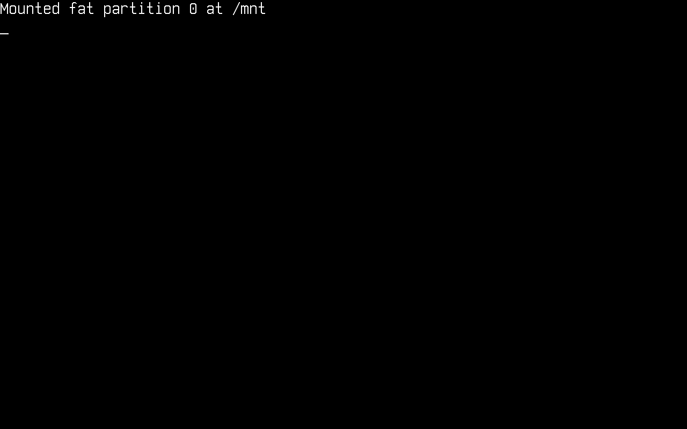
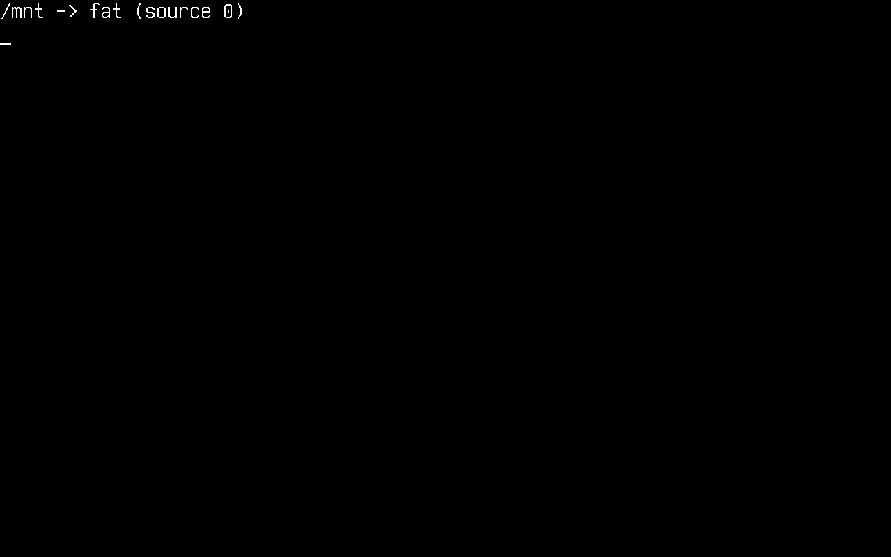
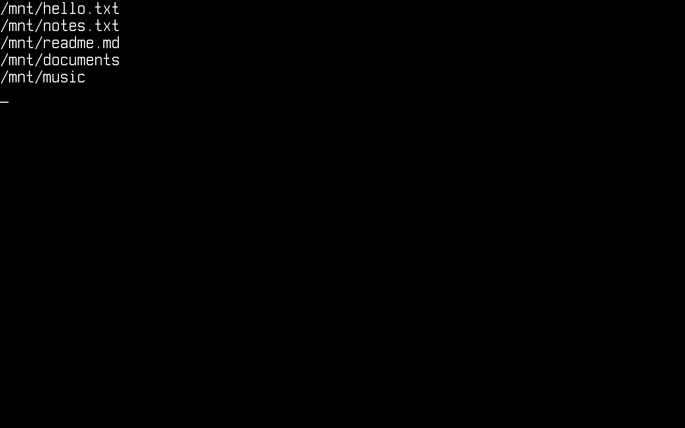
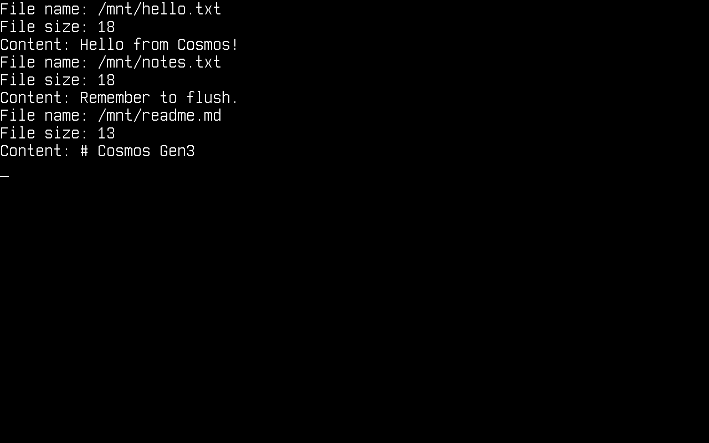
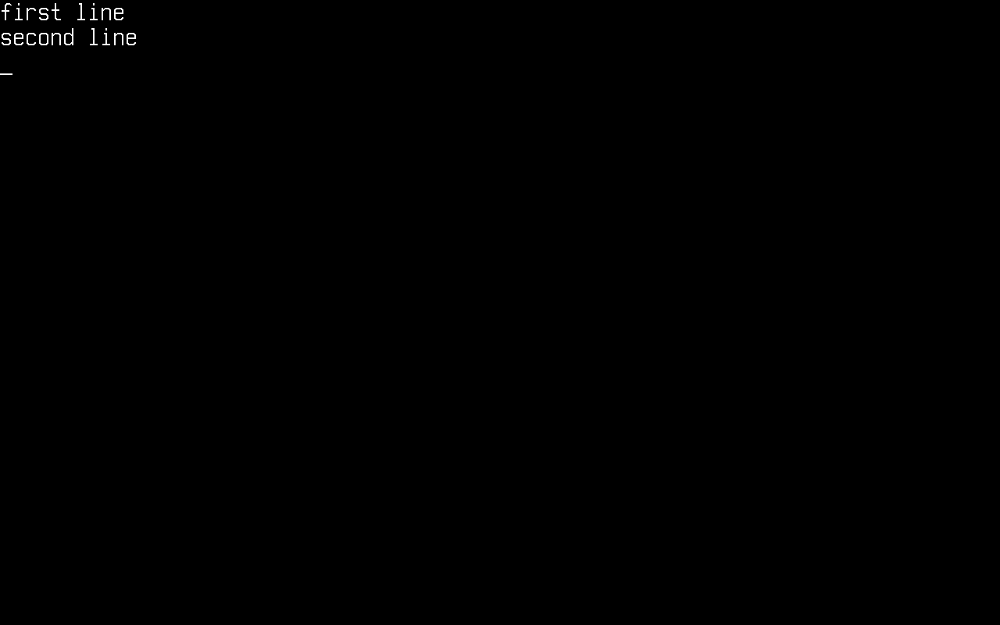

# File System

In this article, we will discuss using the Cosmos Gen3 VFS (virtual file system).
Unlike Gen2, where you talked to `CosmosVFS` and a plugged subset of `System.IO`, Gen3 gives you the **standard .NET `System.IO` API** — `File`, `Directory`, `FileStream`, `StreamReader`/`StreamWriter`, `FileInfo`/`DirectoryInfo` — running unmodified on top of the kernel's VFS. You mount a filesystem at a Unix-style mount point and use ordinary rooted paths.

The main differences if you come from Gen2:

| | Gen2 | Gen3 |
|---|---|---|
| Paths | DOS drive letters (`0:\file.txt`) | Unix paths (`/mnt/file.txt`) |
| Setup | `CosmosVFS` + `VFSManager.RegisterVFS` | `VfsManager.RegisterFilesystem` + `VfsManager.TryMount` |
| API surface | Plugged subset of `System.IO` | Full `System.IO` (streams, enumeration patterns, `FileInfo`, …) |
| `File.Move` | Not plugged (copy + delete) | Works, including onto-existing overwrite semantics |
| Filesystems | FAT32 (FAT12/16 partial) | FAT12/16/32 |

**Attention**: **Always** format your drive with Cosmos and **only** Cosmos if you plan to use it with Cosmos. Tools like Parted or FDisk are much more advanced and may lay the disk out differently than Cosmos expects.

**WARNING!**: Please do **not** try this on actual hardware! It may cause **IRREPARABLE DAMAGE** to your data. Use a virtual machine (QEMU via `cosmos run`, VMware, VirtualBox, …).

## Enable storage in your kernel

Storage support is behind a feature switch. Make sure your kernel's `.csproj` does not turn it off (it defaults to `true`):

```xml
<PropertyGroup>
  <CosmosEnableStorage>true</CosmosEnableStorage>
</PropertyGroup>
```

At boot the kernel initializes `StorageManager`, which registers every AHCI and NVMe device it finds and scans their MBR/GPT partition tables into `StorageManager.Partitions`.

To give your kernel a disk in QEMU, attach an image with `cosmos run`:

```console
$ qemu-img create disk.img 64M
$ cosmos run --disk disk.img            # attached as an AHCI disk (default)
$ cosmos run --disk disk.img,nvme       # or as an NVMe namespace
```

`--disk` is repeatable if you want several drives.

## Register a filesystem driver and mount it

These are the `using`s the snippets below rely on:

```csharp
using System.IO;
using Cosmos.Kernel.System.Storage;
using Cosmos.Kernel.System.Vfs;
using Cosmos.Kernel.System.Filesystems.Fat;
using Cosmos.Kernel.HAL.Vfs;
```

First, register a FAT driver under a name of your choice, then mount a partition at a mount point. For the FAT driver, the `source` argument is the index into `StorageManager.Partitions` as a string (`"0"` = first discovered partition across all disks). Add this to your kernel's `BeforeRun()`:

```csharp
FatFilesystemType fat = new();

VfsManager.RegisterFilesystem("fat", fat);

if (VfsManager.TryMount("fat", "0", MountFlags.None, "/mnt", out VfsManager.VfsMount? mount))
{
    Console.WriteLine("Mounted " + mount.Name + " partition " + mount.Source + " at " + mount.MountPoint);
}
```

<!-- screenshot: kernel console right after boot showing the "Mounted fat partition 0 at /mnt" line -->


From this point on, everything under `/mnt` is served by the FAT driver, and everything in this article is plain `System.IO`.

**Note**: `/` itself is a *virtual root*. It always exists — even with nothing mounted — and enumerating it lists the mount points. You cannot create files directly in it (`IOException`, read-only file system); create them under a mount point like `/mnt`.

### Alternative: a RAM disk

For quick experiments you don't need a disk image at all. A block device is just an `IBlockDevice` (from `Cosmos.Kernel.HAL.Interfaces.Devices`), and a RAM-backed one fits in a few lines — this is exactly what the kernel test suites use:

```csharp
internal sealed class MemoryBlockDevice : IBlockDevice
{
    private readonly byte[] _storage;

    public MemoryBlockDevice(string name, ulong blockSize, ulong blockCount)
    {
        Name = name;
        BlockSize = blockSize;
        BlockCount = blockCount;
        _storage = new byte[blockSize * blockCount];
    }

    public string Name { get; }
    public ulong BlockSize { get; }
    public ulong BlockCount { get; }

    public void ReadBlock(ulong blockNo, ulong blockCount, Span<byte> data)
        => _storage.AsSpan((int)(blockNo * BlockSize), (int)(blockCount * BlockSize)).CopyTo(data);

    public void WriteBlock(ulong blockNo, ulong blockCount, ReadOnlySpan<byte> data)
        => data.Slice(0, (int)(blockCount * BlockSize)).CopyTo(_storage.AsSpan((int)(blockNo * BlockSize)));

    public void Flush() { }
}
```

The FAT driver accepts an injected device directly (leave `source` empty when formatting and mounting):

```csharp
MemoryBlockDevice ramDisk = new("RAMDISK", 512, 65536);   // 32 MiB
FatFilesystemType fat = new(ramDisk);

fat.TryFormat(default, new FatFormatOptions { Type = FatType.Fat16 });

VfsManager.RegisterFilesystem("ramfat", fat);
VfsManager.TryMount("ramfat", "", MountFlags.None, "/mnt", out _);
```

## Format a disk

To format (mkfs) a partition through the VFS, use `VfsManager.TryFormat` with the driver name, the partition index and the driver's option type. The FAT formatter picks sane geometry from the options you give it:

```csharp
FatFormatOptions options = new()
{
    Type = FatType.Fat32,
    VolumeLabel = "COSMOS     ",
};

if (!VfsManager.TryFormat("fat", "0", options))
{
    Console.WriteLine("Format failed");
}
```

Formatting is refused while the source is mounted — unmount first with `VfsManager.TryUnmount("/mnt")`.

## List mounted volumes

`VfsManager.Mounts` is the mount table. Each entry tells you the driver name, the backing source and the mount point:

```csharp
foreach (VfsManager.VfsMount m in VfsManager.Mounts)
{
    Console.WriteLine(m.MountPoint + " -> " + m.Name + " (source " + m.Source + ")");
}
```

<!-- screenshot: console output of the mount-table loop, e.g. "/mnt -> fat (source 0)" -->


## Get a list of files

We start by getting a list of files, using:

```csharp
string[] files = Directory.GetFiles("/mnt");

foreach (string file in files)
{
    Console.WriteLine(file);
}
```

Search patterns work too — this is the stock BCL enumeration engine:

```csharp
string[] logs = Directory.GetFiles("/mnt", "*.txt");
```

<!-- screenshot: console listing a few files under /mnt -->


## Get a directory listing (files and other directories)

```csharp
string[] files = Directory.GetFiles("/mnt");
string[] directories = Directory.GetDirectories("/mnt");

foreach (string file in files)
{
    Console.WriteLine(file);
}
foreach (string directory in directories)
{
    Console.WriteLine(directory);
}
```

<!-- screenshot: console listing files and directories under /mnt -->


## Read all the files in a directory

We get the file list and print the content of each file. As in Gen2, keep filesystem code inside `try`/`catch` — the exceptions are the standard `System.IO` ones and they are catchable:

```csharp
try
{
    foreach (string file in Directory.GetFiles("/mnt"))
    {
        string content = File.ReadAllText(file);

        Console.WriteLine("File name: " + file);
        Console.WriteLine("File size: " + content.Length);
        Console.WriteLine("Content: " + content);
    }
}
catch (Exception e)
{
    Console.WriteLine(e.ToString());
}
```

<!-- screenshot: console showing a file's name, size and content -->


## Create a new file

```csharp
try
{
    using FileStream stream = File.Create("/mnt/testing.txt");
}
catch (Exception e)
{
    Console.WriteLine(e.ToString());
}
```

## Create a new directory

`Directory.CreateDirectory` creates the whole chain of missing parents in one call:

```csharp
try
{
    Directory.CreateDirectory("/mnt/documents/reports");
}
catch (Exception e)
{
    Console.WriteLine(e.ToString());
}
```

## Write to a file

```csharp
try
{
    File.WriteAllText("/mnt/testing.txt", "Learning how to use the Gen3 VFS!");
}
catch (Exception e)
{
    Console.WriteLine(e.ToString());
}
```

`File.AppendAllText`, `File.WriteAllBytes` and `File.WriteAllLines` work the same way.

## Read a specific file

```csharp
try
{
    Console.WriteLine(File.ReadAllText("/mnt/testing.txt"));
}
catch (Exception e)
{
    Console.WriteLine(e.ToString());
}
```

<!-- screenshot: console printing the file content written in the previous step -->


And for binary data:

```csharp
byte[] data = File.ReadAllBytes("/mnt/testing.txt");
Console.WriteLine("Read " + data.Length + " bytes");
```

## Copy, move, delete

Unlike Gen2, `File.Move` is fully supported — no copy-and-delete workaround needed. A move onto an existing destination throws `IOException` unless you pass `overwrite: true`; the overwrite is crash-safe (the destination is kept as a backup until the rename lands).

```csharp
try
{
    File.Copy("/mnt/testing.txt", "/mnt/copy.txt");
    File.Move("/mnt/copy.txt", "/mnt/renamed.txt");
    File.Delete("/mnt/renamed.txt");

    Directory.Delete("/mnt/documents", recursive: true);
}
catch (Exception e)
{
    Console.WriteLine(e.ToString());
}
```

Deleting a file that is still open does not fail: the delete goes *pending* and the entry disappears when the last handle closes, which is what the BCL's `DeleteOnClose` semantics expect.

## Streams

The full stream stack is available, including seeking, truncation (`SetLength`) and buffered text I/O:

```csharp
using (FileStream stream = new("/mnt/log.bin", FileMode.Create, FileAccess.ReadWrite))
{
    stream.Write(new byte[] { 1, 2, 3, 4 });
    stream.Seek(0, SeekOrigin.Begin);
    int first = stream.ReadByte();          // 1
}

using (StreamWriter writer = new("/mnt/notes.txt"))
{
    writer.WriteLine("first line");
    writer.WriteLine("second line");
}

using (StreamReader reader = new("/mnt/notes.txt"))
{
    string? line;
    while ((line = reader.ReadLine()) != null)
    {
        Console.WriteLine(line);
    }
}
```

<!-- screenshot: console printing the two lines read back through StreamReader -->


## Current directory and relative paths

The kernel keeps a current directory (it starts at `/`), so relative paths and `Path.GetFullPath` behave like on any Unix system:

```csharp
Directory.CreateDirectory("/mnt/work");
Directory.SetCurrentDirectory("/mnt/work");

File.WriteAllText("relative.txt", "resolved against the CWD");
Console.WriteLine(File.Exists("/mnt/work/relative.txt"));      // True
Console.WriteLine(Path.GetFullPath("sub/../file.txt"));        // /mnt/work/file.txt

Directory.SetCurrentDirectory("/");
```

## Error handling

The standard `System.IO` exception contract applies, so you can catch precisely:

- Opening a missing file whose parent exists → `FileNotFoundException`
- Any path under a missing directory (or an unmounted prefix) → `DirectoryNotFoundException`
- Creating a file directly in the virtual root `/` → `IOException` (read-only file system)
- Deleting a non-empty directory without `recursive: true` → `IOException`
- `File.Copy`/`File.Move` onto an existing file without overwrite → `IOException`

With **nothing mounted at all**, `System.IO` still degrades gracefully: `Directory.Exists("/")` is `true`, enumerating `/` returns an empty list, and every access to another path fails with one of the exceptions above — never a kernel fault.

## Current limitations

- Symbolic links and hard links are not supported (`ENOTSUP`/`EPERM` under the hood; the BCL surfaces `IOException`).
- File timestamps are not persisted yet (`File.SetLastWriteTime` is accepted but a FAT timestamp lands later).
- `DriveInfo` (free-space queries) is not wired up yet.
- FAT is the only filesystem driver today; the `IVfsFilesystemType` interface is what a new driver implements.

## How it works

Your code calls the stock BCL, which bottoms out in the Unix PAL (`Interop.Sys.*` P/Invokes). Those ~45 entry points are [plugged](plugs.md) in `Cosmos.Kernel.Plugs` — a file-descriptor table adapts the PAL contract (fds, dir streams, PAL errnos) and delegates to `VfsManager`, which owns path resolution, the mount table, the current directory and open-handle semantics, and dispatches to the mounted filesystem driver, which reads and writes an `IBlockDevice` (AHCI or NVMe via `StorageManager`, RAM via `MemoryBlockDevice`).

```
File / Directory / FileStream          (stock BCL)
        │
Interop.Sys.* PAL calls                (stock BCL, plugged)
        │
FileDescriptorTable                    (Cosmos.Kernel.Plugs — fds, dir streams, errno)
        │
VfsManager                             (mounts, paths, CWD, open handles)
        │
IVfsFilesystemType / IVfsSuperblock    (FAT driver)
        │
IBlockDevice                           (AHCI, NVMe, MemoryBlockDevice)
```
