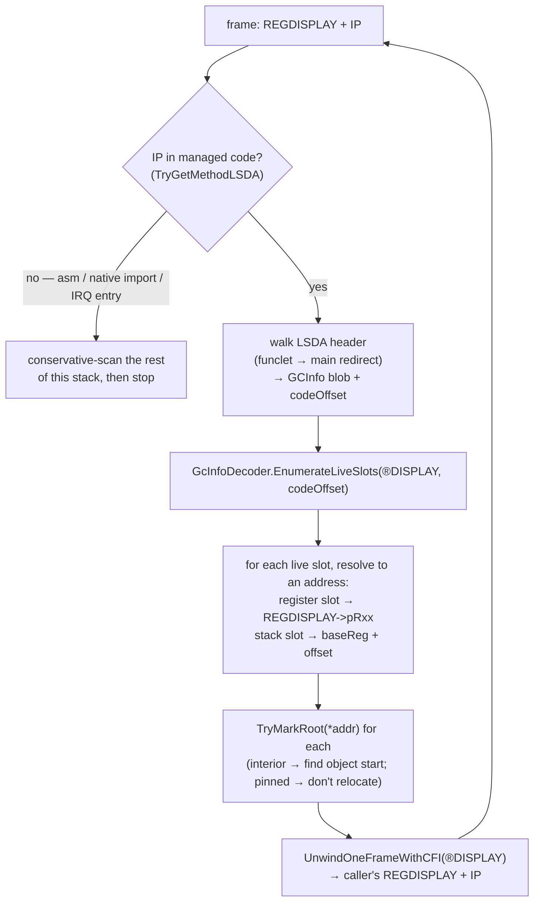

## Overview

This article describes the **target** design for how the garbage collector finds roots on thread
stacks: a **precise** per-frame scan driven by the **GCInfo** metadata the NativeAOT compiler (ILC)
emits for every method. It replaces the **conservative** scan documented in
[Garbage Collector → Mark phase](garbage-collector.md#mark-phase).

> **Status — not yet implemented.** The GC still uses the conservative scan today. This is the
> architecture the project is moving to. The problem is tracked in
> [issue #346](https://github.com/valentinbreiz/nativeaot-patcher/issues/346); the staged rollout
> is [issue #348](https://github.com/valentinbreiz/nativeaot-patcher/issues/348); the first
> plumbing (a feature flag, IRQ save/restore natives, a stress test) landed in
> [PR #347](https://github.com/valentinbreiz/nativeaot-patcher/pull/347). The conservative scan
> stays the default until the rollout in [Rollout status](#rollout-status) completes.

---

## Why conservative scanning has to go

### What the conservative scan does

During the mark phase the GC has to discover every object still reachable from a thread's stack —
local variables, spilled registers, method arguments. It does **not** know which stack words are
object references and which are integers, so it treats *every* pointer-sized word as a candidate:
`ScanStackRoots` → `ScanThreadStack` → `ScanMemoryRange` → `TryMarkRoot` in
[`GarbageCollector.Mark.cs`](../../src/Cosmos.Kernel.Core/Memory/GarbageCollector/GarbageCollector.Mark.cs).
`TryMarkRoot` keeps a candidate only if it lands inside the GC heap (`IsInGCHeap`) and the
`MethodTable*` it would point at lives in the kernel's higher half — but those are plausibility
filters, not proof.

```
   conservative scan — "anything that LOOKS like a heap pointer is a root"
   ─────────────────────────────────────────────────────────────────────────────
   a thread's stack, walked 8 bytes at a time:

   ┌────────────────────┐
   │ 0x0000000000000007 │  int 7              → not in heap range, ignored
   │ 0xFFFF8001A2B3C4D0 │  live List<int> ref → in heap range      → MARKED  ✅ correct
   │ 0xFFFF8001DEADBEEF │  dead spill slot    → still in range     → MARKED  ❌ false root
   │ 0x00007FFE12340000 │  a return address   → not in range       → ignored
   │ 0xFFFF8001CAFE0000 │  stale callee ptr   → still in range     → MARKED  ❌ false root
   └────────────────────┘
```

### Problem 1 — over-rooting

Any stale heap pointer left in a dead spill slot, a scratch slot, or a not-yet-overwritten callee
frame is treated as a root, so the object it points at — and everything that object transitively
references — survives the collection. A false root through a strong reference **leaks silently**. A
false root that keeps a *weak* reference's target alive is at least noticed: a weak handle that
should have been cleared after collection still resolves, which is what CI catches.

### Problem 2 — layout-fragility (the `InterruptScope` regression)

Because the scan reads "whatever word is at this stack offset", its correctness depends on the exact
stack layout the compiler chose — which slot the compiler reused, which value it left there, whether
the GC's scan range happens to cover it. That layout shifts whenever codegen shifts.

The concrete instance ([issue #346](https://github.com/valentinbreiz/nativeaot-patcher/issues/346)):
commit `6c497186` added one field — `private ulong _savedFlags;` — to the
[`InterruptScope`](../../src/Cosmos.Kernel.Core/CPU/InternalCpu.cs) `ref struct`. `InterruptScope`
is a `ref struct`, so it always lives on the stack, and `DisableInterruptsScope()` plus the
constructor are `AggressiveInlining`'d, so the struct's fields become locals in the caller's frame —
and `using (InternalCpu.DisableInterruptsScope())` wraps GC, heap and scheduler hot paths (`GC.Collect`,
`Heap.Alloc`/`Free`, scheduler context switch). The extra 8 bytes shifted the slots below it. A
stale `byte[128]` pointer left in a returned frame landed in a slot the conservative scan reads, the
array was kept alive, its weak handle was not cleared, and the GarbageCollector suite's tests 14
(`GC_WeakReference`) and 20 (`GC_DependentHandleCleanup`) failed **on ARM64**. The field was
reverted in `2f1b6d17`, and `InterruptScope` is now frozen — no field may be added to it until
precise scanning lands.

### Why ARM64 broke and x64 didn't

Same source change, different outcome per architecture, because "is there a stale heap pointer in a
slot the scan reads" is a codegen artifact, and ILC makes independent decisions per arch:

- **Register file.** x64 has 16 general-purpose registers; ARM64 has 31. The register allocator
  spills different values to different stack slots — so the stale `byte[128]` pointer lived in a
  spilled slot on one arch and in a register (reused before the GC ran) on the other.
- **Frame setup and alignment.** x64 (`push rbp` / `sub rsp, N`) and ARM64
  (`stp x29, x30, [sp, #-N]!`, SP kept 16-byte aligned at all times) absorb 8 extra bytes
  differently — on one arch it fell into existing alignment padding, on the other it pushed every
  slot below it down and re-ran register allocation.
- **Inlining.** ILC's inliner uses a per-arch cost model, so the set of live frames at GC time
  differs.

The arch asymmetry *is* the problem statement: the GC is not consistently broken, it is broken
whenever the compiler happens to put a stale pointer in a slot the scan reads — adding a field, an
ILC upgrade, or a refactor that introduces a local are all the same class of failure. ARM64 GC CI
is the canary because, empirically, ARM64 codegen surfaces this first.

### The shortcut that doesn't work

A tempting half-measure is to keep the conservative scan but only read live frame ranges, found by
walking the RBP / X29 frame-pointer chain. That is **not safe here**: ILC compiles many functions
without a frame pointer (`-fomit-frame-pointer`-style codegen), so the frame chain silently *skips*
those frames. The kernel's own exception unwinder documents this — see the comment in
[`ExceptionHandling.cs`](../../src/Cosmos.Kernel.Core/Runtime/ExceptionHandling.cs) (around the x64
`REGDISPLAY` construction): *"CFI says RBP is 'SameValue' because function may use
-fomit-frame-pointer …"*. For exception dispatch a skipped frame is tolerable (worst case: a missed
catch handler). For the GC a skipped frame means **missed roots**, which collects a live object →
use-after-free during sweep — strictly worse than the false-rooting it was meant to remove. Precise
GCInfo is the only correct path.

---

## What GCInfo is

When ILC compiles a method it emits, alongside the machine code, a small **GCInfo blob** that
answers exactly one question:

> *If a GC fires while execution is at code offset N inside this method, which CPU registers and
> which stack slots hold live object references — and which of those are interior pointers, and
> which are pinned?*

One blob per method. It is what makes a *precise* scan possible: instead of guessing which stack
words look like pointers, the GC asks the compiler.

### Where it lives in the binary

ILC writes, per method, a record into the `.dotnet_eh_table` section, laid out
`[LSDA header][GCInfo blob][EH clauses]`. The linker keeps that section and its bounds — see
`*(.dotnet_eh_table)` and `__dotnet_eh_table_start` / `__dotnet_eh_table_end` in
[`linker.x64.ld`](../../src/Cosmos.Build.Templates/Linker/linker.x64.ld) and
[`linker.arm64.ld`](../../src/Cosmos.Build.Templates/Linker/linker.arm64.ld). The DWARF `.eh_frame`
FDE for a method carries a pointer to that record's LSDA header — and the GC's per-frame walk already
extracts it (`TryGetMethodLSDA` in
[`ExceptionHandling.cs`](../../src/Cosmos.Kernel.Core/Runtime/ExceptionHandling.cs)). So an
instruction pointer is only an LSDA-header walk away from the GCInfo blob — **no build-pipeline, no
post-link tool, no patcher change is needed**.

```
 .dotnet_eh_table  (kept by the linker; bounded by __dotnet_eh_table_start/end)
 ═══════════════════════════════════════════════════════════════════════════════
       ... record for method Foo() ...                 ... record for Bar() ...
 ┌──────────────────────────────────────────────┐    ┌──────────────────────────┐
 │ LSDA header                                  │    │ LSDA header              │
 │   byte 0 = unwindBlockFlags                  │    │ ...                      │
 │     UBF_FUNC_KIND_MASK 0x03   ROOT/HANDLER/  │    │                          │
 │                               FILTER         │    │                          │
 │     UBF_FUNC_HAS_EHINFO 0x04                 │    │                          │
 │     UBF_FUNC_HAS_ASSOCIATED_DATA 0x10        │    │                          │
 │   (funclet only) int32 → rel offset to the   │    │                          │
 │     main method's LSDA, int32 → start delta  │    │                          │
 │     — a funclet reuses its main method's     │    │                          │
 │     GCInfo                                   │    │                          │
 │   (if HAS_ASSOCIATED_DATA) int32 ptr         │    │                          │
 │   (if HAS_EHINFO)          int32 ptr         │    │                          │
 │ >>> GCInfo blob <<<  ◄───────────────────────┼────┼── what the precise scan   │
 │   (bit-packed, see below)                    │    │   decodes                 │
 │ EH clauses (try/catch/finally table)         │    │                          │
 └──────────────────────────────────────────────┘    └──────────────────────────┘
        ▲
        │ a .eh_frame FDE points its LSDA pointer here.  TryGetMethodLSDA already returns it.
        │ codeOffset = ip - methodStart
```

The LSDA header layout above is the format the NativeAOT runtime parses — see `FindMethodInfo` /
`GetCodeOffset` in `dotnet/runtime/src/coreclr/nativeaot/Runtime/unix/UnixNativeCodeManager.cpp`.

### What's inside the blob

GCInfo is a tightly bit-packed stream (every field is the minimum number of bits — it is not
byte-aligned). Logically it has three parts:

| Part | Contents |
|------|----------|
| **Header** | Version and flags, code length (must equal the FDE's PC range — a useful sanity check), prolog size / epilog locations (GCInfo is invalid mid-prolog), the stack-base register the slot offsets are relative to (one of `CALLER_SP`/CFA, `SP`, `FP`), whether a security object / GS cookie / PSPSym / generics-instantiation context is present, number of safepoints, number of interruptible ranges. |
| **Slot table** | The universe of slots this method ever uses for object refs. Each slot is either a **register** (by number) or a **stack slot** (base register + signed offset). Flags per slot: `GC_SLOT_UNTRACKED` (live for the whole method body — the cheap case, no per-offset bookkeeping), `GC_SLOT_INTERIOR` (the value is a pointer into the *middle* of an object, not its header), `GC_SLOT_PINNED` (must not be relocated). |
| **Liveness** | Which slots from the table are live at which code offsets. A *fully-interruptible* method encodes a bitmap valid at any IP in a range; a *partially-interruptible* method encodes liveness as deltas at each **safepoint** (= call site) only. |

```
 GCInfo for a fully/partially-interruptible method, conceptually:

   slot table:  slot0 = REG  RSI                    (holds 's')
                slot1 = STACK base=CFA  off=-0x18   (holds 'a')          flags: (none)
                slot2 = STACK base=CFA  off=-0x20                        flags: INTERIOR  (&arr[3])
                slot3 = STACK base=SP   off=+0x08                        flags: PINNED

   liveness over the method body [0x00 .. codeLength]:
        offset:  0x00 ──── 0x4A ──────── 0x6C ──────── 0x9F ──── (codeLength)
        slot1:   .........██████████████.............................
        slot0:   ......................████████████████████████████
                          ▲ at 0x4A only slot1 (the array) is live
                                       ▲ at 0x6C only slot0 (the string) is live
```

### A tiny worked example

```csharp
static void Foo()
{
    byte[] a = new byte[128];     // 'a' is an object reference
    Bar();                        // ←(I) call site = safepoint; 'a' is still needed below ⇒ live here
    GC.KeepAlive(a);
    string s = Compute();         // 's' is an object reference; 'a' is now dead
    Console.WriteLine(s);         // ←(II) call site = safepoint; 's' live, 'a' dead here
}
```

- GC fires while `Foo`'s frame is on the stack with the IP at the return address after `Bar()`
  → `codeOffset` resolves to safepoint (I) → GCInfo reports **only the slot holding `a`** → the
  `byte[128]` is kept, nothing else.
- GC fires with the IP at the return address after `WriteLine` → safepoint (II) → GCInfo reports
  **only the register holding `s`** → the `byte[128]` is **not** reported and is collected, *even
  though its stale pointer is still sitting in `a`'s stack slot*. That last case is exactly what the
  conservative scan gets wrong.

The authoritative format and decoder semantics are `dotnet/runtime/src/coreclr/vm/gcinfodecoder.cpp`
(`GcInfoDecoder::EnumerateLiveSlots`, built with `GCINFODECODER_NO_EE` for NativeAOT) and
`dotnet/runtime/src/coreclr/inc/{gcinfotypes.h,gcinfodecoder.h}` (encoding constants, slot flags,
`GCINFO_VERSION`). A readable managed implementation of the same bit-stream — written for dumping,
the obvious thing to port from — is
`dotnet/runtime/src/coreclr/tools/aot/ILCompiler.Reflection.ReadyToRun/Amd64/{GcInfo,GcSlotTable,GcTransition}.cs`.

---

## How a precise scan walks a thread

A precise scan walks a thread one frame at a time. For each frame it has two inputs: the **IP**
(the return address pointing into that method's code) and a **`REGDISPLAY`** — a struct holding
pointers to where this frame's register values currently live. Both come from machinery the kernel
already has, built for exception handling ([issue #227](https://github.com/valentinbreiz/nativeaot-patcher/issues/227)):
the `REGDISPLAY` struct (laid out to match NativeAOT's), `TryGetMethodLSDA`, the DWARF `.eh_frame`
FDE/CIE parsing, and `UnwindOneFrameWithCFI` (executes DWARF call-frame instructions to reconstruct
the caller's register state) — all in
[`ExceptionHandling.cs`](../../src/Cosmos.Kernel.Core/Runtime/ExceptionHandling.cs). The GC scanner
drives the same per-frame loop the exception dispatcher does.



`TryMarkRoot` stays the callback — its heap-range and `MethodTable` checks are harmless
belt-and-braces on a precisely-reported root, and it is also what the conservative-tail fallback
uses. The fallback matters: Cosmos has frames with no GCInfo — interrupt entry stubs, the context
switch, native imports — so when the walk reaches an IP outside managed code, the scanner
conservative-scans the remaining stack range for that thread and stops, rather than crashing.

---

## The safepoint constraint

GCInfo is only valid at **safepoints**: call sites for a partially-interruptible method, or any IP
inside a fully-interruptible range. So whether a precise scan of a given thread is *sound* depends on
where that thread's instruction pointer is when the GC runs:

1. **The thread that triggered the GC.** It reached the collector through a managed call chain into
   the allocator, so every return address up its stack is a call-site safepoint. A precise scan of
   this thread is sound. Exception **funclet** frames (catch / filter / finally bodies) are entered
   via the dispatcher's `call` too, so they are also safepoints — a funclet frame is scanned with
   its *main* method's GCInfo at the funclet's code offset (the LSDA-header redirect points there).

2. **Threads parked in the scheduler.** A thread sitting in the run queue, blocked, or sleeping was
   preempted by the timer IRQ at an **arbitrary** instruction — not necessarily a safepoint, so its
   GCInfo lookup may be meaningless there. Stock NativeAOT solves this with **return-address
   hijacking**: before scanning such a thread, the runtime overwrites the on-stack return address
   with the address of a stub, lets the thread run to that return, parks it at the stub (a safepoint
   by construction), scans it precisely, then restores the real return address. Cosmos has no such
   subsystem yet.

Consequence — the rollout is staged: precise scanning is enabled where it is provably sound first
(the GC-triggering thread, then funclet frames), hijacking for preempted threads comes next, and the
default flip comes last. Until then the conservative scan covers every thread the precise scan does
not yet handle. The threads the GC iterates and their saved register state come from the scheduler's
thread registry — see [Scheduler](scheduler.md), `SchedulerManager`, and
[`ThreadContext.X64.cs`](../../src/Cosmos.Kernel.Core/Scheduler/ThreadContext.X64.cs) /
[`ThreadContext.ARM64.cs`](../../src/Cosmos.Kernel.Core/Scheduler/ThreadContext.ARM64.cs).

---

## What already exists

So the article is honest about design-vs-done, here is what is already in the tree and what the
precise scan reuses:

| Piece | Where | Status |
|-------|-------|--------|
| CFI unwinder, `REGDISPLAY`, `TryGetMethodLSDA`, `UnwindOneFrameWithCFI`, `.eh_frame` FDE/CIE parsing | [`ExceptionHandling.cs`](../../src/Cosmos.Kernel.Core/Runtime/ExceptionHandling.cs) | exists (built for [#227](https://github.com/valentinbreiz/nativeaot-patcher/issues/227)) — the per-frame walk machinery |
| `.dotnet_eh_table` kept, with `__dotnet_eh_table_start/end` | [`linker.x64.ld`](../../src/Cosmos.Build.Templates/Linker/linker.x64.ld), [`linker.arm64.ld`](../../src/Cosmos.Build.Templates/Linker/linker.arm64.ld) | exists — GCInfo is reachable at runtime via the FDE LSDA |
| `CosmosEnableConservativeGCStackScan` MSBuild prop → `CosmosFeatures.ConservativeStackScan` | [`CosmosFeatures.cs`](../../src/Cosmos.Kernel.Core/CosmosFeatures.cs), Sdk props | exists ([PR #347](https://github.com/valentinbreiz/nativeaot-patcher/pull/347)) — default `true`; when `false` today, `ScanStackRoots` panics with a `#346` message until the precise path is wired |
| `_native_cpu_save_irq_and_disable` / `_native_cpu_restore_irq` natives + `CpuNative` partials | [`CpuNative.cs`](../../src/Cosmos.Kernel.Core/Bridge/Import/CpuNative.cs), `Cosmos.Kernel.Native.X64/CPU/CpuOps.s`, `Cosmos.Kernel.Native.ARM64/CPU/CpuOps.s` | exists ([PR #347](https://github.com/valentinbreiz/nativeaot-patcher/pull/347)) — **unused**; staged for re-adding `InterruptScope._savedFlags` once precise scan covers every thread |
| `GC_StackScanPaddingStress` test (GarbageCollector suite) | `tests/Kernels/Cosmos.Kernel.Tests.GarbageCollector` | exists ([PR #347](https://github.com/valentinbreiz/nativeaot-patcher/pull/347)) — runs the weak-ref pattern across several `stackalloc` padding shapes; widens the net for layout-sensitive false-rooting |

No build-pipeline, post-link, ILC, or `Cosmos.Patcher` change is part of this work — GCInfo is
already emitted into `.dotnet_eh_table` and reachable via the FDE LSDA.

---

## Rollout status

The staged plan; [issue #348](https://github.com/valentinbreiz/nativeaot-patcher/issues/348) is the
source of truth (roughly one PR per phase, x64 first, ARM64 follow-up).

| Phase | Lands | State |
|-------|-------|-------|
| 0 | Scaffolding: feature flag, IRQ save/restore natives, padding-stress test | done — [PR #347](https://github.com/valentinbreiz/nativeaot-patcher/pull/347) |
| 1 | `GcInfoDecoder` (port of the bit-stream decoder) — header, slot table, `EnumerateLiveSlots`, `IsSafePoint`; x64 first, ARM64 behind `#if ARCH_ARM64` | planned |
| 2 | IP→GCInfo plumbing (LSDA-header walk, incl. funclet→main redirect) + precise-scan the GC-triggering thread; other threads stay conservative | planned |
| 3 | Exception-funclet frames scanned precisely — targets [#227](https://github.com/valentinbreiz/nativeaot-patcher/issues/227) | planned |
| 4 | Return-address hijacking for preempted threads (the subsystem stock NativeAOT has, Cosmos lacks); `InterruptScope._savedFlags` becomes safe to re-add | planned |
| 5 | Flip `CosmosEnableConservativeGCStackScan` default to `false`; keep the conservative branch as an explicit opt-out debugging fallback; close [#346](https://github.com/valentinbreiz/nativeaot-patcher/issues/346) | planned |

Boundary today: the conservative scan in [Garbage Collector → Mark phase](garbage-collector.md#mark-phase)
is the only stack-root scan that runs. Each phase shrinks the set of frames that need it.

---

## Source files

| File | Path | Role |
|------|------|------|
| Exception handling / CFI unwinder | [`src/Cosmos.Kernel.Core/Runtime/ExceptionHandling.cs`](../../src/Cosmos.Kernel.Core/Runtime/ExceptionHandling.cs) | `REGDISPLAY`, `TryGetMethodLSDA`, `UnwindOneFrameWithCFI`, `.eh_frame` parsing — reused as-is |
| Mark phase (conservative scan) | [`src/Cosmos.Kernel.Core/Memory/GarbageCollector/GarbageCollector.Mark.cs`](../../src/Cosmos.Kernel.Core/Memory/GarbageCollector/GarbageCollector.Mark.cs) | `ScanStackRoots`, `ScanThreadStack`, `ScanMemoryRange`, `TryMarkRoot` |
| Linker scripts | [`src/Cosmos.Build.Templates/Linker/linker.x64.ld`](../../src/Cosmos.Build.Templates/Linker/linker.x64.ld), [`linker.arm64.ld`](../../src/Cosmos.Build.Templates/Linker/linker.arm64.ld) | keep `.dotnet_eh_table` + `__dotnet_eh_table_start/end` |
| Feature flag | [`src/Cosmos.Kernel.Core/CosmosFeatures.cs`](../../src/Cosmos.Kernel.Core/CosmosFeatures.cs) | `ConservativeStackScan` |
| IRQ save/restore natives | [`src/Cosmos.Kernel.Core/Bridge/Import/CpuNative.cs`](../../src/Cosmos.Kernel.Core/Bridge/Import/CpuNative.cs), `Cosmos.Kernel.Native.{X64,ARM64}/CPU/CpuOps.s` | staged for `InterruptScope._savedFlags` re-add |
| `InterruptScope` | [`src/Cosmos.Kernel.Core/CPU/InternalCpu.cs`](../../src/Cosmos.Kernel.Core/CPU/InternalCpu.cs) | the frozen `ref struct` from the [#346](https://github.com/valentinbreiz/nativeaot-patcher/issues/346) regression |
| Thread context | [`src/Cosmos.Kernel.Core/Scheduler/ThreadContext.X64.cs`](../../src/Cosmos.Kernel.Core/Scheduler/ThreadContext.X64.cs), [`ThreadContext.ARM64.cs`](../../src/Cosmos.Kernel.Core/Scheduler/ThreadContext.ARM64.cs) | saved registers / IP per parked thread |
| GCInfo decoder | `src/Cosmos.Kernel.Core/Runtime/GcInfo/GcInfoDecoder.cs` (+ bit-stream reader, slot table) | **planned** — Phase 1 |
| IP→GCInfo lookup | `src/Cosmos.Kernel.Core/Runtime/GcInfo/MethodGcInfoLookup.cs` | **planned** — Phase 2 |
| Precise stack scan | `src/Cosmos.Kernel.Core/Memory/GarbageCollector/GarbageCollector.PreciseStack.cs` | **planned** — Phase 2 |
| Hijack stub | `src/Cosmos.Kernel.Native.X64/.../Hijack.s` (+ ARM64 sibling) | **planned** — Phase 4 |

### References

- Issues: [#346 — replace conservative stack scanning](https://github.com/valentinbreiz/nativeaot-patcher/issues/346),
  [#348 — EPIC: precise GCInfo stack scan](https://github.com/valentinbreiz/nativeaot-patcher/issues/348),
  [#227 — catch-handler crash printing `ex.Message`](https://github.com/valentinbreiz/nativeaot-patcher/issues/227)
- PR: [#347 — #346 scaffolding](https://github.com/valentinbreiz/nativeaot-patcher/pull/347)
- Commits: `6c497186` (added `InterruptScope._savedFlags`, triggered the regression), `2f1b6d17` (the revert)
- Upstream `dotnet/runtime`: `src/coreclr/vm/gcinfodecoder.cpp`, `src/coreclr/inc/{gcinfotypes.h,gcinfodecoder.h}`,
  `src/coreclr/nativeaot/Runtime/unix/UnixNativeCodeManager.cpp` (`FindMethodInfo` / `GetCodeOffset`),
  `src/coreclr/tools/aot/ILCompiler.Reflection.ReadyToRun/Amd64/{GcInfo,GcSlotTable,GcTransition}.cs`
- Related articles: [Garbage Collector](garbage-collector.md), [Scheduler](scheduler.md)
