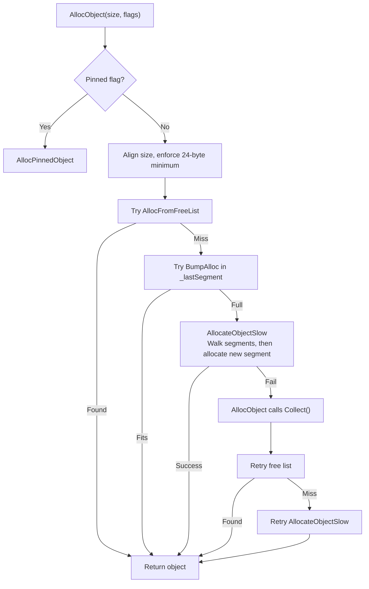
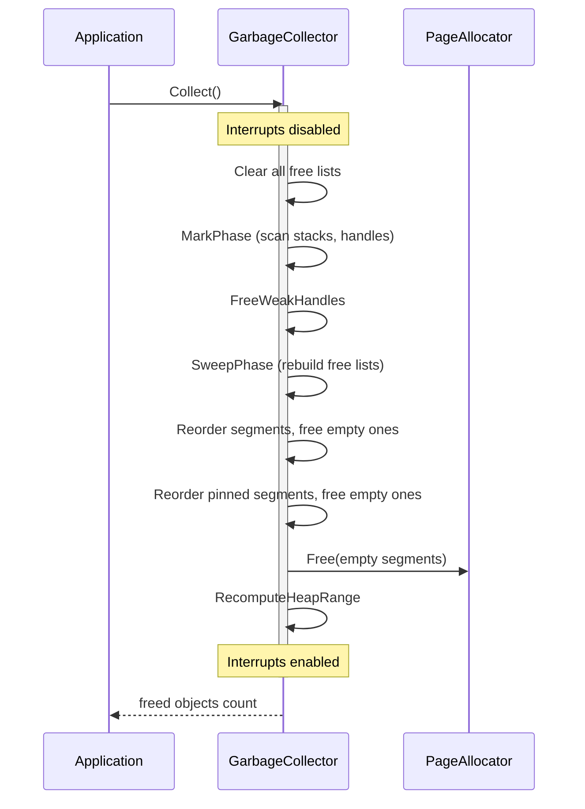
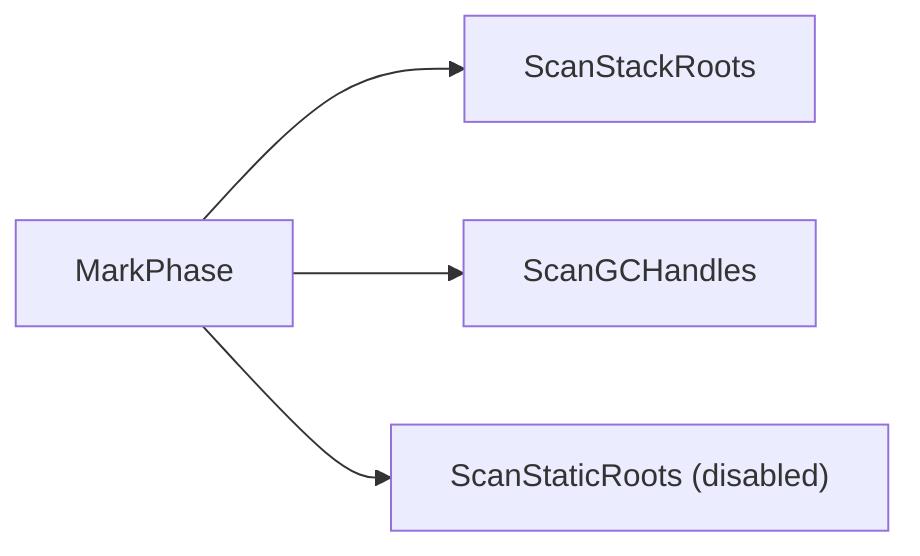
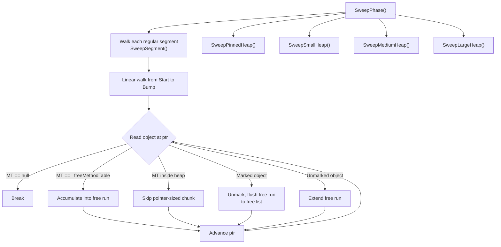

## Overview

The garbage collector is a **mark-and-sweep** collector. It manages object lifetimes across multiple GC-managed heaps (including the GC heap, GC handles, pinned heap, and frozen segments), tracks roots through conservative stack scanning and GC handles, and runs with interrupts disabled as a stop-the-world collection.

All GC code lives in the `GarbageCollector` partial class split across four files:

| File | Responsibility |
|------|----------------|
| [`GarbageCollector.cs`](../../src/Cosmos.Kernel.Core/Memory/GarbageCollector.cs) | Core allocator, mark phase, sweep phase, free lists, segments |
| [`GarbageCollector.GCHandler.cs`](../../src/Cosmos.Kernel.Core/Memory/GarbageCollector.GCHandler.cs) | GC handle table (Weak, Normal, Pinned handles) |
| [`GarbageCollector.Frozen.cs`](../../src/Cosmos.Kernel.Core/Memory/GarbageCollector.Frozen.cs) | Frozen segment registration (pre-initialized read-only data) |
| [`GarbageCollector.PinnedHeap.cs`](../../src/Cosmos.Kernel.Core/Memory/GarbageCollector.PinnedHeap.cs) | Pinned object allocation and sweeping |

---

### MethodTable struct

Every managed type compiled by the NativeAOT compiler (ILC) has a `MethodTable`, a type descriptor struct that lives in the kernel's code/data sections (never on the GC heap). The GC relies on several of its fields:

| Field | Purpose |
|-------|---------|
| `RawBaseSize` / `BaseSize` | Size of a fixed-size object (in bytes) |
| `ComponentSize` | Size of each element for arrays/strings |
| `HasComponentSize` | True for arrays and strings |
| `ContainsGCPointers` | True if the type has reference-type fields the GC must trace |

Because `MethodTable` pointers always reside in kernel code sections, the GC uses `IsInGCHeap((nint)mt)` as a validity check. If a `MethodTable*` points inside the heap, it cannot be a real type descriptor and the candidate object is rejected.

### Object struct

Every managed object on the GC heap starts with a [`GCObject`](../../src/Cosmos.Kernel.Core/Memory/GCObject.cs) header:

```
              ┌──────────────────────────────────┐
              │  MethodTable*  (8 bytes on x64)  │  ← bit 0 used as mark bit
              ├──────────────────────────────────┤
              │  Length         (4 bytes)        │  ← element count for arrays/strings
              ├──────────────────────────────────┤
              │  ... object fields / elements ...│
              └──────────────────────────────────┘
```

**Mark bit encoding**: The least significant bit of the `MethodTable` pointer doubles as the mark flag. Since `MethodTable` pointers are always aligned, bit 0 is normally zero. `Mark()` sets it to 1, `Unmark()` clears it. Any code that needs the real `MethodTable*` calls `GetMethodTable()` which masks off bit 0.

### FreeBlock struct

Dead objects discovered during sweep are converted into `FreeBlock` entries. A `FreeBlock` is deliberately laid out to be walkable like a `GCObject` so the sweep can iterate through a segment linearly without distinguishing between live objects, dead objects, and free blocks until it inspects the `MethodTable`:

```
              ┌──────────────────────────────────┐
              │  MethodTable*  (8 bytes on x64)  │  ← points to _freeMethodTable marker
              ├──────────────────────────────────┤
              │  Size           (4 bytes)        │  ← total size of this free block
              ├──────────────────────────────────┤
              │  Next*          (8 bytes)        │  ← next FreeBlock in this size class bucket
              └──────────────────────────────────┘
```

---

## Memory layout

### Single segment

Each segment is a contiguous memory region obtained from the page allocator. The `GCSegment` header sits at the start of the allocated pages, followed by the usable region where objects are placed:

```
                         one segment (1+ pages from PageAllocator)
┌ ─ ─ ─ ─ ─ ─ ─ ─ ─ ─ ─ ─ ─ ─ ─ ─ ─ ─ ─ ─ ─ ─ ─ ─ ─ ─ ─ ─ ─ ─ ─ ─ ─ ─ ─ ─ ─ ┐

│  GCSegment header              Usable region                              │
  ┌────────────────┐ ┌──────────────────────────────────────────────────┐
│ │ Next ──────────────► (next segment or null)                         │   │
  │ Start ─────────┼►│                                                  │
│ │ End ───────────┼─┼─────────────────────────────────────────────────►│   │
  │ Bump ──────────┼─┼───────────────────────────►│                     │
│ │ TotalSize      │ │                            │                     │   │
  │ UsedSize       │ │ [obj A] [obj B] [free] ... │   (unallocated)     │
│ └────────────────┘ └──────────────────────────────────────────────────┘   │

└ ─ ─ ─ ─ ─ ─ ─ ─ ─ ─ ─ ─ ─ ─ ─ ─ ─ ─ ─ ─ ─ ─ ─ ─ ─ ─ ─ ─ ─ ─ ─ ─ ─ ─ ─ ─ ─ ┘
                     ◄─── allocated objects ───►◄── free space ──►
                          & free blocks           (bump region)
```

- **Start → Bump**: contains allocated objects and free blocks (left behind by dead objects after a collection).
- **Bump → End**: untouched space. New objects are placed at `Bump`, which advances forward.

### Regular GC chains

The GC maintains **two independent linked lists** of segments — one for the regular heap, one for pinned objects:

```
 Regular GC heap chain (_segments)
 ═══════════════════════════════════════════════════════════════════

 _segments                                                _tailSegment
     │                                                         │
     ▼                                                         ▼
 ┌────────┐    Next    ┌────────┐    Next    ┌────────┐       ┌────────┐
 │ Seg 0  │──────────► │ Seg 1  │──────────► │ Seg 2  │─···─► │ Seg N  │──► null
 │ (FULL) │            │(SEMI)  │            │(SEMI)  │       │ (FREE) │
 └────────┘            └────────┘            └────────┘       └────────┘
                            ▲
                            │
                  _lastSegment / _currentSegment
                  (next alloc starts here)


 Pinned heap chain (_pinnedSegments)
 ═══════════════════════════════════════════════════════════════════

 _pinnedSegments
     │
     ▼
 ┌────────┐    Next    ┌────────┐
 │ Pin 0  │──────────► │ Pin 1  │──► null
 │ (FULL) │            │(SEMI)  │
 └────────┘            └────────┘
                            ▲
                            │
                    _currentPinnedSegment
```

Objects allocated with the `GC_ALLOC_PINNED_OBJECT_HEAP` flag go to the **pinned chain**.

The GC tracks two segment pointers for the regular heap: `_lastSegment` is the segment where the next allocation attempt begins (set to the first semifull or free segment after collection), and `_currentSegment` tracks the segment that last successfully served an allocation. Both are updated together during bump allocation and segment reordering.

After each collection, segments in both chains are sorted into three groups: **FULL** (bump reached end) → **SEMIFULL** (partially used) → **FREE** (empty). Empty multi-page segments are returned to the page allocator entirely. `_lastSegment` is set to the first semifull (or free) segment so the next allocation targets available space first.

### Handle store

GC handles let the runtime hold references to managed objects from locations the GC does not automatically scan (registers, native code, internal caches). For example, `RuntimeType` caches a `RuntimeTypeInfo` via a weak GC handle — without a handle, the GC would not know that the cached object is still reachable and might collect it. Handle types control lifetime: `Weak` handles do not prevent collection, while `Normal` and `Pinned` handles keep objects alive.

The handle table is stored in a dedicated `GCSegment` allocated at GC initialization.

Each handle entry is:

```
GCHandle (24 bytes on x64)
┌──────────────────────────┐
│ GCObject* obj            │  ← the referenced object
├──────────────────────────┤
│ GCHandleType type        │  ← Weak, Normal, or Pinned
├──────────────────────────┤
│ nuint extraInfo          │  ← used for dependent handles
└──────────────────────────┘
```

The handle store is a standalone `GCSegment*` allocated once at GC initialization via `AllocateSegment()`. It is not part of the regular or pinned chains. Unlike regular segments, `Bump` is never advanced — it stays equal to `Start` and serves as the base address of the handle table. The entire region from `Start` to `End` is a flat array of `GCHandle` slots. `AllocateHandler` scans linearly for an empty slot (`obj == null`).

```
 Handle store (handlerStore)
 ═══════════════════════════════════════════════════════════════════

 handlerStore ──► GCSegment (single, not linked)
                       │
              Start = Bump (never moves)                        End
                       │                                         │
                       ▼                                         ▼
                      ┌──────────┬──────────┬──────────┬────────┐
                      │ GCHandle │ GCHandle │ GCHandle │  ...   │
                      │ obj─►ObjA│ obj─►ObjB│ obj=null │        │
                      │ type=Weak│ type=Norm│ (empty)  │        │
                      └──────────┴──────────┴──────────┴────────┘
                                                 ▲
                                          AllocateHandler()
                                          picks first empty slot
```

The GC scans this table during the mark phase, `Normal` and `Pinned` handles are treated as roots. After marking, `FreeWeakHandles` nulls out any `Weak` handle whose object was not marked (see [Handle store](#handle-store)).

### Frozen segments chain

Frozen segments hold **pre-initialized, read-only objects** emitted by the NativeAOT compiler (string literals, static readonly data, etc.). They are registered at startup via `RhRegisterFrozenSegment` and are never collected.

The GC tracks them in a linked list of `FrozenSegmentInfo` nodes allocated from a bump-allocated metadata page. `IsInFrozenSegment` is used to distinguish frozen objects from heap objects during validation.

Frozen segments do not participate in mark or sweep phases.

```
 Frozen segments (_frozenSegments)
 ═══════════════════════════════════════════════════════════════════

 _frozenSegments ──► FrozenSegmentInfo linked list
                          │
                          ▼
                     ┌──────────────┐   Next   ┌──────────────┐
                     │ Start: 0x... │─────────►│ Start: 0x... │──► null
                     │ AllocSize    │          │ AllocSize    │
                     │ CommitSize   │          │ CommitSize   │
                     │ ReservedSize │          │ ReservedSize │
                     └──────┬───────┘          └──────┬───────┘
                            │                         │
                            ▼                         ▼
                     ┌──────────────────┐      ┌──────────────────┐
                     │ read-only objects│      │ read-only objects│
                     │ (string literals,│      │ (static data,    │
                     │  const data, ...)│      │  ...)            │
                     └──────────────────┘      └──────────────────┘
```

### Other heaps

The garbage collector also sweeps objects allocated on the general-purpose heaps (SmallHeap, MediumHeap, LargeHeap). These heaps are not segment-based — the sweeper finds their objects by scanning the page allocator's Range Allocation Table (RAT) for the corresponding page types.

---

## Allocation

### Runtime bridge

#### GC Allocation

The .NET runtime calls exported functions (defined in [`Memory.cs`](../../src/Cosmos.Kernel.Core/Runtime/Memory.cs)) which all funnel into `GarbageCollector.AllocObject(size, flags)`:

| Runtime function | Purpose |
|-----------------|---------|
| `RhpNewFast` | Allocate fixed-size object |
| `RhpNewArray` | Allocate array |
| `RhpNewArrayFast` | Allocate array (fast path) |
| `RhpNewPtrArrayFast` | Allocate pointer array (fast path) |
| `RhNewArray` | Allocate array (via `RhAllocateNewArray`) |
| `RhAllocateNewArray` | Allocate array with flags |
| `RhAllocateNewObject` | Allocate object with flags |
| `RhNewVariableSizeObject` | Allocate variable-size object |
| `RhNewString` | Allocate string (via `RhpNewArray`) |

#### Handles

The .NET runtime accesses GC handles through exported functions in [`Memory.cs`](../../src/Cosmos.Kernel.Core/Runtime/Memory.cs):

| Runtime function | Maps to |
|-----------------|---------|
| `RhpHandleAlloc` | `GarbageCollector.AllocateHandler` |
| `RhHandleFree` | `GarbageCollector.FreeHandle` |
| `RhRegisterFrozenSegment` | `GarbageCollector.RegisterFrozenSegment` |
| `RhUpdateFrozenSegment` | `GarbageCollector.UpdateFrozenSegment` |

### Allocation flow



**Free list allocation** uses 12 size classes — powers of two from 16 to 32768 bytes. A request is matched to the smallest class that fits, then that bucket is walked for a block large enough. If none fits, larger classes are tried. When a block is found, leftovers are split back into the free list if the remainder is at least 24 bytes (`MinBlockSize`).

**Bump allocation** is the fast path: advance `Bump` by the aligned size. If `_lastSegment` is full, the slow path walks all segments from `_lastSegment` forward (then wraps around), and if nothing fits, allocates a new segment from the page allocator.

If all of that fails, a **collection** runs and the allocation retries.

---

## Collection

Collection is triggered when allocation fails or when `Collect()` is called explicitly. The entire collection runs inside a `DisableInterruptsScope` — no thread switching or interrupt handling occurs during GC.

To quickly reject pointers that cannot be heap objects, the GC maintains a bounding box (`_gcHeapMin` / `_gcHeapMax`) covering all segment addresses. `IsInGCHeap` first checks this range before walking the segment list. The range is recomputed after any segment is added, removed, or reordered (flagged by `_heapRangeDirty`).

For pointers outside the main heap range, `IsInPinnedHeap` performs a separate linear walk of pinned segments.

### Collection lifecycle



### Mark phase

The mark phase identifies all reachable objects using a worklist-based traversal. It scans three root sources:



**Static root scanning** walks GCStaticRegion sections from all loaded modules. This is currently disabled.

**Stack scanning** is **conservative**: every pointer-sized value on the stack is treated as a potential object reference. If the scheduler is active, the GC iterates all thread contexts and scans both saved registers and stack memory. Without a scheduler, it scans the current stack from RSP to the stack base.

**GC handle scanning** walks the handle table and marks objects referenced by `Normal` and `Pinned` handles. `Weak` handles do not keep objects alive.

| Type | Keeps object alive? | Freed during collection? |
|------|--------------------|-----------------------|
| `Weak` | No | Yes, if object is unmarked |
| `Normal` | Yes (scanned as root) | No |
| `Pinned` | Yes (scanned as root) | No |

While scanning, `TryMarkRoot(value)` pushes a candidate pointer onto the mark stack, then processes the stack iteratively:

1. Pop a pointer
2. Read the `MethodTable` field (masking off the mark bit)
3. Reject if the `MethodTable` pointer is null or points inside the GC heap — valid method tables live in kernel code, outside the heap
4. Skip if already marked
5. Mark the object (set bit 0 of `MethodTable`)
6. If `ContainsGCPointers` is set, call `EnumerateReferences` to discover child references

`EnumerateReferences` reads the **GCDesc** metadata to find which fields inside an object are managed pointers. This metadata is emitted by the NativeAOT compiler (ILC) and stored in memory immediately *before* each `MethodTable`. It is not part of the `MethodTable` struct itself — the code reads it by indexing backwards from the `MethodTable` pointer: `((nint*)mt)[-1]` gives the first word before `mt`, `((nint*)mt)[-2]` the second, and so on.

The first word before the MethodTable (`MT[-1]`) is `numSeries`, which determines the layout:

**Normal series** (`numSeries > 0`) — for regular objects:

```
          lower addresses
    ┌──────────────────────────┐
    │ GCDescSeries[last]       │  ← SeriesSize + StartOffset
    │ ...                      │
    │ GCDescSeries[0]          │
    ├──────────────────────────┤
    │ numSeries (positive)     │  ← MT[-1]
    ├──────────────────────────┤
    │ MethodTable fields ...   │  ← MT[0], MT[1], ...
    └──────────────────────────┘
          higher addresses
```

Each `GCDescSeries` describes a contiguous range of pointers within the object. The collector scans from `obj + StartOffset` for `(SeriesSize + objectSize) / pointerSize` slots.

**Val series** (`numSeries < 0`) — for arrays whose elements contain pointers (e.g. `SomeStruct[]` where `SomeStruct` has reference fields):

```
          lower addresses
    ┌──────────────────────────┐
    │ ValSerieItem[last]       │  ← Nptrs (pointer count) + Skip (bytes to skip)
    │ ...                      │
    │ ValSerieItem[0]          │
    ├──────────────────────────┤
    │ startOffset              │  ← MT[-2]
    ├──────────────────────────┤
    │ numSeries (negative)     │  ← MT[-1]
    ├──────────────────────────┤
    │ MethodTable fields ...   │
    └──────────────────────────┘
          higher addresses
```

The collector starts at `obj + startOffset` and for each array element, walks the `ValSerieItem` entries backwards (negative loop index). Each entry says "scan `Nptrs` pointers, then skip `Skip` bytes". This pattern repeats for every element in the array.

### Sweep phase



For each regular segment, the sweep walks linearly from `Start` to `Bump`. It accumulates consecutive dead objects and free blocks into a **free run**. When a live (marked) object is encountered, the accumulated free run is flushed as a `FreeBlock` onto the free list, and the object is unmarked for the next cycle.

When a free run reaches the end of a segment (trailing dead objects), the sweeper reclaims that space by moving `Bump` back instead of creating a free block.

The sweep also covers the pinned heap (same algorithm but free runs are not added to the shared free list) and the Small/Medium/Large heaps. For these, the sweeper calls the respective heap's `Free()` method to release dead objects.

### Segment reordering

After sweeping, segments are reordered into three groups:

```
 FULL segments → SEMIFULL segments → FREE segments
```

Empty multi-page segments are returned to the page allocator. `_lastSegment` is set to the first semifull segment (or first free segment) so the next allocation targets available space.

The same reordering runs independently on the pinned segment chain.

---

## Source files

| File | Path |
|------|------|
| GC core | [`src/Cosmos.Kernel.Core/Memory/GarbageCollector.cs`](../../src/Cosmos.Kernel.Core/Memory/GarbageCollector.cs) |
| GC handles | [`src/Cosmos.Kernel.Core/Memory/GarbageCollector.GCHandler.cs`](../../src/Cosmos.Kernel.Core/Memory/GarbageCollector.GCHandler.cs) |
| Frozen segments | [`src/Cosmos.Kernel.Core/Memory/GarbageCollector.Frozen.cs`](../../src/Cosmos.Kernel.Core/Memory/GarbageCollector.Frozen.cs) |
| Pinned heap | [`src/Cosmos.Kernel.Core/Memory/GarbageCollector.PinnedHeap.cs`](../../src/Cosmos.Kernel.Core/Memory/GarbageCollector.PinnedHeap.cs) |
| Object header | [`src/Cosmos.Kernel.Core/Memory/GCObject.cs`](../../src/Cosmos.Kernel.Core/Memory/GCObject.cs) |
| Runtime exports | [`src/Cosmos.Kernel.Core/Runtime/Memory.cs`](../../src/Cosmos.Kernel.Core/Runtime/Memory.cs) |
| Page allocator | [`src/Cosmos.Kernel.Core/Memory/PageAllocator.cs`](../../src/Cosmos.Kernel.Core/Memory/PageAllocator.cs) |
