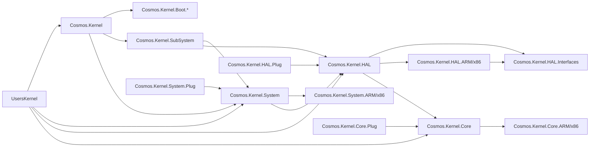

# Kernel Project Layout

The Cosmos kernel is composed of layered projects to enforce a clean dependency graph.

- **UsersKernel**: your custom kernel project.
- **Cosmos.Kernel**: aggregates core runtime, system, graphics, HAL and plugs.
- **Cosmos.Kernel.Boot.\***: bootloader specific implementations such as `Cosmos.Kernel.Boot.Limine`.

Only the `Cosmos.Kernel` project may reference `Cosmos.Kernel.Boot.*` projects. A build check fails if other projects introduce such references.
