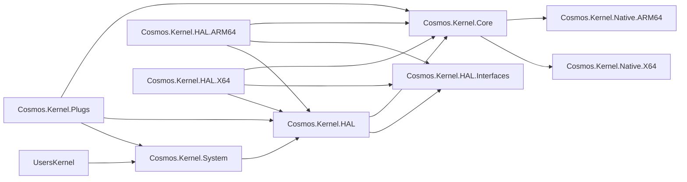

# Kernel Project Layout

The Cosmos kernel is composed of layered projects to enforce a clean dependency graph.

```mermaid
flowchart LR;
	UsersKernel-->Cosmos.Kernel.System;
    Cosmos.Kernel.System-->Cosmos.Kernel.HAL;
	Cosmos.Kernel.Plugs-->Cosmos.Kernel.System;
    Cosmos.Kernel.Plugs-->Cosmos.Kernel.HAL;
    Cosmos.Kernel.Plugs-->Cosmos.Kernel.Core;
    Cosmos.Kernel.HAL-->Cosmos.Kernel.HAL.Interfaces;
    Cosmos.Kernel.HAL.ARM64-->Cosmos.Kernel.HAL;
    Cosmos.Kernel.HAL.X64-->Cosmos.Kernel.HAL;
	Cosmos.Kernel.HAL.ARM64-->Cosmos.Kernel.HAL.Interfaces;
	Cosmos.Kernel.HAL.X64-->Cosmos.Kernel.HAL.Interfaces;
	Cosmos.Kernel.HAL.ARM64-->Cosmos.Kernel.Core;
	Cosmos.Kernel.HAL.X64-->Cosmos.Kernel.Core;
	Cosmos.Kernel.HAL-->Cosmos.Kernel.Core;
    Cosmos.Kernel.Core-->Cosmos.Kernel.Native.X64;
    Cosmos.Kernel.Core-->Cosmos.Kernel.Native.ARM64;
```
