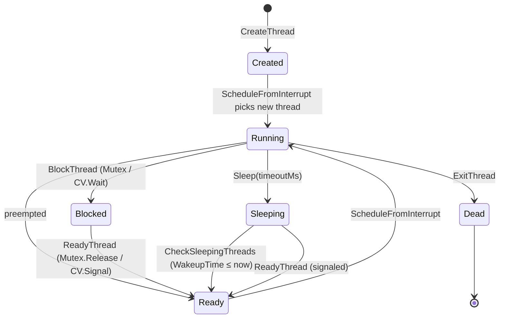
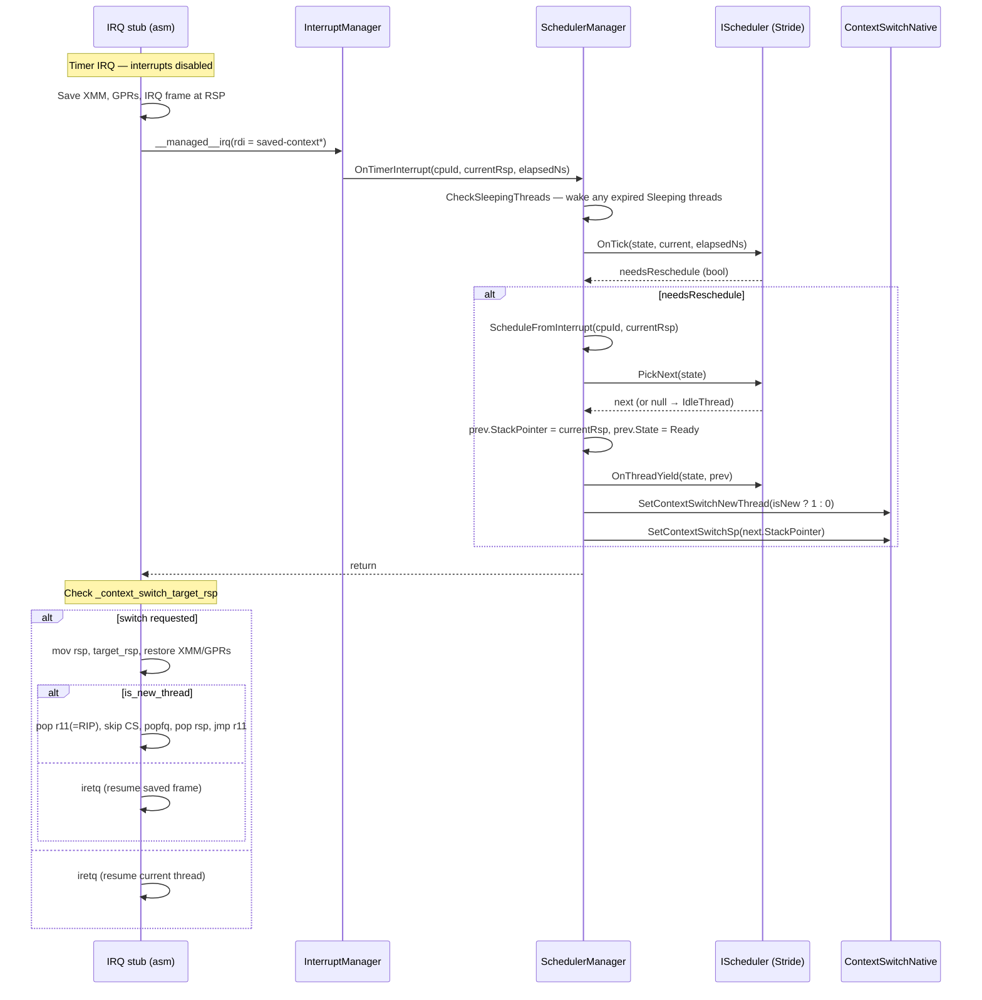

## Overview

The scheduler is a **preemptive, pluggable, virtual-time** scheduler. It manages thread lifecycle (create, ready, run, block, sleep, exit), drives context switches from the timer interrupt, exposes blocking sync primitives (Mutex, ConditionVariable, Monitor) and a non-blocking SpinLock, and feeds the GC's stack-scanning phase through a global thread registry.

The scheduler is partitioned across three layers: a generic **SchedulerManager** that owns lifecycle and the registry, an `IScheduler` algorithm interface, and the default **StrideScheduler** implementation. Architecture-specific assembly (`Interrupts.s` on x64, `ContextSwitch.s` on ARM64) handles the actual register save/restore.

| File | Responsibility |
|------|----------------|
| [`IScheduler.cs`](../../src/Cosmos.Kernel.Core/Scheduler/IScheduler.cs) | Pluggable scheduling algorithm interface (lifecycle hooks, `PickNext`, `OnTick`, load balancing) |
| [`SchedulerManager.cs`](../../src/Cosmos.Kernel.Core/Scheduler/SchedulerManager.cs) | Central manager: thread registry, lifecycle dispatch, timer-tick handler, GC bridge |
| [`SchedulerExtensible.cs`](../../src/Cosmos.Kernel.Core/Scheduler/SchedulerExtensible.cs) | Base class providing a `SchedulerData` slot on `Thread` and `PerCpuState` |
| [`Thread.cs`](../../src/Cosmos.Kernel.Core/Scheduler/Thread.cs) | Thread Control Block (TCB): identity, state, stack layout, TLAB |
| [`ThreadState.cs`](../../src/Cosmos.Kernel.Core/Scheduler/ThreadState.cs) | `ThreadState` enum and `ThreadFlags` |
| [`ThreadContext.X64.cs`](../../src/Cosmos.Kernel.Core/Scheduler/ThreadContext.X64.cs) | x64 saved register layout (XMM, GPRs, IRQ frame) |
| [`ThreadContext.ARM64.cs`](../../src/Cosmos.Kernel.Core/Scheduler/ThreadContext.ARM64.cs) | ARM64 saved register layout (NEON, X0–X30, SP/ELR/SPSR) |
| [`ContextSwitch.cs`](../../src/Cosmos.Kernel.Core/Scheduler/ContextSwitch.cs) | High-level switch dispatcher used outside interrupt context |
| [`PerCpuState.cs`](../../src/Cosmos.Kernel.Core/Scheduler/PerCpuState.cs) | Per-CPU state (CurrentThread, IdleThread, lock, scheduler data) |
| [`SpinLock.cs`](../../src/Cosmos.Kernel.Core/Scheduler/SpinLock.cs) | Non-blocking CAS spinlock |
| [`Mutex.cs`](../../src/Cosmos.Kernel.Core/Scheduler/Mutex.cs) | Recursive blocking mutex with wait queue |
| [`ConditionVariable.cs`](../../src/Cosmos.Kernel.Core/Scheduler/ConditionVariable.cs) | Signal / Wait / WaitTimeout with mutex hand-off |
| [`Monitor.cs`](../../src/Cosmos.Kernel.Core/Scheduler/Monitor.cs) | Composite Mutex + ConditionVariable (Java-style monitor) |
| [`Stride/StrideScheduler.cs`](../../src/Cosmos.Kernel.Core/Scheduler/Stride/StrideScheduler.cs) | Default `IScheduler` — virtual-time stride algorithm |
| [`Stride/StrideThreadData.cs`](../../src/Cosmos.Kernel.Core/Scheduler/Stride/StrideThreadData.cs) | Per-thread stride bookkeeping |
| [`Stride/StrideCpuData.cs`](../../src/Cosmos.Kernel.Core/Scheduler/Stride/StrideCpuData.cs) | Per-CPU stride bookkeeping (run queue) |
| [`Bridge/Import/ContextSwitchNative.cs`](../../src/Cosmos.Kernel.Core/Bridge/Import/ContextSwitchNative.cs) | Native imports: `_native_set_context_switch_sp`, `_native_set_context_switch_new_thread`, `_native_get_sp` |
| [`Bridge/Export/ThreadNative.cs`](../../src/Cosmos.Kernel.Core/Bridge/Export/ThreadNative.cs) | `EntryPointStub` — stable native entry trampoline used as initial RIP/PC |
| [`Runtime/Thread.cs`](../../src/Cosmos.Kernel.Core/Runtime/Thread.cs) | Runtime exports: `RhYield`, `RhGetCurrentThreadStackBounds`, `RhGetThreadStaticStorage` |

---

### Thread struct

A [`Thread`](../../src/Cosmos.Kernel.Core/Scheduler/Thread.cs) is the kernel's Thread Control Block. It is a managed class (inherits `SchedulerExtensible`), so it lives on the GC heap and is itself reachable through `SchedulerManager._allThreads`.

| Field | Purpose |
|-------|---------|
| `Id` | Globally unique thread ID, allocated by `SchedulerManager.AllocateThreadId` |
| `CpuId` | The CPU this thread is currently assigned to |
| `State` | Current `ThreadState` (Created, Ready, Running, Blocked, Sleeping, Dead) |
| `Flags` | `ThreadFlags` bitfield (KernelThread, IdleThread, Pinned, Managed) |
| `StackPointer` | Saved RSP/SP — points to the saved `ThreadContext` at the bottom of the stack |
| `StackBase` / `StackSize` | Bounds of the stack memory allocation |
| `InstructionPointer` | Initial entry point recorded at creation |
| `CreatedAt` / `LastScheduledAt` / `TotalRuntime` | Timing accounting; `TotalRuntime` is summed by `OnTick` for `GetBusyCpuTimeNs` |
| `WakeupTime` | Absolute timestamp at which a `Sleeping` thread should be woken |
| `AllocContext` | Thread-local bump allocator (TLAB) for the GC |
| `SchedulerData` | Inherited from `SchedulerExtensible`; the active scheduler stores its own struct here (e.g. `StrideThreadData`) |

Two constants on the type drive the rest of the layout:

- `Thread.DefaultStackSize = 64 * 1024` — 64 KB stack per thread.
- `Thread.MaxThreadCount = 256` — maximum number of slots in the global registry.

### ThreadState / ThreadFlags

`ThreadState` is a 6-state machine (`Created → Ready ⇄ Running → {Blocked, Sleeping} → Ready → … → Dead`). `ThreadFlags` carries semantic flags that the scheduler honors:

| Flag | Effect |
|------|--------|
| `KernelThread` | Marks a thread as kernel-only (currently informational) |
| `IdleThread` | Excluded from `GetBusyCpuTimeNs` and from migration |
| `Pinned` | Cannot migrate to a different CPU (`SelectCpu` and `Balance` skip it) |
| `Managed` | Entry parameter is a `GCHandle<System.Threading.Thread>`; `InvokeCurrentThreadStart` calls `StartThread` rather than a raw `Action` |

### ThreadContext (x64)

The x64 [`ThreadContext`](../../src/Cosmos.Kernel.Core/Scheduler/ThreadContext.X64.cs) mirrors exactly the layout the IRQ stub builds on the stack when an interrupt fires. `Pack = 1` is mandatory — the assembly indexes by raw byte offsets.

| Field | Size | Purpose |
|-------|------|---------|
| `Xmm[256]` | 256 B | XMM/SSE state, saved first so RSP ends 16-byte aligned |
| `R15`…`Rax` | 15 × 8 B | GPRs in reverse push order |
| `Interrupt` | 8 B | IRQ vector number |
| `CpuFlags` | 8 B | RFLAGS at the moment of the interrupt |
| `Cr2` | 8 B | Page-fault address (only valid for #PF) |
| `TempRcx` | 8 B | Temp slot — reused as the "is-new-thread" flag during context restore |
| `Rip` / `Cs` / `Rflags` / `Rsp` / `Ss` | 5 × 8 B | The standard `iretq` interrupt frame |
| `Size` | const | `256 + 15·8 + 3·8 + 8 + 5·8 = 432` bytes |

`Initialize()` zeroes everything, sets `Rdi = arg` (System V first argument), `Rip = entryPoint`, `Cs = codeSegment`, `Rflags = 0x202` (`IF=1`, bit 1 reserved), and `Rsp = (stackTop & ~0xF) - 8` so the new thread's first `call` sees a 16-byte-aligned RSP.

### ThreadContext (ARM64)

The ARM64 [`ThreadContext`](../../src/Cosmos.Kernel.Core/Scheduler/ThreadContext.ARM64.cs) is parallel: `Neon[512]` (Q0–Q31), then `X0`–`X30`, then `Sp`, `Elr`, `Spsr`, then exception info. `Size = 816`. `Initialize()` sets `X0 = arg` (AArch64 first argument), `Elr = entryPoint`, and `Spsr = 0x3C5` (EL1h, all interrupt masks clear). The IRQ context starts at offset `IrqContextOffset = 512`.

### PerCpuState

Per-CPU state ([`PerCpuState`](../../src/Cosmos.Kernel.Core/Scheduler/PerCpuState.cs)) is a class shared between the manager and the scheduler:

| Field | Purpose |
|-------|---------|
| `CpuId` | This CPU's index |
| `CurrentThread` | The thread currently in `Running` state on this CPU |
| `IdleThread` | The per-CPU idle thread, picked when `PickNext` returns null |
| `LastTickAt` | Timestamp of the last accounted tick |
| `Lock` | `SpinLock` protecting the non-interrupt scheduling path |
| `SchedulerData` | Inherited slot — `StrideScheduler` stores `StrideCpuData` here |

### Stride bookkeeping

Each thread carries a [`StrideThreadData`](../../src/Cosmos.Kernel.Core/Scheduler/Stride/StrideThreadData.cs) and each CPU a [`StrideCpuData`](../../src/Cosmos.Kernel.Core/Scheduler/Stride/StrideCpuData.cs):

| `StrideThreadData` | Purpose |
|---|---|
| `Tickets` | CPU weight (higher = more time) |
| `Stride` | `Stride1 / Tickets` — virtual time advance per quantum |
| `Pass` | Virtual time position; the run queue is sorted ascending on this |
| `Remain` | `Pass - GlobalPass` saved at block time, restored at wakeup |
| `LastWakeup` | Timestamp of the last block→ready transition |
| `SleepCount` | Number of times the thread has blocked (I/O pattern hint) |
| `IsInteractive` / `IsBoosted` | Interactive-detection flags driving the wakeup priority boost |

| `StrideCpuData` | Purpose |
|---|---|
| `TotalTickets` | Sum of `Tickets` across runnable threads on this CPU |
| `GlobalPass` | CPU's virtual time |
| `LastPassUpdate` | Timestamp of the last `UpdateGlobalPass` |
| `RunQueue` | `List<Thread>` sorted ascending by `Pass` |

The constants live on `StrideScheduler` and `SchedulerManager`:

| Constant | Value | Where |
|----------|-------|-------|
| `Stride1` | `1 << 20` | `StrideScheduler.cs` line 16 |
| `DefaultTickets` | `100` | `StrideScheduler.cs` line 21 |
| `InteractiveSleepRatio` | `2` | `StrideScheduler.cs` line 26 |
| `WakeupBoostDecayNs` | `5_000_000` (5 ms) | `StrideScheduler.cs` line 31 |
| `DefaultQuantumNs` | `10_000_000` (10 ms) | `SchedulerManager.cs` line 39 |
| `Thread.MaxThreadCount` | `256` | `Thread.cs` line 45 |
| `Thread.DefaultStackSize` | `64 * 1024` | `Thread.cs` line 40 |

---

## Memory layout

### Per-thread stack

`Thread.InitializeStack` allocates one contiguous chunk from `MemoryOp.Alloc` and lays the saved `ThreadContext` at the **bottom** (low address). `StackPointer` then points into that struct exactly where the IRQ stub expects it. The usable call/locals stack grows downward from `StackBase + StackSize` toward the context:

```
              one stack (StackSize bytes from MemoryOp.Alloc)
┌ ─ ─ ─ ─ ─ ─ ─ ─ ─ ─ ─ ─ ─ ─ ─ ─ ─ ─ ─ ─ ─ ─ ─ ─ ─ ─ ─ ─ ─ ─ ─ ─ ─ ┐

│ StackBase                                 StackBase + StackSize  │
  │                                                       │
│ ▼                                                       ▼        │
  ┌──────────────────────────┬────────────────────────────┐
│ │ ThreadContext            │  usable stack              │        │
  │  Xmm[256]                │  (grows downward from top) │
│ │  R15..Rax                │                            │        │
  │  Interrupt/CpuFlags/Cr2  │                            │
│ │  TempRcx                 │                            │        │
  │  Rip/Cs/Rflags/Rsp/Ss    │                            │
│ └──────────────────────────┴────────────────────────────┘        │
  ▲
│ │                                                                │
  StackPointer (saved RSP — IRQ stub restores from here)
└ ─ ─ ─ ─ ─ ─ ─ ─ ─ ─ ─ ─ ─ ─ ─ ─ ─ ─ ─ ─ ─ ─ ─ ─ ─ ─ ─ ─ ─ ─ ─ ─ ─ ┘
```

The context address is rounded up to 16 bytes for XMM alignment. `context->Initialize` sets `Rsp` inside the saved frame to `(StackBase + StackSize) & ~0xF - 8` so the **first** call inside the new thread lands on a 16-aligned RSP after `push rbp`.

### Global thread registry

[`SchedulerManager._allThreads`](../../src/Cosmos.Kernel.Core/Scheduler/SchedulerManager.cs) is a flat `Thread?[Thread.MaxThreadCount]` allocated once during `Initialize`. Every live thread (regardless of state, except `Dead`) occupies exactly one slot. The GC walks this array directly during the mark phase — interface dispatch is forbidden during GC because it can allocate.

```
 SchedulerManager._allThreads (size 256, allocated once at Initialize)
 ═══════════════════════════════════════════════════════════════════════

  [0] ──► Thread { Id=0,  Flags=IdleThread, State=Running }   ← idle
  [1] ──► Thread { Id=1,  Flags=Managed,    State=Ready   }
  [2] ──► Thread { Id=2,  Flags=Managed,    State=Blocked }   ← waiting on Mutex
  [3] ──► Thread { Id=3,  Flags=None,       State=Sleeping}   ← WakeupTime set
  [4] ──► null                                                ← free slot
  [5] ──► null
  ...                                                _allThreadCount = 4
  [255]──► null
```

`RegisterThread` linearly scans for the first null slot (called from `CreateThread` and `SetupIdleThread`). `UnregisterThread` clears the slot during `ExitThread`, accumulating `TotalRuntime` of non-idle threads into `_exitedNonIdleRuntimeNs` so `GetBusyCpuTimeNs` stays monotonic across the lifecycle.

### Stride run queue

Per-CPU, sorted ascending by `Pass`. `PickNext` always returns index 0; `InsertByPass` walks linearly to find the first index where `thread.Pass <= other.Pass`. Blocked / sleeping / dead threads are **not** in the run queue — only `_allThreads`.

```
 StrideCpuData.RunQueue (one per CPU, in PerCpuState.SchedulerData)
 ═══════════════════════════════════════════════════════════════════════

   Pass = 1042            Pass = 1130           Pass = 1320
   ┌─────────────┐        ┌─────────────┐       ┌─────────────┐
   │ Thread 5    │ ◄──── │ Thread 9    │ ◄──── │ Thread 2    │
   │ Stride=10485│        │ Stride=10485│       │ Stride=5242 │
   └─────────────┘        └─────────────┘       └─────────────┘
        ▲                                              ▲
        │                                              │
   PickNext() pops here                       Tail (highest Pass)
                                              — also the migration victim
                                                picked by Balance()
```

`OnThreadBlocked` removes from the queue and saves `Remain = Pass - GlobalPass`. On wakeup `OnThreadReady` reinserts using either an interactive boost (`Pass = GlobalPass - Stride/2`) or a CFS-style starvation cap (`Pass = max(GlobalPass + Remain, GlobalPass - 2*Stride1)`).

---

## Lifecycle



### Create

`SchedulerManager.CreateThread(cpuId, thread)` (line 343):

1. `RegisterThread(thread)` — claim a slot in `_allThreads`.
2. Inside `DisableInterruptsScope`: `_currentScheduler.OnThreadCreate(state, thread)`. For Stride this allocates a `StrideThreadData` with `Tickets = 100`, `Stride = Stride1 / 100 = 10485`, `Pass = 0`.

The caller is responsible for first calling `Thread.InitializeStack(entryPoint, codeSegment, arg)` so the saved `ThreadContext` is in place. `ThreadPlug.CreateThread` always uses `&ThreadNative.EntryPointStub` as the entry point and passes a `GCHandle<System.Threading.Thread>` as the argument.

### First run

The new thread starts as `Created`. When `ScheduleFromInterrupt` picks it (line 693), it sets `isNewThread = (next.State == ThreadState.Created)`, transitions to `Running`, and writes both `_context_switch_target_rsp` and `_context_switch_is_new_thread = 1`. The IRQ exit path then takes the new-thread tail (see [Preemption flow](#preemption-flow)) which loads the configured RSP and jumps to RIP rather than running `iretq`.

The configured RIP is `ThreadNative.EntryPointStub`, an `[UnmanagedCallersOnly]` trampoline:

```csharp
[UnmanagedCallersOnly]
public static void EntryPointStub(IntPtr parameter)
{
    SchedulerManager.InvokeCurrentThreadStart(parameter);
}
```

`InvokeCurrentThreadStart` (line 148) inspects `currentThread.Flags`. If `Managed` is set, it forwards to `System.Threading.Thread.StartThread(null, parameter)` via `[UnsafeAccessor]`. Otherwise it decodes `parameter` as a `GCHandle<Action>`, invokes the delegate, and disposes the handle. On return (or after a top-level catch), it calls `ExitThread` and falls into a `Halt()` loop — the scheduler will not pick a `Dead` thread, but the loop is a safety net.

### Ready / wake

`SchedulerManager.ReadyThread` (line 357) preserves `Created` (so first-run detection works) and otherwise transitions to `Ready`, then calls `IScheduler.OnThreadReady`. `StrideScheduler.OnThreadReady` (line 59) recomputes `GlobalPass`, applies the interactive boost or starvation cap, calls `InsertByPass`, and adds `Tickets` back to `TotalTickets`.

### Block / Sleep

- `BlockThread` (line 383) sets `State = Blocked` and calls `OnThreadBlocked`, which saves `Remain` and removes from the run queue. The blocking primitive (Mutex / CV) calls `InternalCpu.Halt()` to wait for the next interrupt; on the next tick the scheduler will pick someone else.
- `Sleep(cpuId, thread, timeoutMs)` (line 451) is the same path with `State = Sleeping` and `WakeupTime = now + timeoutMs * 1_000_000`. `OnTimerInterrupt` calls `CheckSleepingThreads` (line 609) every tick, which scans `_allThreads` for sleeping threads whose `WakeupTime ≤ now` and calls `ReadyThread`.

### Exit

`ExitThread` (line 394):

1. If `OnThreadExitCallback` is set (registered via `RhSetThreadExitCallback`), invoke it so the managed `System.Threading.Thread` can release its `_stopped` event.
2. Inside `DisableInterruptsScope`: return the TLAB via `GarbageCollector.ReturnAllocContext` and account the unused bytes through `AddDeadThreadNonAllocBytes`.
3. Set `State = Dead`, call `OnThreadExit` (Stride removes from queue and decrements `TotalTickets`), then `UnregisterThread`.

---

## Preemption flow



The native side of this flow lives in [`Interrupts.s`](../../src/Cosmos.Kernel.Native.X64/CPU/Interrupts.s) on x64 and [`ContextSwitch.s`](../../src/Cosmos.Kernel.Native.ARM64/CPU/ContextSwitch.s) on ARM64. Both architectures expose the same four symbols — `_native_set_context_switch_sp`, `_native_get_context_switch_sp`, `_native_set_context_switch_new_thread`, `_native_get_sp` — so the C# bridge in [`ContextSwitchNative`](../../src/Cosmos.Kernel.Core/Bridge/Import/ContextSwitchNative.cs) needs no architecture gating.

The new-thread tail is what makes a freshly created thread runnable: it loads the saved `Rsp` field as the new stack pointer, restores `Rflags` (re-enabling interrupts), and jumps to `Rip` (`EntryPointStub`). Resumed threads instead unwind through `iretq` so the saved interrupt frame is consumed normally.

`SchedulerManager.Schedule` and the helper `ContextSwitch.Switch` exist for non-interrupt voluntary switches but are not the hot path — preemption goes through `ScheduleFromInterrupt`.

---

## Stride algorithm

Stride scheduling is virtual-time fair share. Each thread has a weight (`Tickets`) and a stride (`Stride1 / Tickets`). Each scheduling round, the chosen thread's `Pass` advances by its stride; the queue stays sorted by `Pass`, so the lowest-pass thread always runs next. Higher tickets ⇒ smaller stride ⇒ pass advances more slowly ⇒ more total CPU.

### Pick

```csharp
public Thread? PickNext(PerCpuState cpuState)
{
    var cpuData = cpuState.GetSchedulerData<StrideCpuData>();
    if (cpuData == null || cpuData.RunQueue.Count == 0) return null;
    var selected = cpuData.RunQueue[0];
    cpuData.RunQueue.RemoveAt(0);
    return selected;
}
```

If the queue is empty, `ScheduleFromInterrupt` falls back to `state.IdleThread`.

### Tick accounting

`OnTick` (line 206) charges the elapsed window to the running thread:

```
current.TotalRuntime += elapsedNs
threadData.Pass     += (Stride * elapsedNs) / DefaultQuantumNs
GlobalPass          += (Stride1 / TotalTickets * elapsedNs) / DefaultQuantumNs
```

It returns `true` (preempt) if either:

- the head of the run queue now has a strictly lower `Pass` than the running thread, or
- the elapsed window is at least one quantum (10 ms).

### Interactive boost

When a thread wakes from `Blocked`, `OnThreadReady` measures `sleepDuration = now - LastWakeup`. If `sleepDuration > TotalRuntime * 2` the thread is flagged `IsInteractive` and gets a boost: `Pass = GlobalPass - Stride / 2`. The boost flag clears in `OnTick` once `now - LastWakeup > WakeupBoostDecayNs` (5 ms). Non-interactive wakers use the CFS-style cap:

```
Pass = max(GlobalPass + Remain, GlobalPass - 2 * Stride1)
```

This both honors saved progress and prevents long-blocked threads from monopolizing the CPU on resume.

### Yield correction

`OnThreadYield` (line 154) re-inserts the yielding thread but first clamps `Pass` upward to `GlobalPass`. Without the clamp, a thread that started with `Pass = 0` (notably the idle thread) would perpetually outrank later threads created with `Pass = GlobalPass`.

### SetPriority

Re-tickets a thread without losing its relative position:

```
remain     = Pass - GlobalPass
remain    *= newStride / oldStride
Pass       = GlobalPass + remain
Tickets    = newTickets
Stride     = Stride1 / newTickets
```

If the thread is `Ready`, it is removed and re-inserted to maintain queue order.

### Load balancing

- `SelectCpu` honors `Pinned` and otherwise prefers any CPU whose load is below 80% of the current CPU's load.
- `Balance` runs only on idle CPUs (`RunQueue.Count == 0`). It finds the busiest peer (largest `RunQueue.Count > 1`) and steals its **tail** thread (highest `Pass`) — that thread is the least likely to be hot. Pinned threads are skipped.
- `OnThreadMigrate` removes from the old CPU, re-bases `Pass = toData.GlobalPass + Remain`, and inserts on the new CPU.

---

## Synchronization primitives

### SpinLock

[`SpinLock`](../../src/Cosmos.Kernel.Core/Scheduler/SpinLock.cs) is a single `int _locked` driven by `Interlocked.CompareExchange`. It does not park the caller and does not interact with the scheduler — it is the guard used inside `Mutex` and `ConditionVariable` to protect their wait queues.

### Mutex

[`Mutex`](../../src/Cosmos.Kernel.Core/Scheduler/Mutex.cs) is a recursive blocking lock backed by a `SpinLock` guard.

| API | Behavior |
|-----|----------|
| `Acquire()` | Spin on the guard; if `_ownerThread == null` claim it; if `_ownerThread == self` increment `_recursionDepth`; else add to `_waitingThreads`, release guard, call `SchedulerManager.BlockThread`, halt — then loop and retry on wakeup |
| `TryAcquire()` | Same logic without the wait/halt step |
| `Release()` | Caller must be owner. Decrement depth; on zero, clear owner and wake the head of `_waitingThreads` via `ReadyThread` |
| `IsLocked` / `OwnerThread` / `WaitingThreadCount` | Read accessors that briefly take the guard |

The 10 000-spin halt fallback in `Acquire` (line 64) keeps a contending CPU from burning the bus indefinitely if the holder is descheduled.

### ConditionVariable

[`ConditionVariable`](../../src/Cosmos.Kernel.Core/Scheduler/ConditionVariable.cs) implements signal / wait with mutex hand-off:

- `Wait(Mutex mutex)`: enqueue self, release the mutex, `BlockThread`, halt, and re-acquire the mutex on resume.
- `WaitTimeout(Mutex, timeoutMs)`: same, but uses `SchedulerManager.Sleep` so the thread also wakes when `WakeupTime ≤ now`. Returns `true` if signaled (the signaller clears `WakeupTime`), `false` on timeout.
- `Signal()`: pop the head of `_waitingThreads` and `ReadyThread` it.
- `SignalAll()`: drain `_waitingThreads`, calling `ReadyThread` on each.

### Monitor

[`Monitor`](../../src/Cosmos.Kernel.Core/Scheduler/Monitor.cs) is a thin composite over `Mutex` + `ConditionVariable` providing Java-style `Acquire / Release / Wait / Signal / SignalAll`. `Signal()` and `SignalAll()` release the underlying mutex after notifying.

All three primitives delegate parking to `SchedulerManager.BlockThread / ReadyThread / Sleep`. Those manager methods wrap their state changes in `DisableInterruptsScope` so the timer interrupt cannot observe a half-finished transition; the primitives themselves do **not** disable interrupts directly.

---

## GC integration

The scheduler is the GC's source of truth for stack roots:

- `SchedulerManager.Threads` (and `ThreadCount`) expose `_allThreads` directly. The GC iterates the array — interface dispatch (which can allocate) is off-limits during a collection.
- For each non-`Dead` thread, the mark phase scans the saved `ThreadContext` at `Thread.GetContext()` (which equals `StackPointer`): every saved register is treated as a root candidate, and stack memory from the saved SP up to `StackBase + StackSize` is conservatively scanned. The `Running` thread on each CPU is scanned via the live RSP recorded by the IRQ entry, not the cached `StackPointer`.
- Live threads' `TotalRuntime` is summed in `GetBusyCpuTimeNs`. On exit, that runtime moves into `_exitedNonIdleRuntimeNs` so the metric stays monotonic when slots are freed.

Two invariants from prior incidents are load-bearing here:

1. The mark phase rejects any candidate `MethodTable*` outside kernel higher-half (`mtPtr >= 0xFFFF800000000000`). Without that check, a stack-resident integer that happens to fall inside the heap range can crash `mt->ContainsGCPointers`.
2. `ScanStackRoots` must scan **every** registered thread, not just `state.CurrentThread`. Earlier versions only scanned the running thread, which let stack locals on threads in the run queue or blocked on a mutex be collected and reused.

Both checks live in [`GarbageCollector.Mark.cs`](../../src/Cosmos.Kernel.Core/Memory/GarbageCollector/GarbageCollector.Mark.cs).

---

## Runtime bridge

### Runtime exports (`Runtime/Thread.cs`)

| Runtime function | Maps to | Purpose |
|------------------|---------|---------|
| `RhYield` | `SchedulerManager.YieldThread` + `InternalCpu.Halt` | Cooperative yield from `Thread.Yield` |
| `RhGetThreadStaticStorage` | `Thread.GetThreadStaticStorage()` on `CurrentThread` | Per-thread static field storage; falls back to a shared array if `CosmosFeatures.SchedulerEnabled` is false |
| `RhGetCurrentThreadStackBounds` | `ContextSwitchNative.GetSp` + `Thread.DefaultStackSize` | Stack low/high reported to runtime stack walkers |
| `RhSetCurrentThreadName` | logs the name | Currently informational |
| `RhSetThreadExitCallback` | `SchedulerManager.OnThreadExitCallback` | Managed-side hook called by `ExitThread` before tearing down |
| `RhSpinWait` | inline loop | Pure spin, no scheduler interaction |

### Native imports (`Bridge/Import/ContextSwitchNative.cs`)

| C# call | Native symbol | Direction |
|---------|---------------|-----------|
| `SetContextSwitchSp(nuint)` | `_native_set_context_switch_sp` | Stage target RSP for the IRQ exit path |
| `GetContextSwitchSp()` | `_native_get_context_switch_sp` | Diagnostic |
| `SetContextSwitchNewThread(int)` | `_native_set_context_switch_new_thread` | 1 = new thread (jmp to RIP), 0 = resume (iretq) |
| `GetSp()` | `_native_get_sp` | Read current SP |

All four are tagged `[SuppressGCTransition]` — they are pure register operations with no GC observation.

### Native export (`Bridge/Export/ThreadNative.cs`)

`ThreadNative.EntryPointStub` is the stable initial RIP/PC for every kernel thread. It is `[UnmanagedCallersOnly]`, so it has a fixed C ABI signature regardless of compiler-generated calling conventions for managed methods, and it forwards immediately to `SchedulerManager.InvokeCurrentThreadStart`.

### Managed thread plug

[`ThreadPlug`](../../src/Cosmos.Kernel.Plugs/System/Threading/ThreadPlug.cs) plugs `System.Threading.Thread.CreateThread` so that calling `new System.Threading.Thread(action).Start()` in user kernel code:

1. Allocates a kernel `Thread` with `Flags = ThreadFlags.Managed` and a fresh ID.
2. Calls `InitializeStack` with `entryPoint = &ThreadNative.EntryPointStub` and `arg = GCHandle<System.Threading.Thread>.ToIntPtr(handle)`.
3. Calls `SchedulerManager.CreateThread` then `ReadyThread` under `DisableInterruptsScope`.

Because `Flags.Managed` is set, `InvokeCurrentThreadStart` invokes `System.Threading.Thread.StartThread(null, parameter)` (reached via `[UnsafeAccessor]`) instead of decoding the parameter as a free `Action`.

---

## Feature switch

The scheduler is gated by `CosmosEnableScheduler` in the kernel `.csproj`, surfaced as `CosmosFeatures.SchedulerEnabled` and consumed in two places:

- `SchedulerManager.IsEnabled` — every public manager entry point that mutates state calls `ThrowIfDisabled`.
- `Runtime/Thread.cs` — `RhGetThreadStaticStorage`, `RhYield`, and `RhSetThreadExitCallback` fall back to single-threaded behavior when the switch is off.

`SchedulerManager.Enabled` is a separate runtime flag (set after `Initialize` + `SetScheduler` + idle threads are wired up) gating the timer interrupt path: `OnTimerInterrupt` returns early until `Enabled = true`.

---

## Source files

| File | Path |
|------|------|
| Scheduler interface | [`src/Cosmos.Kernel.Core/Scheduler/IScheduler.cs`](../../src/Cosmos.Kernel.Core/Scheduler/IScheduler.cs) |
| Scheduler manager | [`src/Cosmos.Kernel.Core/Scheduler/SchedulerManager.cs`](../../src/Cosmos.Kernel.Core/Scheduler/SchedulerManager.cs) |
| Extensible base | [`src/Cosmos.Kernel.Core/Scheduler/SchedulerExtensible.cs`](../../src/Cosmos.Kernel.Core/Scheduler/SchedulerExtensible.cs) |
| Thread TCB | [`src/Cosmos.Kernel.Core/Scheduler/Thread.cs`](../../src/Cosmos.Kernel.Core/Scheduler/Thread.cs) |
| Thread state | [`src/Cosmos.Kernel.Core/Scheduler/ThreadState.cs`](../../src/Cosmos.Kernel.Core/Scheduler/ThreadState.cs) |
| Per-CPU state | [`src/Cosmos.Kernel.Core/Scheduler/PerCpuState.cs`](../../src/Cosmos.Kernel.Core/Scheduler/PerCpuState.cs) |
| Thread context (x64) | [`src/Cosmos.Kernel.Core/Scheduler/ThreadContext.X64.cs`](../../src/Cosmos.Kernel.Core/Scheduler/ThreadContext.X64.cs) |
| Thread context (ARM64) | [`src/Cosmos.Kernel.Core/Scheduler/ThreadContext.ARM64.cs`](../../src/Cosmos.Kernel.Core/Scheduler/ThreadContext.ARM64.cs) |
| Voluntary switch | [`src/Cosmos.Kernel.Core/Scheduler/ContextSwitch.cs`](../../src/Cosmos.Kernel.Core/Scheduler/ContextSwitch.cs) |
| SpinLock | [`src/Cosmos.Kernel.Core/Scheduler/SpinLock.cs`](../../src/Cosmos.Kernel.Core/Scheduler/SpinLock.cs) |
| Mutex | [`src/Cosmos.Kernel.Core/Scheduler/Mutex.cs`](../../src/Cosmos.Kernel.Core/Scheduler/Mutex.cs) |
| Condition variable | [`src/Cosmos.Kernel.Core/Scheduler/ConditionVariable.cs`](../../src/Cosmos.Kernel.Core/Scheduler/ConditionVariable.cs) |
| Monitor | [`src/Cosmos.Kernel.Core/Scheduler/Monitor.cs`](../../src/Cosmos.Kernel.Core/Scheduler/Monitor.cs) |
| Stride scheduler | [`src/Cosmos.Kernel.Core/Scheduler/Stride/StrideScheduler.cs`](../../src/Cosmos.Kernel.Core/Scheduler/Stride/StrideScheduler.cs) |
| Stride thread data | [`src/Cosmos.Kernel.Core/Scheduler/Stride/StrideThreadData.cs`](../../src/Cosmos.Kernel.Core/Scheduler/Stride/StrideThreadData.cs) |
| Stride CPU data | [`src/Cosmos.Kernel.Core/Scheduler/Stride/StrideCpuData.cs`](../../src/Cosmos.Kernel.Core/Scheduler/Stride/StrideCpuData.cs) |
| Native imports | [`src/Cosmos.Kernel.Core/Bridge/Import/ContextSwitchNative.cs`](../../src/Cosmos.Kernel.Core/Bridge/Import/ContextSwitchNative.cs) |
| Entry trampoline | [`src/Cosmos.Kernel.Core/Bridge/Export/ThreadNative.cs`](../../src/Cosmos.Kernel.Core/Bridge/Export/ThreadNative.cs) |
| Runtime exports | [`src/Cosmos.Kernel.Core/Runtime/Thread.cs`](../../src/Cosmos.Kernel.Core/Runtime/Thread.cs) |
| Managed Thread plug | [`src/Cosmos.Kernel.Plugs/System/Threading/ThreadPlug.cs`](../../src/Cosmos.Kernel.Plugs/System/Threading/ThreadPlug.cs) |
| x64 IRQ + switch asm | [`src/Cosmos.Kernel.Native.X64/CPU/Interrupts.s`](../../src/Cosmos.Kernel.Native.X64/CPU/Interrupts.s) |
| ARM64 switch asm | [`src/Cosmos.Kernel.Native.ARM64/CPU/ContextSwitch.s`](../../src/Cosmos.Kernel.Native.ARM64/CPU/ContextSwitch.s) |
| GC mark integration | [`src/Cosmos.Kernel.Core/Memory/GarbageCollector/GarbageCollector.Mark.cs`](../../src/Cosmos.Kernel.Core/Memory/GarbageCollector/GarbageCollector.Mark.cs) |
