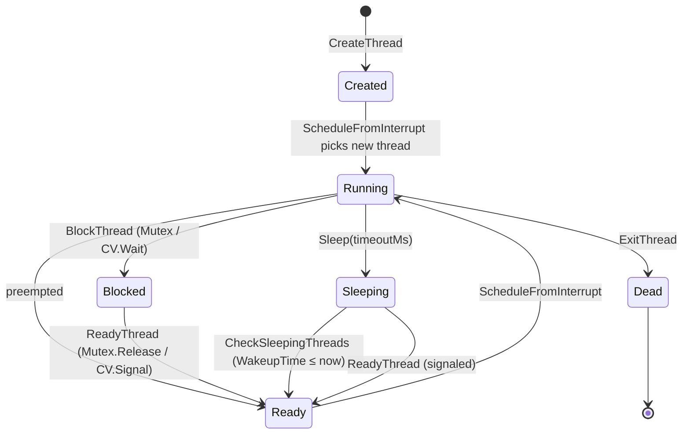
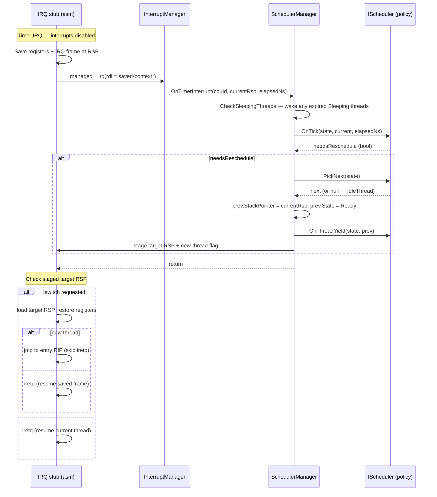

## Overview

The scheduler is a **preemptive, pluggable, virtual-time** scheduler. It manages thread lifecycle (create, ready, run, block, sleep, exit), drives context switches from the timer interrupt, exposes blocking sync primitives (Mutex, ConditionVariable, Monitor) and a non-blocking SpinLock, and feeds the GC's stack-scanning phase through a global thread registry.

The design separates **policy** from **mechanism**. Mechanism — context switching, the timer-tick entry, the thread registry, the GC bridge — is fixed and shared. Policy — what to pick next, what to do on a tick, how to balance CPUs — is a single interface (`IScheduler`) that any algorithm can implement. The default algorithm is **Stride** (virtual-time fair-share), but it is one of many possible plug-ins. See [Plugging in a scheduling algorithm](#plugging-in-a-scheduling-algorithm) for examples.

```
 ┌──────────────────────────────────────────────────────────────────┐
 │  Mechanism (fixed)                                               │
 │  ─────────────────                                               │
 │  • SchedulerManager      — lifecycle dispatch, thread registry   │
 │  • PerCpuState / Thread  — extensible TCB + per-CPU state        │
 │  • IRQ stub + ContextSwitch.s — register save/restore            │
 │  • Mutex / CV / Monitor  — park/unpark via SchedulerManager      │
 │  • GC stack-scan bridge                                          │
 └──────────────────────────┬───────────────────────────────────────┘
                            │ IScheduler interface
 ┌──────────────────────────┴───────────────────────────────────────┐
 │  Policy (pluggable)                                              │
 │  ───────────────────                                             │
 │  • StrideScheduler  (default)                                    │
 │  • RoundRobin / MLFQ / EDF / FIFO / …  (see examples below)      │
 └──────────────────────────────────────────────────────────────────┘
```

The architecture-specific assembly (`Interrupts.s` on x64, `ContextSwitch.s` on ARM64) handles the actual register save/restore and is the only part of the system that knows about register layouts.

---

## Layers

| Layer | Responsibility |
|-------|----------------|
| `IScheduler` | Pluggable policy interface — lifecycle hooks, `PickNext`, `OnTick`, load balancing |
| `SchedulerManager` | Mechanism — thread registry, lifecycle dispatch, timer-tick handler, GC bridge |
| `SchedulerExtensible` | Base class adding a single per-instance slot used by the active scheduler to attach its own bookkeeping to `Thread` and `PerCpuState` |
| `Thread` | Thread Control Block: identity, state, stack layout, TLAB |
| `ThreadContext` (x64 / ARM64) | Saved-register layout that mirrors the IRQ stub |
| `PerCpuState` | Per-CPU state: `CurrentThread`, `IdleThread`, lock, and the scheduler's own per-CPU slot |
| Sync primitives (`SpinLock`, `Mutex`, `ConditionVariable`, `Monitor`) | Park/unpark on top of `BlockThread` / `ReadyThread` |
| `Stride/*` | The default `IScheduler` implementation |
| `Bridge/Import` and `Bridge/Export` | Native trampolines and the stable initial-RIP entry stub |
| `Runtime/Thread.cs` | Runtime exports (`RhYield`, stack bounds, thread-static storage) |

The complete file map lives in [Source files](#source-files) at the bottom.

---

## Thread model

A `Thread` is a managed class that lives on the GC heap. It carries:

- **Identity / state** — a globally unique `Id`, the assigned `CpuId`, a `ThreadState` (Created → Ready ⇄ Running → {Blocked, Sleeping} → Ready → … → Dead), and a `ThreadFlags` bitfield (`KernelThread`, `IdleThread`, `Pinned`, `Managed`).
- **Stack** — `StackBase`, `StackSize`, `StackPointer`. The saved `ThreadContext` lives at the bottom of the stack; `StackPointer` points into it.
- **Accounting** — `CreatedAt`, `LastScheduledAt`, `TotalRuntime`, `WakeupTime`.
- **GC** — a thread-local bump allocator (`AllocContext`).
- **Scheduler slot** — `SchedulerData`, an `object?` reserved for the active scheduler. Stride stores `StrideThreadData` here; another algorithm would store something different (see examples).

Two flags are load-bearing for policy:

- `Pinned` — the thread cannot migrate. Both `SelectCpu` and `Balance` must skip it.
- `Managed` — the entry parameter is a `GCHandle<System.Threading.Thread>`; the entry trampoline forwards into managed `Thread.StartThread` instead of decoding the parameter as a free `Action`.

### Memory layout — per-thread stack

`Thread.InitializeStack` allocates one contiguous chunk and lays the saved `ThreadContext` at the **bottom** (low address). The usable call/locals stack grows downward from `StackBase + StackSize` toward the context.

```
              one stack (StackSize bytes)
┌ ─ ─ ─ ─ ─ ─ ─ ─ ─ ─ ─ ─ ─ ─ ─ ─ ─ ─ ─ ─ ─ ─ ─ ─ ─ ─ ─ ─ ─ ─ ─ ─ ─ ┐

│ StackBase                                 StackBase + StackSize  │
  │                                                       │
│ ▼                                                       ▼        │
  ┌──────────────────────────┬────────────────────────────┐
│ │ ThreadContext            │  usable stack              │        │
  │  (saved registers,       │  (grows downward from top) │
│ │   IRQ frame)             │                            │        │
  │                          │                            │
│ └──────────────────────────┴────────────────────────────┘        │
  ▲
│ │                                                                │
  StackPointer (saved RSP — IRQ stub restores from here)
└ ─ ─ ─ ─ ─ ─ ─ ─ ─ ─ ─ ─ ─ ─ ─ ─ ─ ─ ─ ─ ─ ─ ─ ─ ─ ─ ─ ─ ─ ─ ─ ─ ─ ┘
```

The context address is rounded up so the SIMD save area is naturally aligned. The initial saved SP inside the new context is set so the first `call` inside the new thread lands on a 16-byte-aligned RSP after the prologue's `push rbp`.

The saved-context layout itself differs by architecture (x64 saves XMM + GPRs + `iretq` frame; ARM64 saves NEON + X0–X30 + Sp/Elr/Spsr) but is opaque to the scheduler — only the IRQ stub indexes into it.

### Global thread registry

`SchedulerManager` owns a flat fixed-size array (`Thread?[]`) allocated once at boot. Every live thread, regardless of state, occupies one slot until it dies. This array is the GC's source of truth: the mark phase iterates it directly without going through any interface dispatch (which could allocate during a collection).

```
 SchedulerManager._allThreads (one slot per live thread)
 ═══════════════════════════════════════════════════════════════════════

  [0] ──► Thread { Flags=IdleThread, State=Running   }   ← idle
  [1] ──► Thread { Flags=Managed,    State=Ready     }
  [2] ──► Thread { Flags=Managed,    State=Blocked   }   ← waiting on Mutex
  [3] ──► Thread { Flags=None,       State=Sleeping  }   ← WakeupTime set
  [4] ──► null                                            ← free slot
  ...
```

Blocked, sleeping, and dead threads are absent from any scheduler-owned run queue — but they are still in `_allThreads`. That is the invariant that keeps the GC correct: stack roots on parked threads must remain reachable.

---

## Lifecycle



`SchedulerManager` is the single owner of every state transition. Each transition does two things: update `Thread.State` under interrupt-disabled scope, and notify the active `IScheduler` via the matching hook (`OnThreadCreate`, `OnThreadReady`, `OnThreadBlocked`, `OnThreadYield`, `OnThreadExit`). The scheduler uses these hooks to update its own data structures (run queue, priority bookkeeping, etc.).

The first run of a freshly created thread is special: instead of resuming a saved frame with `iretq`, the IRQ exit path loads the configured RSP and jumps directly to the configured RIP. That RIP is always a single stable trampoline, `ThreadNative.EntryPointStub`, which forwards to the manager's invoke routine — which in turn either runs an `Action` delegate or reaches into the managed `System.Threading.Thread.StartThread` based on the `Managed` flag. This means every thread, kernel or managed, has the same initial entry shape.

On exit, the manager flushes the TLAB back to the GC, calls `OnThreadExit` on the scheduler, and clears the registry slot. The thread's accumulated runtime is rolled into a global counter so the `GetBusyCpuTimeNs` metric stays monotonic across thread death.

---

## Preemption flow



Two things to note:

1. **The policy never touches registers.** The IRQ stub captures the outgoing RSP and hands it to the manager; the manager hands a target RSP back. Everything in between (`OnTick`, `PickNext`, `OnThreadYield`) is plain managed C# operating on `Thread` and `PerCpuState`.
2. **The new-thread tail is what bootstraps a fresh thread.** Because a `Created` thread has no saved IRQ frame to `iretq` into, the IRQ exit path is told (via a flag staged from C#) to instead load the saved RSP and jump to the saved RIP. After that first entry, the thread is indistinguishable from any resumed thread.

Voluntary (non-IRQ) switches go through `SchedulerManager.Schedule` / `ContextSwitch.Switch` and use the same target-RSP mechanism, but they are not the hot path — preemption dominates.

---

## Default algorithm: Stride

Stride scheduling is virtual-time fair-share. Each thread has a weight (`Tickets`) and a stride (`Stride1 / Tickets`). Each scheduling round, the chosen thread's `Pass` advances by its stride; the run queue stays sorted by `Pass`, so the lowest-pass thread always runs next. Higher tickets ⇒ smaller stride ⇒ pass advances more slowly ⇒ more total CPU.

The per-CPU run queue is a single list sorted ascending by `Pass`:

```
 StrideCpuData.RunQueue (one per CPU)
 ═══════════════════════════════════════════════════════════════════════

   Pass = 1042            Pass = 1130           Pass = 1320
   ┌─────────────┐        ┌─────────────┐       ┌─────────────┐
   │ Thread A    │        │ Thread B    │       │ Thread C    │
   │ Stride=10485│        │ Stride=10485│       │ Stride=5242 │
   └─────────────┘        └─────────────┘       └─────────────┘
        ▲                                              ▲
        │                                              │
   PickNext() pops here                       Tail (highest Pass)
                                              — also the migration victim
                                                picked by Balance()
```

What Stride uses each `IScheduler` hook for:

| Hook | What Stride does |
|------|------------------|
| `OnThreadCreate` | Allocate `StrideThreadData` with default tickets, set `Pass = 0` |
| `OnThreadReady` | Choose between an interactive boost (`Pass = GlobalPass − Stride/2`) or a CFS-style starvation cap, then insert into the queue sorted by `Pass` |
| `OnThreadBlocked` | Remove from run queue, save `Remain = Pass − GlobalPass` to restore on wakeup |
| `OnTick` | Advance current thread's `Pass` and the CPU's `GlobalPass`; signal preempt if the head of the queue now has a lower `Pass` or the quantum has elapsed |
| `OnThreadYield` | Re-insert the yielding thread, but clamp `Pass` upward to `GlobalPass` so a long-blocked thread can't perpetually outrank others |
| `PickNext` | Pop the head of the run queue (lowest `Pass`); return null if empty (manager runs the idle thread) |
| `SelectCpu` | Honor `Pinned`; otherwise prefer any CPU under 80% of the current CPU's load |
| `Balance` | Idle CPUs steal the **tail** thread (highest `Pass`, least hot) from the busiest peer |
| `SetPriority` | Re-ticket without losing relative position by scaling `Remain` by the stride ratio |

Two refinements deserve names because they are reused by other algorithms:

- **Interactive boost** — a thread that blocks frequently relative to its runtime is treated as I/O-bound and gets a head-start `Pass` on wakeup. The boost decays after a few ms.
- **Starvation cap** — a long-blocked thread cannot wake with a `Pass` so far behind `GlobalPass` that it monopolizes the CPU. The cap is `Pass = max(GlobalPass + Remain, GlobalPass − 2 × Stride1)`.

---

## Plugging in a scheduling algorithm

Any algorithm that implements `IScheduler` is a drop-in replacement. The mechanism layer never assumes virtual time, run queues, or priorities — those are policy. Switching the active scheduler is a single call:

```
SchedulerManager.SetScheduler(new MyScheduler());
```

The manager calls `ShutdownCpu` on the outgoing scheduler and `InitializeCpu` on the incoming one for every CPU.

The `IScheduler` contract is intentionally small — the algorithm decides what data to attach to threads and CPUs by storing whatever it wants in `Thread.SchedulerData` and `PerCpuState.SchedulerData` (both inherited from `SchedulerExtensible`). Below are sketches of how a few classic algorithms would map onto this interface.

### Round-Robin

The simplest preemptive algorithm: a FIFO queue, fixed-quantum preemption.

| Hook | Behavior |
|------|----------|
| `PerCpuState.SchedulerData` | A `Queue<Thread>` |
| `Thread.SchedulerData` | None needed (or a remaining-quantum counter) |
| `OnThreadReady` | Enqueue at the tail |
| `OnThreadBlocked` | No-op (the thread isn't in the queue once it started running) |
| `OnTick` | Decrement remaining quantum; preempt when it hits zero |
| `OnThreadYield` | Re-enqueue at the tail, reset quantum |
| `PickNext` | Dequeue the head |
| `SelectCpu` | Round-robin or shortest-queue |
| `Balance` | Steal half the queue from the busiest CPU |
| `SetPriority` / `GetPriority` | No-op / constant |

Round-Robin doesn't need an interactive boost or starvation cap — the FIFO order already bounds latency at `quantum × queue_depth`.

### Multi-Level Feedback Queue (MLFQ)

A classic interactivity-favoring policy: several priority queues, threads demote when they use a full quantum and promote when they block early.

| Hook | Behavior |
|------|----------|
| `PerCpuState.SchedulerData` | An array of `Queue<Thread>` (one per priority level) |
| `Thread.SchedulerData` | Current level + quantum-used counter |
| `OnThreadReady` | Enqueue at the thread's current level |
| `OnThreadBlocked` | Promote one level (it blocked, so it's interactive) |
| `OnTick` | Charge time to the running thread; if it consumed a full quantum at this level, demote one level on next yield |
| `PickNext` | Scan levels top-down for a non-empty queue |
| `Balance` | Periodically reset all threads to top priority (anti-starvation) |

MLFQ doesn't track virtual time at all — its bookkeeping is just integer levels.

### Earliest-Deadline-First (EDF)

For real-time workloads where each thread has an absolute deadline.

| Hook | Behavior |
|------|----------|
| `PerCpuState.SchedulerData` | A min-heap keyed on deadline |
| `Thread.SchedulerData` | `Deadline`, `Period`, `WorstCaseExecution` |
| `OnThreadReady` | Insert into the heap |
| `OnTick` | Preempt if the heap root's deadline is earlier than the current thread's |
| `PickNext` | Pop the heap root |
| `SetPriority` | Re-prioritization is meaningless; the priority is the deadline |
| `SelectCpu` | Partition by utilization to avoid overload |

EDF reuses none of Stride's bookkeeping — it stores deadlines, not virtual time. The mechanism layer doesn't care.

### FIFO (cooperative)

A degenerate but useful debugging policy: one global queue, no preemption, threads run until they block or yield.

| Hook | Behavior |
|------|----------|
| `OnTick` | Always return `false` (never preempt) |
| `OnThreadYield` | Move to the tail |
| `PickNext` | Pop the head |

Useful when chasing a race that disappears under preemption.

### Common patterns

Across all of these, the same shape recurs:

1. **Define what to store per thread and per CPU.** Allocate them in `OnThreadCreate` / `InitializeCpu`, retrieve them with `GetSchedulerData<T>()`.
2. **Decide queue shape** — FIFO, sorted list, heap, multi-level. The mechanism layer doesn't care; it only calls `PickNext`.
3. **Decide preemption trigger** — quantum exhaustion, queue-head priority, deadline, never. That logic lives entirely in `OnTick`'s return value.
4. **Decide migration policy** — which CPU to start on (`SelectCpu`), and how to rebalance (`Balance`). Honor the `Pinned` flag.
5. **Hook into block/wake** so threads leave and re-enter the runnable set correctly. Whatever state needs to survive a sleep (saved progress, queue position, remaining quantum) is what `OnThreadBlocked` should stash.

A scheduler that doesn't need a hook can leave it as a no-op. The interface is wide so that the *mechanism* can drive any algorithm without per-algorithm special cases — not because every hook is mandatory.

---

## Synchronization primitives

Synchronization sits on top of `BlockThread` / `ReadyThread` / `Sleep` and is therefore policy-agnostic.

- **`SpinLock`** — pure CAS, no scheduler interaction. Used internally by `Mutex` and `ConditionVariable` to protect their wait queues.
- **`Mutex`** — recursive blocking lock. Owner ID + recursion depth + a wait queue. On contention, the caller is parked via `BlockThread`; on release, the manager wakes the head of the queue. A bounded spin precedes parking so brief contention doesn't take the slow path.
- **`ConditionVariable`** — signal/wait with mutex hand-off. `Wait` releases the mutex, parks, and re-acquires on wakeup. `WaitTimeout` parks with a wakeup deadline (`Sleep`) so the thread also resumes on expiry.
- **`Monitor`** — Java-style composite of `Mutex` and `ConditionVariable`.

All three blocking primitives delegate the actual state transition to the manager, which wraps the transition in a disable-interrupts scope so the timer interrupt cannot observe a half-finished park.

---

## GC integration

The scheduler is the GC's source of truth for stack roots. Two invariants matter:

1. **Every registered thread is scanned, not just the running one.** Stack locals on a thread blocked on a mutex are still reachable and must be marked. Earlier versions only scanned `CurrentThread` and lost objects whose only reference was on a parked stack.
2. **Mark-phase iteration goes directly through the array, not via any interface.** Interface dispatch can allocate, and the mark phase cannot allocate. This is why the registry is a flat array and not, say, a `List<Thread>` exposed through `IEnumerable`.

For each non-`Dead` thread, the mark phase scans the saved `ThreadContext` (every saved register is a root candidate) and conservatively scans stack memory between the saved SP and `StackBase + StackSize`. The currently running thread is scanned via the live SP captured by the IRQ stub, not the cached `StackPointer`.

A defensive check rejects any candidate `MethodTable*` outside kernel higher-half (`>= 0xFFFF800000000000`). Without it, a stack-resident integer that happens to land in heap range can crash a downstream type-info read.

---

## Runtime and managed-thread bridge

The scheduler exposes a thin runtime surface so the .NET runtime and BCL see it as a real threading implementation:

- **Runtime exports** (`RhYield`, `RhGetCurrentThreadStackBounds`, `RhGetThreadStaticStorage`, `RhSetThreadExitCallback`) live in `Runtime/Thread.cs` and either delegate to `SchedulerManager` or, when the scheduler feature switch is off, fall back to single-threaded behavior.
- **`ThreadPlug`** redirects `System.Threading.Thread.CreateThread` so `new Thread(action).Start()` in a kernel project allocates a kernel `Thread` flagged `Managed`, sets the entry point to `EntryPointStub`, and registers it with the manager.
- **`ContextSwitchNative`** is the C# side of the four native symbols that stage the IRQ exit path (`set_context_switch_sp`, `get_context_switch_sp`, `set_context_switch_new_thread`, `get_sp`). All four are `[SuppressGCTransition]` because they are pure register operations.

---

## Feature switch

The scheduler is gated by `CosmosEnableScheduler` in the kernel `.csproj`, surfaced as `CosmosFeatures.SchedulerEnabled`. Two checkpoints honor it:

- `SchedulerManager.IsEnabled` — every public manager entry point that mutates state checks it.
- `Runtime/Thread.cs` — runtime exports fall back to single-threaded behavior when off.

A separate runtime flag `SchedulerManager.Enabled` is set after `Initialize` + `SetScheduler` + idle-thread wiring is complete; the timer interrupt path returns early until it flips. This avoids racing the very first context switch against a half-built scheduler state.

---

## Source files

| File | Path |
|------|------|
| Scheduler interface | [`src/Cosmos.Kernel.Core/Scheduler/IScheduler.cs`](../../src/Cosmos.Kernel.Core/Scheduler/IScheduler.cs) |
| Scheduler manager | [`src/Cosmos.Kernel.Core/Scheduler/SchedulerManager.cs`](../../src/Cosmos.Kernel.Core/Scheduler/SchedulerManager.cs) |
| Extensible base | [`src/Cosmos.Kernel.Core/Scheduler/SchedulerExtensible.cs`](../../src/Cosmos.Kernel.Core/Scheduler/SchedulerExtensible.cs) |
| Thread TCB | [`src/Cosmos.Kernel.Core/Scheduler/Thread.cs`](../../src/Cosmos.Kernel.Core/Scheduler/Thread.cs) |
| Thread state | [`src/Cosmos.Kernel.Core/Scheduler/ThreadState.cs`](../../src/Cosmos.Kernel.Core/Scheduler/ThreadState.cs) |
| Per-CPU state | [`src/Cosmos.Kernel.Core/Scheduler/PerCpuState.cs`](../../src/Cosmos.Kernel.Core/Scheduler/PerCpuState.cs) |
| Thread context (x64) | [`src/Cosmos.Kernel.Core/Scheduler/ThreadContext.X64.cs`](../../src/Cosmos.Kernel.Core/Scheduler/ThreadContext.X64.cs) |
| Thread context (ARM64) | [`src/Cosmos.Kernel.Core/Scheduler/ThreadContext.ARM64.cs`](../../src/Cosmos.Kernel.Core/Scheduler/ThreadContext.ARM64.cs) |
| Voluntary switch | [`src/Cosmos.Kernel.Core/Scheduler/ContextSwitch.cs`](../../src/Cosmos.Kernel.Core/Scheduler/ContextSwitch.cs) |
| SpinLock | [`src/Cosmos.Kernel.Core/Scheduler/SpinLock.cs`](../../src/Cosmos.Kernel.Core/Scheduler/SpinLock.cs) |
| Mutex | [`src/Cosmos.Kernel.Core/Scheduler/Mutex.cs`](../../src/Cosmos.Kernel.Core/Scheduler/Mutex.cs) |
| Condition variable | [`src/Cosmos.Kernel.Core/Scheduler/ConditionVariable.cs`](../../src/Cosmos.Kernel.Core/Scheduler/ConditionVariable.cs) |
| Monitor | [`src/Cosmos.Kernel.Core/Scheduler/Monitor.cs`](../../src/Cosmos.Kernel.Core/Scheduler/Monitor.cs) |
| Stride scheduler | [`src/Cosmos.Kernel.Core/Scheduler/Stride/StrideScheduler.cs`](../../src/Cosmos.Kernel.Core/Scheduler/Stride/StrideScheduler.cs) |
| Stride thread data | [`src/Cosmos.Kernel.Core/Scheduler/Stride/StrideThreadData.cs`](../../src/Cosmos.Kernel.Core/Scheduler/Stride/StrideThreadData.cs) |
| Stride CPU data | [`src/Cosmos.Kernel.Core/Scheduler/Stride/StrideCpuData.cs`](../../src/Cosmos.Kernel.Core/Scheduler/Stride/StrideCpuData.cs) |
| Native imports | [`src/Cosmos.Kernel.Core/Bridge/Import/ContextSwitchNative.cs`](../../src/Cosmos.Kernel.Core/Bridge/Import/ContextSwitchNative.cs) |
| Entry trampoline | [`src/Cosmos.Kernel.Core/Bridge/Export/ThreadNative.cs`](../../src/Cosmos.Kernel.Core/Bridge/Export/ThreadNative.cs) |
| Runtime exports | [`src/Cosmos.Kernel.Core/Runtime/Thread.cs`](../../src/Cosmos.Kernel.Core/Runtime/Thread.cs) |
| Managed Thread plug | [`src/Cosmos.Kernel.Plugs/System/Threading/ThreadPlug.cs`](../../src/Cosmos.Kernel.Plugs/System/Threading/ThreadPlug.cs) |
| x64 IRQ + switch asm | [`src/Cosmos.Kernel.Native.X64/CPU/Interrupts.s`](../../src/Cosmos.Kernel.Native.X64/CPU/Interrupts.s) |
| ARM64 switch asm | [`src/Cosmos.Kernel.Native.ARM64/CPU/ContextSwitch.s`](../../src/Cosmos.Kernel.Native.ARM64/CPU/ContextSwitch.s) |
| GC mark integration | [`src/Cosmos.Kernel.Core/Memory/GarbageCollector/GarbageCollector.Mark.cs`](../../src/Cosmos.Kernel.Core/Memory/GarbageCollector/GarbageCollector.Mark.cs) |
