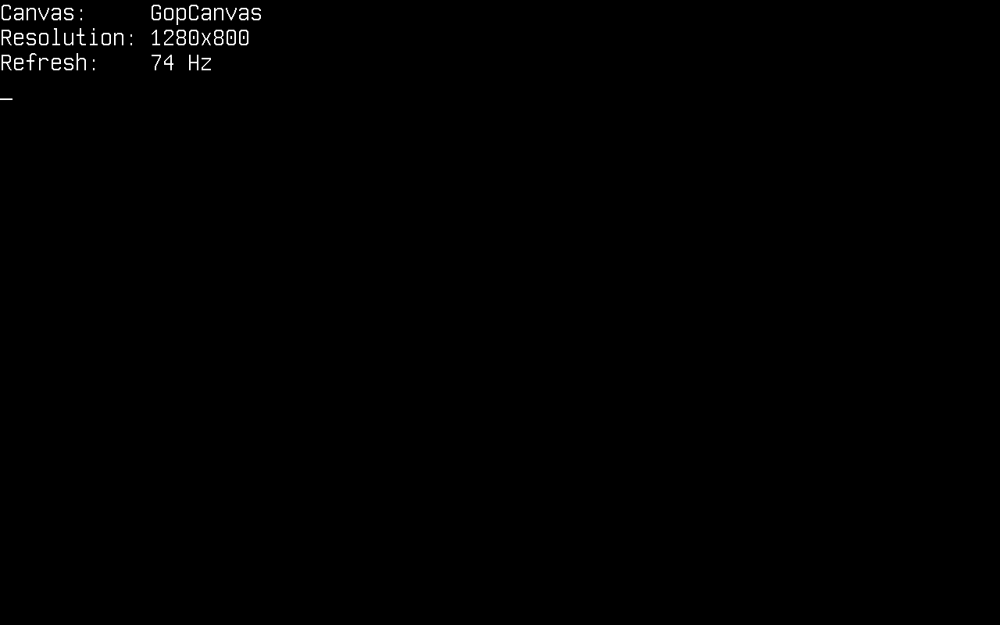
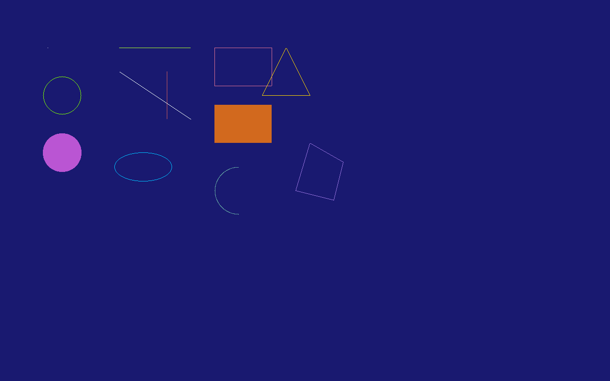
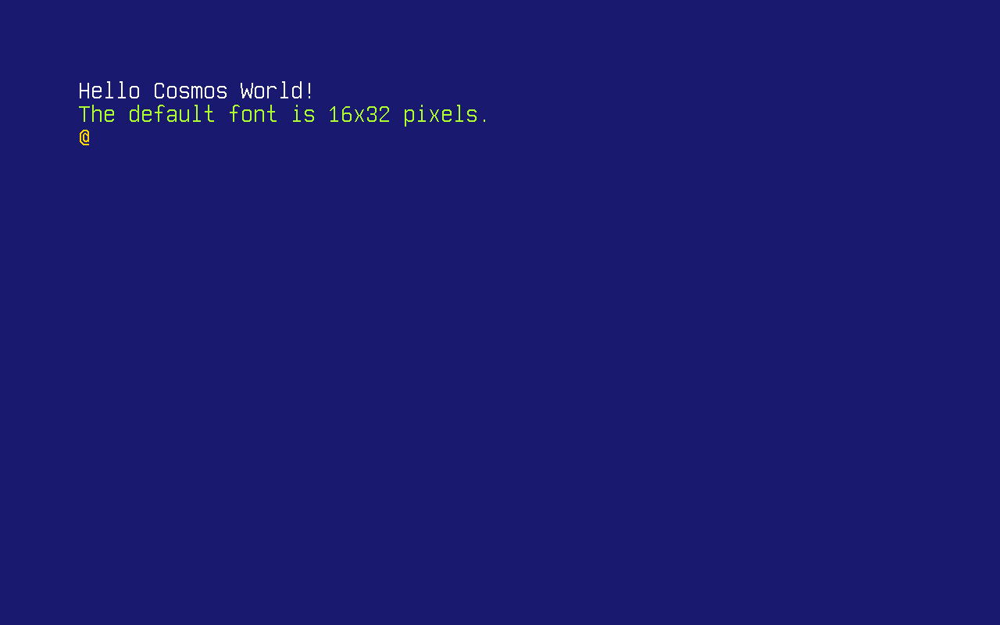
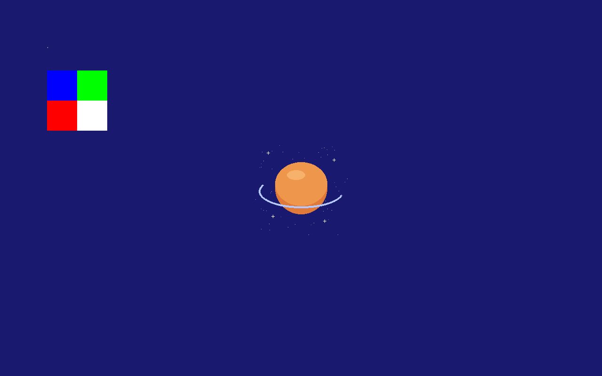
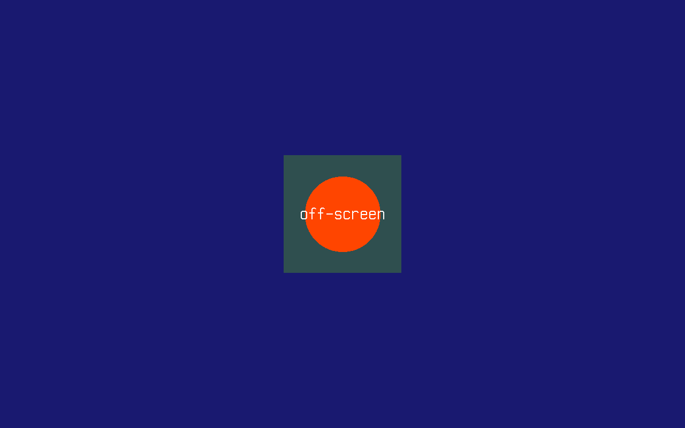

# Graphics

In this article, we will discuss the Cosmos Graphics Subsystem (CGS) on Cosmos Gen3: how to get a drawing surface and put shapes, text and images on the screen. CGS is based on the abstraction of a **Canvas** — an empty space you draw on. It is a drawing layer, not a widget toolkit: there are no windows or buttons, but everything you need to build them.

The main differences if you come from Gen2:

| | Gen2 | Gen3 |
|---|---|---|
| Canvas API | `Cosmos.System.Graphics` | Same API, in `Cosmos.Kernel.System.Graphics` |
| Video drivers | VBE, VGA, VMWare SVGA II | Limine-provided framebuffer (x64 and ARM64) |
| `Display()` | Required on double-buffered drivers | Always required — the canvas is double-buffered |
| Video mode | Switchable at runtime | Fixed at boot by the bootloader |
| Text console | Separate VGA text mode | Rendered on the same canvas |
| Colors | `System.Drawing.Color` | `System.Drawing.Color` |

If you find bugs or something abnormal, please [submit an issue](https://github.com/valentinbreiz/nativeaot-patcher/issues/new) on our repository.

## Enable graphics in your kernel

Graphics support is behind a feature switch. Make sure your kernel's `.csproj` does not turn it off (it defaults to `true`):

```xml
<PropertyGroup>
  <CosmosEnableGraphics>true</CosmosEnableGraphics>
</PropertyGroup>
```

These are the `using`s the snippets below rely on:

```csharp
using System.Drawing;
using Cosmos.Kernel.System.Graphics;
using Cosmos.Kernel.System.Graphics.Fonts;
```

## Getting a canvas

`Canvas.GetFullScreen()` returns the canvas backed by the screen — the framebuffer the bootloader set up at boot:

```csharp
Canvas canvas = Canvas.GetFullScreen();

Console.WriteLine("Canvas:     " + canvas.Name());
Console.WriteLine("Resolution: " + canvas.Width + "x" + canvas.Height);
Console.WriteLine("Refresh:    " + canvas.RefreshRate + " Hz");
```

<!-- screenshot: console showing "Canvas: GopCanvas", the resolution and refresh rate -->


Two things to know before you start drawing:

- **The resolution is fixed at boot.** Unlike Gen2, requesting a different `Mode` does not reprogram the video card — the canvas always has the resolution the bootloader chose. Use `canvas.Width` and `canvas.Height` instead of assuming one.
- **Nothing appears until you call `Display()`.** The canvas is double-buffered: every drawing call goes to a back buffer, and `Display()` swaps the finished frame to video memory. Draw the whole frame, then call `Display()` once — that is also what keeps animations flicker-free.
- **`Console` shares the screen with you.** There is no separate text mode: `Console.WriteLine` is itself rendered on the full-screen canvas (and calls `Display()` on every write). Once you start drawing, stop writing to `Console` — the next write would paint text right over your graphics. This also means an uncaught exception prints over whatever you drew, which — unlike Gen2, where the screen just froze — at least tells you what went wrong.

## Drawing shapes

The canvas offers the classic set of primitives — points, lines, rectangles, circles, ellipses, arcs, triangles and polygons, most in outlined and filled variants:

```csharp
Canvas canvas = Canvas.GetFullScreen();

canvas.Clear(Color.MidnightBlue);

/* A single point */
canvas.DrawPoint(Color.White, 100, 100);

/* Lines: horizontal, vertical and diagonal */
canvas.DrawLine(Color.GreenYellow, 250, 100, 400, 100);
canvas.DrawLine(Color.IndianRed, 350, 150, 350, 250);
canvas.DrawLine(Color.MintCream, 250, 150, 400, 250);

/* Outlined and filled rectangles */
canvas.DrawRectangle(Color.PaleVioletRed, 450, 100, 120, 80);
canvas.DrawFilledRectangle(Color.Chocolate, 450, 220, 120, 80);

/* Circles and ellipses */
canvas.DrawCircle(Color.Chartreuse, 130, 200, 40);
canvas.DrawFilledCircle(Color.MediumOrchid, 130, 320, 40);
canvas.DrawEllipse(Color.DeepSkyBlue, 300, 350, 60, 30);

/* An arc — angles are in degrees */
canvas.DrawArc(500, 400, 50, 50, Color.CadetBlue, 90, 270);

/* Triangles and polygons */
canvas.DrawTriangle(Color.Gold, 600, 100, 650, 200, 550, 200);
canvas.DrawPolygon(Color.MediumPurple,
    new Point(650, 300), new Point(720, 340), new Point(700, 420), new Point(620, 400));

/* Swap the finished frame to the screen */
canvas.Display();
```

<!-- screenshot: the shapes above on a midnight blue background -->


Colors are plain `System.Drawing.Color` values, so the full named palette (`Color.MidnightBlue`, `Color.Chartreuse`, ...) and `Color.FromArgb(...)` are available. Colors with an alpha channel below 255 are blended with the pixel already on the canvas.

## Drawing text

Text rendering uses PSF (PC Screen Font) bitmap fonts. A default 16x32 font is built in:

```csharp
Canvas canvas = Canvas.GetFullScreen();

canvas.Clear(Color.MidnightBlue);

Font font = PCScreenFont.DefaultFont;

canvas.DrawString("Hello Cosmos World!", font, Color.White, 100, 100);
canvas.DrawString("The default font is " + font.Width + "x" + font.Height + " pixels.",
    font, Color.GreenYellow, 100, 130);
canvas.DrawChar('@', font, Color.Gold, 100, 160);

canvas.Display();
```

<!-- screenshot: the strings above rendered with the default PSF font -->


You can also ship your own `.psf` font and load it with `PCScreenFont.LoadFont(byte[])`.

## Drawing images

Images are represented by the `Bitmap` class. You can build one in code from raw pixel data — each pixel is four bytes in **B, G, R, A** order:

```csharp
Canvas canvas = Canvas.GetFullScreen();

canvas.Clear(Color.MidnightBlue);

/* A 2x2 bitmap: blue, green, red and white pixels (B G R A byte order) */
Bitmap bitmap = new Bitmap(2, 2, new byte[]
{
    255, 0, 0, 255,      // blue
    0, 255, 0, 255,      // green
    0, 0, 255, 255,      // red
    255, 255, 255, 255,  // white
}, ColorDepth.ColorDepth32);

/* Draw it pixel-for-pixel, then scaled up to 128x128 */
canvas.DrawImage(bitmap, 100, 100);
canvas.DrawImage(bitmap, 100, 150, 128, 128);

canvas.Display();
```

More usefully, `Bitmap` can load an uncompressed 24-bit or 32-bit **BMP file** through standard `System.IO` — for example from a FAT disk mounted as shown in the [File System](filesystem.md) article:

```csharp
/* logo.bmp is a 24-bit BMP on the FAT partition mounted at /mnt */
Bitmap logo = new Bitmap(@"/mnt/logo.bmp");

canvas.DrawImage(logo,
    (canvas.Width - (int)logo.Width) / 2,
    (canvas.Height - (int)logo.Height) / 2);

canvas.Display();
```

<!-- screenshot: the 2x2 bitmap raw and scaled, plus the logo loaded from disk centered on screen -->


`DrawImageAlpha` draws with per-pixel alpha blending, and `canvas.GetImage(x, y, width, height)` does the reverse — it copies a region of the canvas back into a `Bitmap`.

## Off-screen canvases

A `Canvas` does not have to be the screen. Constructing one with a size gives you a memory-backed canvas with the exact same drawing API — compose a tile or sprite once, then blit it to the screen with `DrawCanvas` as many times as you like:

```csharp
Canvas canvas = Canvas.GetFullScreen();

canvas.Clear(Color.MidnightBlue);

/* Compose off-screen... */
Canvas tile = new Canvas(220, 220);
tile.Clear(Color.DarkSlateGray);
tile.DrawFilledCircle(Color.OrangeRed, 110, 110, 70);
tile.DrawString("off-screen", PCScreenFont.DefaultFont, Color.White, 30, 94);

/* ...then blit it to the screen wherever it is needed */
canvas.DrawCanvas(tile, (canvas.Width - 220) / 2, (canvas.Height - 220) / 2);

canvas.Display();
```

<!-- screenshot: the composed 220x220 tile blitted in the middle of the screen -->


## Reading pixels back

`GetPointColor` returns the color of a pixel already on the canvas:

```csharp
canvas.DrawPoint(Color.Red, 69, 69);
Color color = canvas.GetPointColor(69, 69);   // Color.Red
```

## Current limitations

- Only 32-bit color depth is supported end to end; BMP loading additionally accepts 24-bit files.
- The video mode cannot be changed at runtime — the framebuffer resolution is whatever the bootloader negotiated at boot.
- Only the BMP image format is supported (uncompressed, 24 or 32 bpp).
- No hardware acceleration: every primitive is drawn pixel by pixel by the CPU.
- `FullScreenCanvas.Disable()` exists but there is no VGA text mode to fall back to on UEFI machines.

## How it works

`Canvas.GetFullScreen()` returns a `GopCanvas`, a canvas backed by the framebuffer that the [Limine](https://limine-bootloader.org/) bootloader requests from the firmware (UEFI GOP) before handing control to the kernel. This is why the same code works unmodified on x64 and ARM64 — the kernel never touches a video card directly. Drawing calls land in a back buffer in ordinary memory; `Display()` copies the whole back buffer into the mapped framebuffer in one go. The kernel console ([`KernelConsole`](https://github.com/valentinbreiz/nativeaot-patcher/blob/main/src/Cosmos.Kernel.System/Graphics/KernelConsole.cs)) renders `Console` output onto that same canvas with the default PSF font, calling `Display()` after every write.

```
Canvas API (shapes, text, images)      (Cosmos.Kernel.System.Graphics)
        │
GopCanvas ── shared with ── KernelConsole (Console output)
        │
Back buffer ──── Display() ────▶ framebuffer mapped by Limine (UEFI GOP, x64 & ARM64)
```
