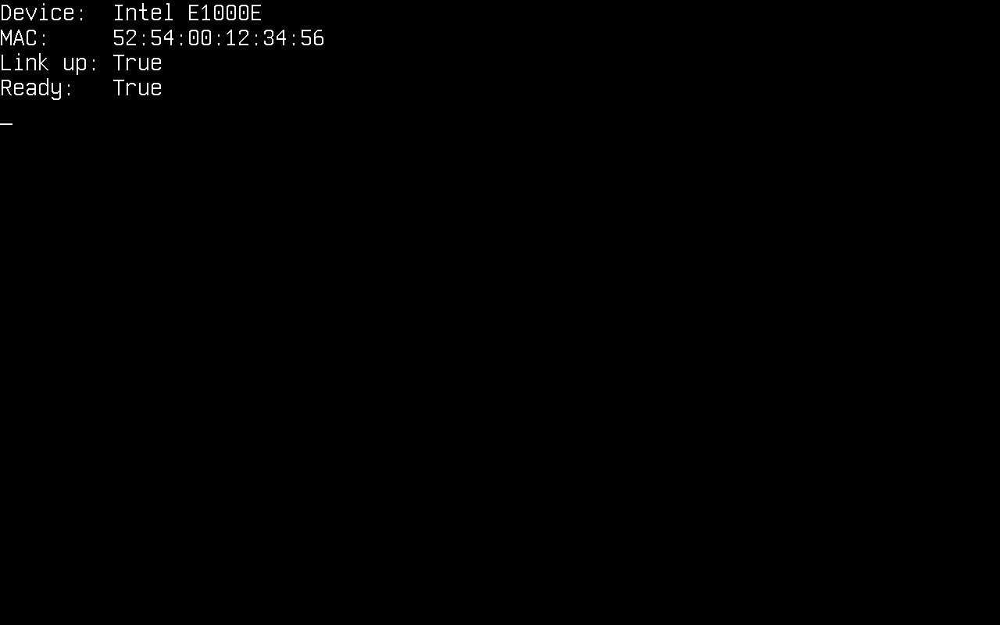
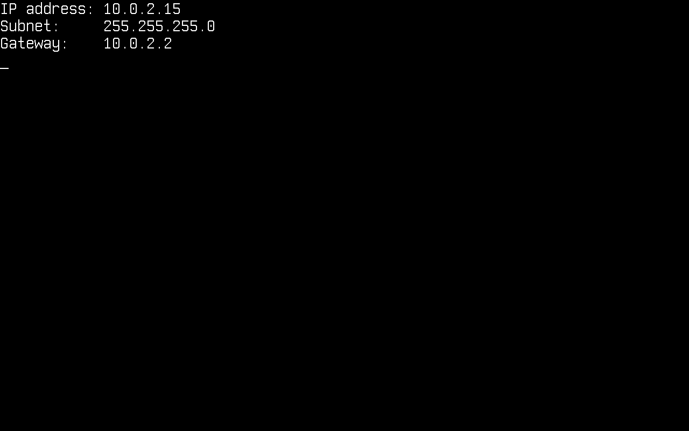
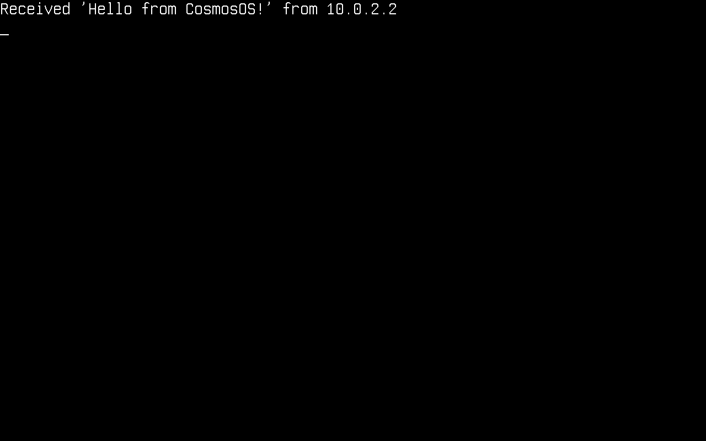
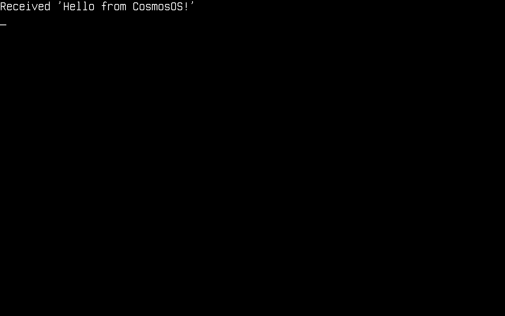
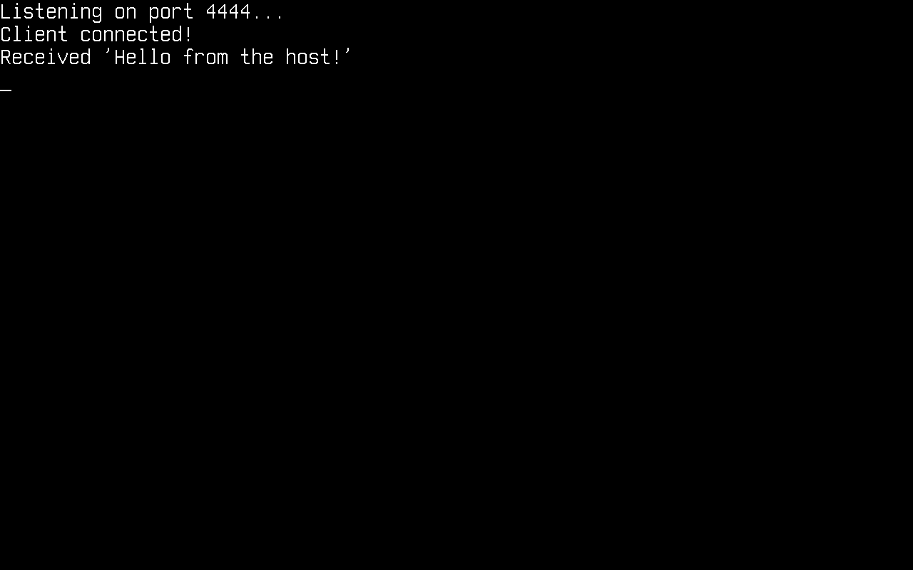
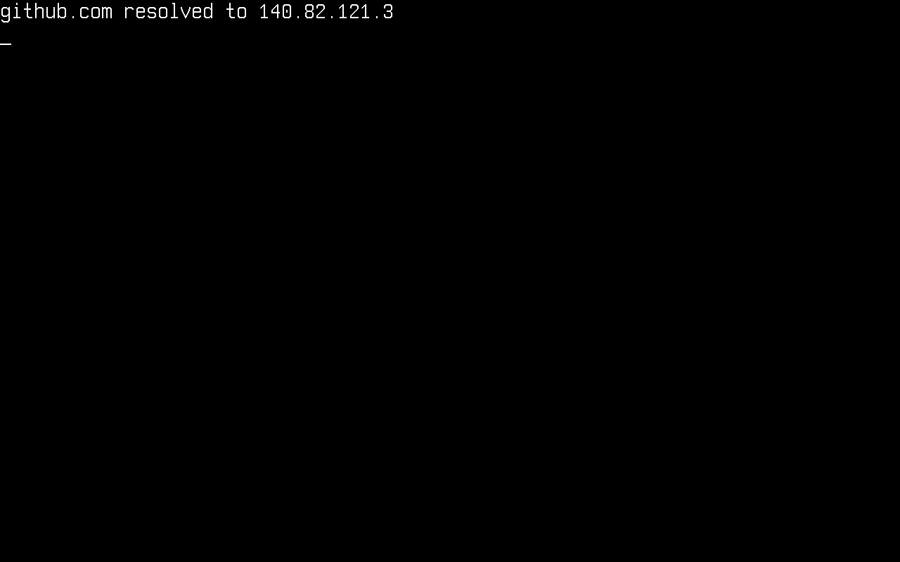

# Network

In this article, we will discuss networking on Cosmos Gen3: how to bring the network stack up and send and receive packets. The available protocols are **ARP**, **IPv4**, **UDP**, **TCP**, **DHCP** and **DNS**.

The main differences if you come from Gen2:

| | Gen2 | Gen3 |
|---|---|---|
| TCP | Standard `System.Net.Sockets` (plugged) | Standard `System.Net.Sockets` (plugged) |
| UDP | Cosmos-specific `UdpClient` class | Standard `System.Net.Sockets.UdpClient` (plugged) |
| DHCP / DNS | Cosmos client classes | Cosmos client classes (`Cosmos.Kernel.System.Network`) |
| NIC drivers | RTL8168, E1000, PCNET | Intel E1000E (x64), virtio-net (x64 PCI + ARM64 MMIO) |

None of these protocols implements every feature of its RFC. If you find bugs or something abnormal, please [submit an issue](https://github.com/valentinbreiz/nativeaot-patcher/issues/new) on our repository.

## Enable networking in your kernel

Network support is behind a feature switch. Make sure your kernel's `.csproj` does not turn it off (it defaults to `true`):

```xml
<PropertyGroup>
  <CosmosEnableNetwork>true</CosmosEnableNetwork>
</PropertyGroup>
```

At boot the kernel detects the NIC and registers it with `NetworkManager`. On x64 both **Intel E1000E** (QEMU's default q35 NIC, preferred when present) and **virtio-net-pci** are supported, so `cosmos run` needs no extra flags. On ARM64 attach a virtio NIC explicitly:

```console
$ cosmos run                          # x64: default e1000e NIC, user-mode networking
$ cosmos run --nic virtio-net-pci     # x64: virtio NIC over PCI
$ cosmos run --nic virtio-net-device  # arm64: virtio NIC over MMIO
```

Virtio-pci devices deliver interrupts via MSI-X, which on ARM64 requires a GICv3 ITS (`-M virt,gic-version=3`); `cosmos run` launches ARM64 with QEMU's default GICv2, so use the MMIO variant there.

With QEMU *user-mode networking* (the default), your kernel lives in a private `10.0.2.0/24` network: the host is reachable at **10.0.2.2**, QEMU's built-in DHCP server assigns addresses, and outbound UDP/TCP is NATed to the real network.

These are the `using`s the snippets below rely on:

```csharp
using System.Net;
using System.Net.Sockets;
using System.Text;
using Cosmos.Kernel.System.Network;
using Cosmos.Kernel.System.Network.Config;
using Cosmos.Kernel.System.Network.IPv4;
using Cosmos.Kernel.System.Network.IPv4.UDP.DHCP;
using Cosmos.Kernel.System.Network.IPv4.UDP.DNS;
using Cosmos.Kernel.System.Timer;
```

## The network device

`NetworkManager` owns the detected NICs. Check that a device is there and ready before configuring anything:

```csharp
var device = NetworkManager.PrimaryDevice;

if (device != null)
{
    Console.WriteLine("Device:  " + device.Name);
    Console.WriteLine("MAC:     " + device.MacAddress.ToString());
    Console.WriteLine("Link up: " + device.LinkUp);
    Console.WriteLine("Ready:   " + device.Ready);
}
```

<!-- screenshot: console showing "Device: Intel E1000E", the MAC, "Link up: True", "Ready: True" -->


## Initialize the network stack

Before using any protocol, initialize the stack once (this hooks packet reception to the device):

```csharp
NetworkStack.Initialize();
```

## Configure IPv4

Like on any operating system, the kernel needs an IPv4 configuration (address, subnet mask, gateway) before it can talk to the network. It can be obtained dynamically through DHCP or set manually.

### Dynamically through DHCP

`DHCPClient.SendDiscoverPacket()` runs the whole DISCOVER → OFFER → REQUEST → ACK exchange and applies the resulting configuration. It returns the elapsed milliseconds, or `-1` on timeout:

```csharp
var dhcpClient = new DHCPClient();

if (dhcpClient.SendDiscoverPacket() != -1)
{
    IPConfig? config = NetworkConfigManager.Get(device);
    Console.WriteLine("IP address: " + config.IPAddress.ToString());
    Console.WriteLine("Subnet:     " + config.SubnetMask.ToString());
    Console.WriteLine("Gateway:    " + config.DefaultGateway.ToString());
}
else
{
    Console.WriteLine("DHCP timed out");
}
```

<!-- screenshot: console showing the DHCP-assigned 10.0.2.15 address, subnet and 10.0.2.2 gateway -->


### Manually

```csharp
IPConfig.Enable(device,
    new Address(192, 168, 1, 69),     // local address
    new Address(255, 255, 255, 0),    // subnet mask
    new Address(192, 168, 1, 254));   // gateway
```

### Get the local IP address

```csharp
Console.WriteLine(NetworkConfigManager.Get(device).IPAddress.ToString());
```

## UDP

UDP uses the standard .NET `UdpClient` — no Cosmos-specific classes. Sends go out immediately; for receives, poll `Available` (a receive with nothing pending would block):

```csharp
using System.Net.Sockets;

var udpClient = new UdpClient(4242);

/* Send data — 10.0.2.2 is the host under QEMU user networking */
byte[] message = Encoding.ASCII.GetBytes("Hello from CosmosOS!");
udpClient.Send(message, message.Length, new IPEndPoint(IPAddress.Parse("10.0.2.2"), 4242));

/* Receive data */
IPEndPoint remote = new(IPAddress.Any, 0);
while (udpClient.Available == 0)
{
    TimerManager.Wait(100);
}

byte[] data = udpClient.Receive(ref remote);
Console.WriteLine("Received '" + Encoding.ASCII.GetString(data) + "' from " + remote.Address);

udpClient.Close();
```

<!-- screenshot: console showing the UDP echo received back from the host -->


## TCP client

TCP also goes through the standard .NET classes: `TcpClient`, `TcpListener` and `NetworkStream`.

```csharp
var tcpClient = new TcpClient();
tcpClient.Connect(IPAddress.Parse("10.0.2.2"), 4343);

NetworkStream stream = tcpClient.GetStream();

/* Send data */
byte[] message = Encoding.ASCII.GetBytes("Hello from CosmosOS!");
stream.Write(message, 0, message.Length);

/* Receive data */
while (!stream.DataAvailable)
{
    TimerManager.Wait(100);
}

byte[] buffer = new byte[tcpClient.ReceiveBufferSize];
int bytesRead = stream.Read(buffer, 0, buffer.Length);
Console.WriteLine("Received '" + Encoding.ASCII.GetString(buffer, 0, bytesRead) + "'");

tcpClient.Close();
```

<!-- screenshot: console showing the TCP echo received back from the host -->


## TCP server

`TcpListener` accepts incoming connections. Poll `Pending()` to avoid blocking in `AcceptTcpClient()`:

```csharp
var listener = new TcpListener(IPAddress.Any, 4444);
listener.Start();
Console.WriteLine("Listening on port 4444...");

while (!listener.Pending())
{
    TimerManager.Wait(100);
}

TcpClient client = listener.AcceptTcpClient();
Console.WriteLine("Client connected!");

NetworkStream stream = client.GetStream();
while (!stream.DataAvailable)
{
    TimerManager.Wait(100);
}

byte[] buffer = new byte[client.ReceiveBufferSize];
int bytesRead = stream.Read(buffer, 0, buffer.Length);
Console.WriteLine("Received '" + Encoding.ASCII.GetString(buffer, 0, bytesRead) + "'");

/* Echo it back */
stream.Write(buffer, 0, bytesRead);

client.Close();
listener.Stop();
```

To reach a listener inside QEMU user networking from your host, forward a host port to the guest. With plain QEMU that is `-nic user,model=e1000e,hostfwd=tcp::4444-:4444`, then connect to `localhost:4444` on the host.

<!-- screenshot: console showing "Listening on port 4444...", "Client connected!" and the received message -->


## DNS

DNS uses the Cosmos `DnsClient` (the .NET `Dns` class is not plugged yet). Register a nameserver, ask for one domain, and read the answer back:

```csharp
DNSConfig.Add(new Address(1, 1, 1, 1));   // Cloudflare public DNS

var dnsClient = new DnsClient();
dnsClient.Connect(new Address(1, 1, 1, 1));

/* Ask for a single domain name */
dnsClient.SendAsk("github.com");

/* Receive the answer (5 s timeout) */
Address address = dnsClient.Receive(5000);
if (address != null)
{
    Console.WriteLine("github.com resolved to " + address.ToString());
}

dnsClient.Close();
```

<!-- screenshot: console showing github.com resolved to an IP address -->


## Current limitations

- ICMP is not implemented yet — no ping, in either direction.
- `System.Net.Dns` is not plugged; use the Cosmos `DnsClient` shown above.
- No TLS, so no `HttpClient`/HTTPS — raw TCP only.
- One NIC: the stack talks to `NetworkManager.PrimaryDevice`.
- Half-close is not supported: `Close()` on an established TCP connection expects the peer to answer the FIN handshake within 5 seconds and throws if it keeps the connection open.

## How it works

Your code calls the standard .NET socket classes, whose PAL bottoms out in `Socket`-level [plugs](../dev/plugs.md) in `Cosmos.Kernel.Plugs` (`SocketPlug`, `TcpClientPlug`, `TcpListenerPlug`, `UdpClientPlug`, `NetworkStreamPlug`). Those delegate to the Cosmos network stack — the TCP state machine and UDP layer over IPv4, ARP and Ethernet — which sends and receives frames through the `NetworkDevice` driver registered with `NetworkManager`. The Cosmos `DHCPClient` and `DnsClient` sit directly on the Cosmos UDP layer.

```
TcpClient / TcpListener / UdpClient / NetworkStream     (stock BCL)
        │
Socket plugs                                            (Cosmos.Kernel.Plugs)
        │
Cosmos TCP state machine / UDP                          (Cosmos.Kernel.System.Network.IPv4)
        │                                    DHCPClient / DnsClient ride UDP directly
IPv4 / ARP / Ethernet
        │
NetworkDevice driver                                    (Intel E1000E, virtio-net)
```
